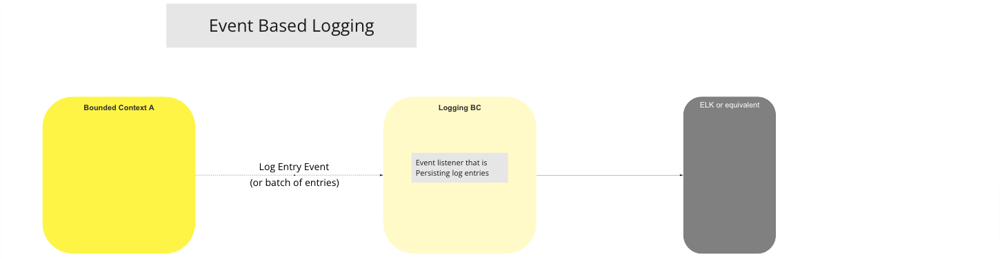

# Logging BC

The Logging Bounded Context is used to store technical information to assist debugging, troubleshooting and problem resolution. Logs are consumed from any other Bounded Context [^1] and stored for querying and reporting. The log information is stored as "technicalities" and should any loss of data take place, then there should be no other consequence than losing technical ability to understand how the system behaves. All system activities are logged and persisted to allow the Auditing Bounded Context [^2] to perform queries against the log data.

Bounded Contexts should publish the events in a defined format and using whatever mechanism is available from the Logging Bounded Context. The structure implicitly has an abstraction layer built into the event received byt the Logging Bounded Context which in turn is then used to persist the log data.

## Use Cases

### Event Based Logging

#### Flow Diagram

>UC Workflow Diagram: Event Based Logging

<!-- Footnotes themselves at the bottom. -->
## Notes

[^1]: [Mojaloop Common Interface List](../../refarch/commonInterfaces.md)
[^2]: [Auditing Bounded Context](../auditing/index.md)
