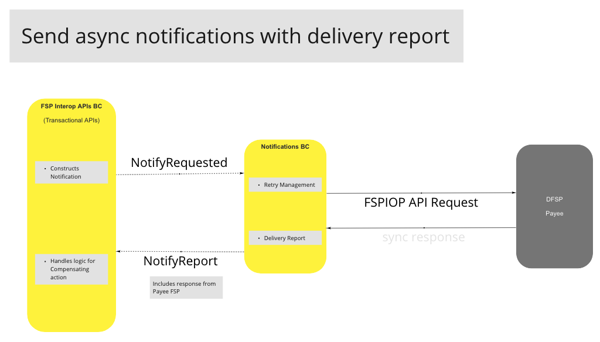
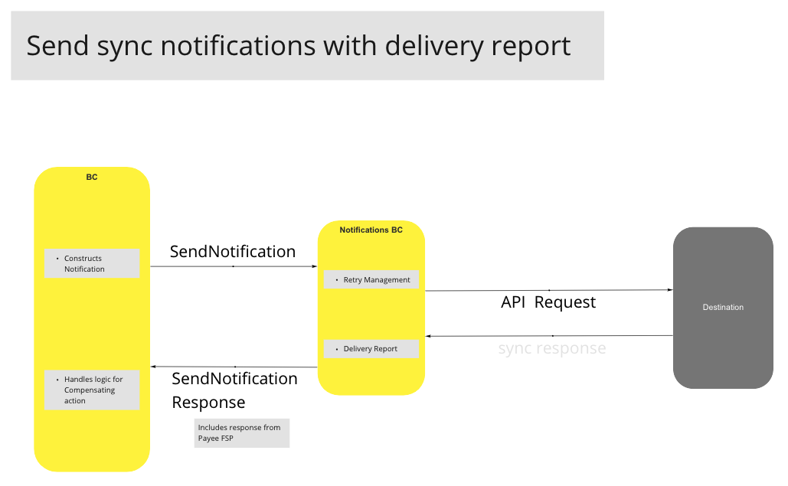
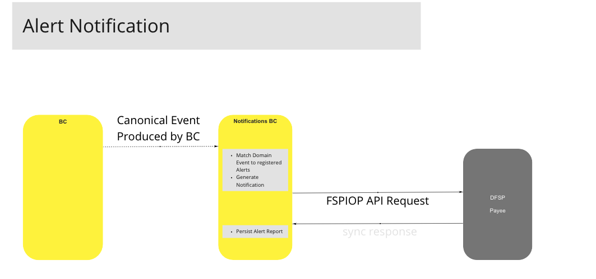

# Notifications and Alerts BC

The Notifications and Alerts BC acts as the notification-engine of the Mojaloop platform. It provides supporting capabilities for reliable FSPIOP Callbacks by ensuring that delivery reports are made available for compensating actions, and audit purposes. Similarly, these capabilities can be leveraged for sending alerts reliably to internal sub-systems or external consumers.

Reliability is ensured by several mechanisms:

- Each Notification command contains
  - all the necessary information (headers, payload, transport, etc) required by the BC to deliver it
  - retry and delivery configuration on how the Notification BC should handle delivery failures
- Notification or Alert reports are persisted and are queryable.

## Terms

Terms with specific and commonly accepted meaning within the Bounded Context in which they are used.

| Term | Description |
|---|---|
| **Notification** | An outbound notification send by the Notifications and Alerts BC normally to an external destination containing contextual headers and payloads. An example of this being the FSPIOP Callbacks as part of the Mojaloop API Specification. |
| **Alert** | Similar to a notification except an Alert is normally used to inform internal sub-systems (i.e. other BC) or a Hub Operator of an "observed" Canonical Event. An example of this being that an FSP has exceeded their available liquidity. |
| **Delivery Report** | A report produced by the Notifications and Alerts BC containing delivery information about a specific Notification or Alert, such as the status of the delivery, the response received by the destination, the number of retries, and information about failures. This report can be either by a domain event, and/or a synchronous response to an API request. |
| **Canonical Event** | This is any Domain Event produced by a Bounded Context |

## Use Cases

### Send Asynchronous Notifications with Delivery Report

#### Flow Diagram

### Send Synchronous Notifications with Delivery Report

#### Flow Diagram

<!-- Footnotes themselves at the bottom. -->

### Alert Registration

#### Description

Hub Operators or Sub-systems will be able to call the Alert Registration API to subscribe to specific notification alerts. The AlertRegister operation will include:

- Domain Message/Event to be monitored
- End-point / Transport information for Notification Delivery
- Template for the Notification Alert that will be used to generate the actual Notification

#### Flow Diagram

### Alert Notifications

#### Flow Diagram

<!-- Footnotes themselves at the bottom. -->
<!--## Notes

[^1]: Common Interfaces: [Mojaloop Common Interface List](../../commonInterfaces.md)-->
