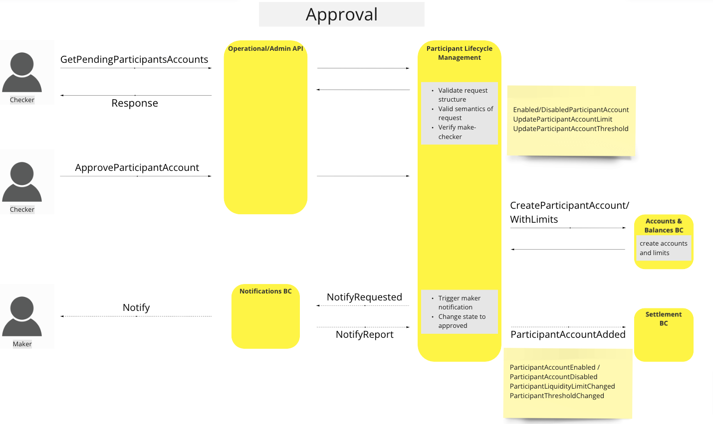

# Participant Lifecycle Management BC

The Participant Lifecycle Bounded Context's primary concern regards anything to do with the management of a Participant within the Mojaloop Environment. When we are defining the Participant Lifecycle Management Bounded Context there are a few key concepts that should be clearly defined.

#### Maker-Checker Process
The Maker-Checker Process establishes the 6 eye verification and ensure that no write action takes place without being validated by some one with adiquite permissions. These permissions are defined by the Participant Lifecycle Management Bounded Context but are configurable and assignable as needed by the Scheme Rules. It is recommended that the users/roles that receive the maker permissions do not receive the checker permissions, and that the checker permissions are assigned to different users/roles. It will still be possible to assign both responsibilities to the same users/roles but this then voids the security that is provided by the maker-checker process that the system was built to support.

#### Participant States
The participant state management allows the admin operators to control permissions for a given participant based on their state. During the Platform Configuration phase, the Participant Lifecycle Management Bounded Context expects participant states to be defined and configured with either roles/permissions. The participant states can then be assigned to a given participant through the Participant Status Management process.

## Terms

Terms with specific and commonly accepted meaning within the Bounded Context in which they are used.

| Term        | Description  |
| ----------- | ------------ |
| **Participant** | Financial Service Provider that register on the Mojaloop ecosystem. Allowing said FSP to be able to transact with other Participants |
| **Maker**       | Representative that is responsible for creating data structures through the use of request.   |
| **Checker**     | Representative that is responsible for approving and accepting data that has been requested to be created. |

## Functional Overview

Please review the common interfaces page to see how these interaction take place. [^1]

>BC Workflow Diagram: Functional Overview

## Use Cases

### Create Participant (Single Step Registration)

#### Description

The workflow provided by this UC enables the BC to employ a process through which to create a Participant on the Mojaloop ecosystem, this usually requires all the information that relates to the participant and the initial accounts needed.

#### Flow Diagram

>UC Workflow Diagram: Create Participant

### Manage Funds

#### Description

The workflow provided by this UC enables the BC to employ a process through which to either withdraw or deposit funds to the Participant's account(s).

#### Flow Diagram

>UC Workflow Diagram: Manage Funds

### Update Endpoints

#### Description

The workflow provided by this UC enables the BC to employ a process through which to update the endpoint of a given participant. When the request has been approved the endpoint will be called on a keep alive path to ensure connectivity.

#### Flow Diagram

>UC Workflow Diagram: Update Endpoints

### Update Participant Status

#### Description

The workflow provided by this UC enables the BC to employ a process through which to change the status of a given participant to enforce different roles/scheme rules on the participant.

#### Flow Diagram

>UC Workflow Diagram: Update Participant Status

### Get Participant

#### Description

The workflow provided by this UC enables the BC to employ a process through which to get information with about a given participant.

#### Flow Diagram

>UC Workflow Diagram: Get Participant

### Add Participant Accounts

#### Description

The workflow provided by this UC enables the BC to employ a process through which to control different aspects of a Participant's accounts, from creating an account, enabling/disabling and updating the limits and threshold warnings of an account.

- Add Participant Account
- Update Participant Account Status (Enable/Disable)
- Update Liquidity Limits and Warning Thresholds

#### Flow Diagram

<!-- Warning Note to Developers & Editors!!: The following two images are being rendered to the Accounts & Balances BC. -->

>UC Workflow Diagram: Add Participant Accounts

### Liquidity Cover Reserve

#### Description

The workflow provided by this UC enables the BC to employ a process through which to reserve liquidity cover for a Participant and notify the Accounts and Balances BC about the update.

#### Flow Diagram

>UC Workflow Diagram: Liquidity Cover Reserve

### Liquidity Threshold Exceeded

#### Description

The workflow provided by this UC enables the BC to employ a process through which to notify the participant that a preset liquidity threshold has been reached and action might be required.

#### Flow Diagram

>UC Workflow Diagram: Liquidity Threshold Exceeded

### Liquidity Limit Exceeded

#### Description

The workflow provided by this UC enables the BC to employ a process through which to notify the participant when they have reached the preset liquidity limit of an account.

#### Flow Diagram

>UC Workflow Diagram: Liquidity Limit Exceeded

### Liquidity Threshold & Limit Reset

#### Description

The workflow provided by this UC enables the BC to employ a process through which reset the liquidity limit or threshold notification checks when successful transfers have been executed and the participant account position is in a positive state.

#### Flow Diagram

>UC Workflow Diagram: Liquidity Threshold and Limit Reset

### Liquidity Cover Query

#### Description

The workflow provided by this UC enables the BC to employ a process through which to query the current liquidity of a participant account, along with additional read operations that are related to the participant's liquidity.

#### Flow Diagram

<!-- Warning Note to Developers & Editors!!: The following two images are being rendered to the Accounts & Balances BC. -->

>UC Workflow Diagram: Liquidity Cover Queries

## Canonical Model

-   Participant
    -   id
    -   participantAlias
    -   endpointURL
    -   state
    -   Accounts[]
        -   accountID
        -   ledgerAccountType
        -   accountCurrency
        -   isActive
        -   warningThreshold
        -   limit
            -   type
            -   value

## Concluding Comments

**Participant Accounts:** Participants can only have one account per allowed currency.
**Update Position Use Case:** Has been changed to the Manage Funds use case
**Maker/Checker Operations:** Retry count has no effect on the way we process/re-process requests.

<!-- Footnotes themselves at the bottom. -->

## Notes

[^1]: Common Interfaces: [Mojaloop Common Interface List](../../boundedContexts/commonInterfaces.md)
