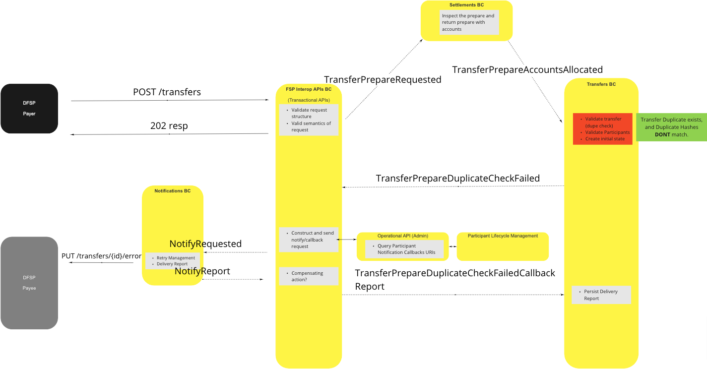

# {name} BC

{overview}

## Terms

Terms with specific and commonly accepted meaning within the Bounded Context in which they are used.

| Term | Description |
|---|---|
| Term1 | Description1 |

## Use Cases

### Perform Transfer (universal mode)

> example image - replace

<!-- Footnotes themselves at the bottom. -->
## Notes

[^1]: Common Interfaces: [Mojaloop Common Interface List](../../commonInterfaces.md)
