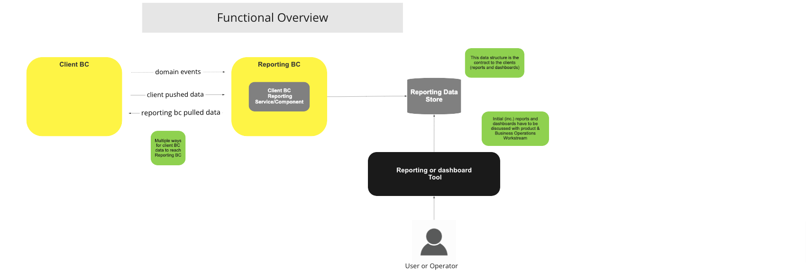
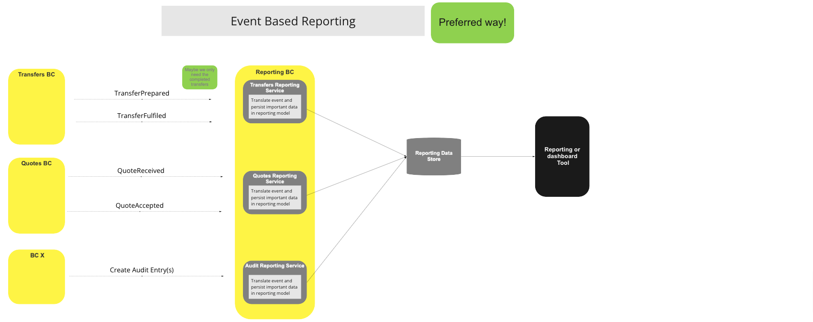
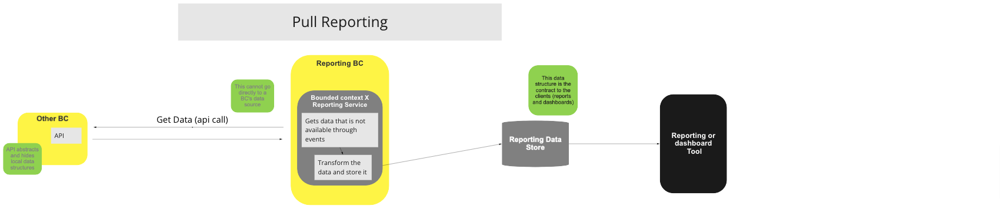
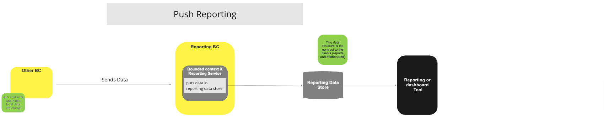
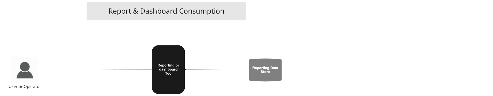

# Reporting BC

## Overview

### Strategy & Rules

The Reporting strategy for this Reference Architecture, is to describe the generic mechanisms by which client BCs' data can be persisted, and kept up to date, in a Reporting Data Store, so users and systems, can later consume this data directly from the Reporting Data Store, or through any Reporting and/or Dashboarding tools connected to the Reporting Data Store.  

- This Reporting Data Store must be write-only from the switch's perspective and read-only by external components.
- The data models on the Reporting Data Store can be different from the internal operational data models that the switch uses; where relevant, for performance or other reasons, multiple models of the same data can be made available in the Reporting Data Store - akin to multiple projections or views.
- A Client BC Reporting Component provided by the switch, will be translating internal events and internal data models to the external data store models - This component can be replaced or, there can even exist many of these for a single Client BC.
- Such component must exists in the Reporting BC for any Client BC's who's data is made available in the Reporting Data Store.
- Any direct data sending, or fetching, from the source Client BC, or its internal data stores, to the Reporting Data Store, constitutes a violation of the decoupling principle and will negatively affect the maintainability of the system by virtue of its tight coupling.

### Reporting strategies:

- Event based - Preferred way - On the Reporting BC sits a component (event handler) that is listening to relevant event from its correspondent BC and transforms those events into reporting data store entries - there can be many of these components per Client BC, however, each should be the only one responsible for writing a subset of the reporting data
- Push - The Client BC will call the correspondent Client BC Reporting Component API to send data, this API will be transforming the data and persisting it to the reporting store ([^1] with the source BC, ie, there should be a API per source BC)
- Pull - On the reporting BC sits a Client BC Reporting Component (timer based) that calls an API on the source BC to retrieve its data, that is then persistent to the reporting store ([^1] with the source BC)

**For performance critical BC we should always try to use the event driven reporting strategy.**

### Absolutely minimum rules to observe:

- Only the Reporting Data Store can be used for reporting and dashboarding. External systems are forbidden direct access to Bounded Contexts' own data stores. Operational access for external systems will be available via the Operational or [Interop APIs](/refarch/boundedContexts/fspInteropApi/).
- Client BC's internal source data cannot be "passed" directly to the Reporting Data Store - There must be a translation between the source data structure and the reporting data structure, even if there are no structure changes. Objective is to not have a dependency on the source BC data structure on the reporting side.

### To Do

- Decide which initial reports and dashboards should be included as part of the base reporting functionality
- Chose a open source reporting and dashboarding tools to deliver this base functionality
- Compliance / Assurance Reporting - define some of these base reports (KYC, AML)
- Discuss “Process Monitoring (and SLA's)” and decide if this can be done on top of the reporting layer (the definition of the critical numbers, SLI’s & SLO’s, is done via platform configuration)
- Add link to the Operational API BC in the rules section above

## Terms

Terms with specific and commonly accepted meaning within the Bounded Context in which they are used.

| Term | Description |
|---|---|
| **Client BC** | Source (or owner) Bounded Context of data being persisted in the Reporting Data Store|
| **Reporting Data Store** | External data store(s) (can be multiple) where reporting data produced by the Client BC Reporting Components is persisted and kept up to date|
| **Client BC Reporting Component** | This component, can take the form or a service, and will be responsible for the translation of the internal model to the external model(s) stored in the Reporting Data Store |
| **Reporting or dashboard Tool**  | External tools that use data in the Reporting Data Store as source to produce reports, dashboards or any other reporting related task |

## Functional Overview

> BC Function Diagram: Functional Overview

## Use Cases

### Event based Reporting (preferred way)

#### Description

Strategy to feed the Reporting Data Store by having Client BC Reporting Component listening to the internal events and persisting the related reporting data.

#### Flow Diagram

> UC Workflow Diagram: Event Based Reporting (Preferred Way)

### Pull based Reporting

#### Description

Strategy to feed the Reporting Data Store by having Client BC Reporting Component fetching data from the Client BC API.

#### Flow Diagram

> UC Workflow Diagram: Pull Reporting

### Push based Reporting

#### Description

Strategy to feed the Reporting Data Store by having the Client BC sending to the Client BC Reporting Component API the data to be reported, and the Client BC Reporting Component translating and persisting it.

#### Flow Diagram

> UC Workflow Diagram: Push Reporting

### User Report and Dashboard Consumption

#### Description

Example of how a user can consume reports nd dashboards

#### Flow Diagram

> UC Workflow Diagram: User Reporting & Consumption Dashboard

<!-- Footnotes themselves at the bottom. -->
## Notes

[^1]: Common Interfaces: [Mojaloop Common Interface List](../../refarch/commonInterfaces.md)
