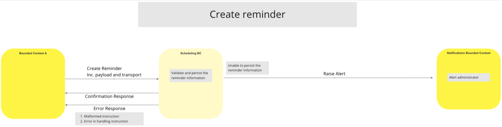
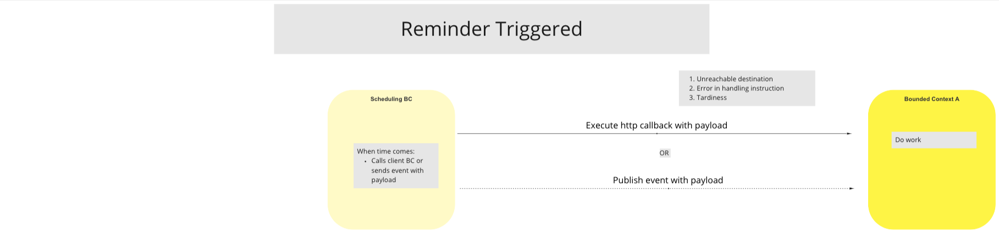
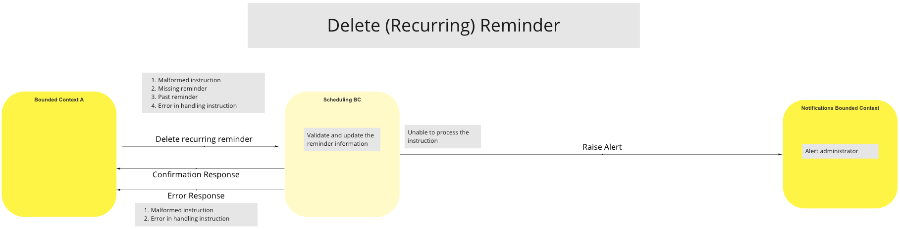

# Scheduling BC

Multiple processes and events in BCs across the Mojaloop Switch platform require functionality to trigger at specific times, or in accordance with a schedule.  In order to support this requirement across the Switch, and avoid building scheduling functionality into multiple BCs, a single Scheduling BC will be introduced and implemented for the Switch platform.

In order to schedule a process or event, a Client BC submits a request to the Scheduling BC to create a reminder for a specific time or time schedule.  The Scheduling BC maintains a schedule of all of the reminders that it receives, and, as the time for reminders is reached, it sends notification of the reminder to the appropriate Client BC.

In addition, the Scheduling BC will also provide services to the Switch to enable Client BCs and Switch Admins to manage reminders that are set within the Scheduling BC.

## Terms

The following common term/s are in use in this BC:

| Term | Description |
|---|---|
| **Client BC** | Any other BC making use of the Scheduling BC Services |

## Use Cases

<!--***Note:*** *An "Update Reminder" UC has not been provided. The recommended course of action to follow is to Delete and Create a new Reminder.*
-->
The status of the UCs for the Scheduling BC is as follows:

| Available UCs |  |  | Planned UCs |  |
| --- | :-- | --- | --- | :-- |
| **Use Case** | **Description** | | **Use Case** | **Description** |
| **Create Reminder** | Client BC requests a reminder to be created | | **Client Reminder Query** | Client BC queries its own reminders |
| **Delete Reminder** | Client BC requests a reminder to be deleted | | **Admin Reminder Query** | Platform Admin queries all reminders |
| **Reminder Trigger** | Scheduling BC executes reminder trigger when the time comes | | |
| **Update Reminder** | *Not provided.  Recommended solution: delete and create a new Reminder* | | |  |  |

<!---The following UCs are planned for inclusion in the Scheduling BC -

| Use Case | Description |
| --- | :-- |
| Client Reminder Query | Client BC queries its own reminders |
| Admin Reminder Query | Platform Admin queries all reminders |
| Reminder Trigger | Scheduling BC executes reminder trigger when the time comes |
--->
### Create Reminder

#### Description
The workflow provided by this UC enables the Switch to handle authorised Client BC requests to create Reminders.

#### Flow Diagram

>
### Reminder Triggered

#### Description
The workflow provided by this UC enables the Switch to handle reminders messaged from the Scheduling BC to a Client BC to execute a task, or as a reminder only.

#### Flow Diagram

>
### Delete (Recurring) Reminder

#### Description
The workflow provided by this UC enables the switch to handle messages from authorised Client BCs to the Scheduling BC to delete a Reminder.  In the event that the Scheduling BC is unable to process the instruction, it sends an Alert message to the Notifications BC.

#### Flow Diagram

>

<!-- Footnotes themselves at the bottom. -->
## Notes

#### Create Reminder - Required data

The Create Reminder request needs to include the following data:

| Data | Description |
| --- | ---- |
| **Identifier** | name/id |
| **Cron Definition** | recurring?, time interval? |
| **Trigger Transport** | HTTP Callback/Event; Callback URL or Event Topic |
| **Special Payload** | opaque for the scheduling BC |
| **Recovery Conditions** | retry, reschedule, abort, abandon |
| **Alerts** | notification, logging on exceptions |
| **Actions** | register of automatable/schedulable BC processes |

#### Scheduling BC - Requirements

The Scheduling BC must meet the following requirements:

* Reminders must be triggered once only

* BC must keep track of triggered Reminders

* BC must keep track of Create/Read/Delete actions

    * Updates will be facilitated through Delete/Create actions as noted in the [Use Case Available UCs](#use-cases) list

* Job batches

* Offer multiple interface options (gRPC, REST, HTTP, etc.)

* Reminders should be triggered with an HTTP callback, not a gRPC call, or to a specific topic

* It should have no ability to process logic external to the Scheduling BC itself

* Make use of Linux-based UTC timestamps only in order to avoid synchronization issues

***Note:*** *It is assumed that the underlying system will keep perfect time.*

#### Scheduling BC - Outstanding requirements

Access requirements for the Scheduling BC still require definition.

#### Scheduling BC - Exceptions

* Malformed instructions
    * Invalid date/time, including times in the past
    * Invalid BC or command
* Failed execution (identified through call-back)
* Insufficient authority for the Client BC to perform the CRD operation
* Failure to process/execute Reminder

#### Questions

A number of questions came up during the Reference Architecture Work Sessions and, as some were felt to have potential value from which others would benefit, we have included them below:

* After the scheduled task has been initiated, does the Scheduling BC remain responsible for tracking its progress?

    * Answer: No. When the Reminder is due, it is communicated to the Client BC using the precribed method, and thereafter, the Scheduling BC responsibility for the reminder is passed back to the Client BC.

* Is the Client BC or the person who scheduled a Reminder noted as the "User" by the Scheduling BC?  IOW, whose ID is stamped on the process audit trail?

    * Answer: This should be determined by the Client BC, based on its action on receipt of the Reminder.