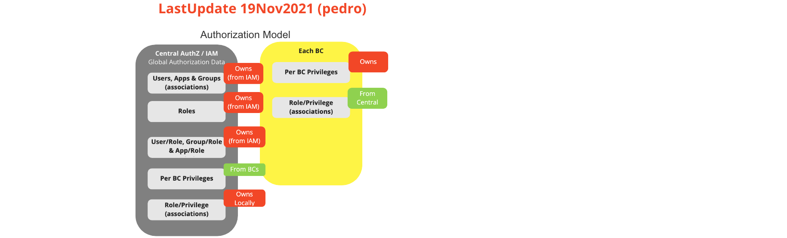
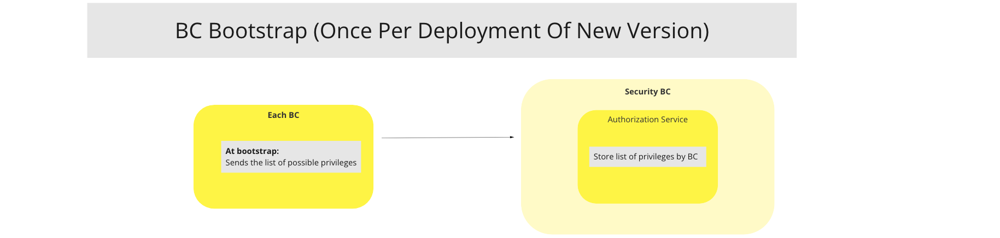
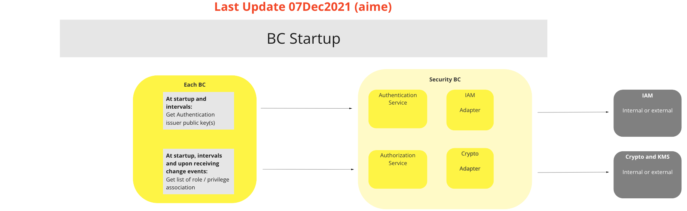
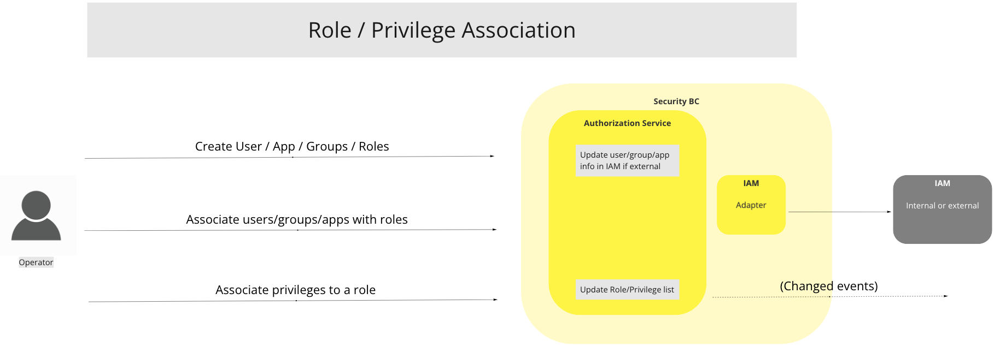
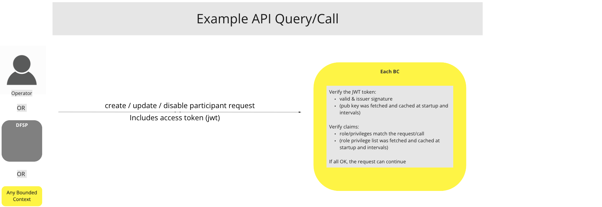

# Security BC

## Overview

The protocol is request and response based, and the used transport protocol is secure Hypertext Transfer Protocol Secure (HTTPS). All services use the HTTP POST and GET methods. Both the request and response bodies are encoded in JSON-formatted text.

## Terms

Terms with specific and commonly accepted meaning within the Security Bounded Context.

| Module | Description |
|---|---|
| **Crypto providers** | Adapter that will provide cryptographic services and Key Management Services |
| **IAM** | Identity and Access Management. Adapter that will provide services for user management, menus, profiles, roles and permissions.  |
| **AuthN** | Authentication module. Requires userid and password and returns a JWT token  |
| **AuthZ** | Authorization module. Requires JWT and certificate (public key). Verifies JWT ROLES and signature  |
| **JWT** | JSON Web Token. Returned after a successful user authentication. Contains user details, ROLES and signature.   |
| **KMS** | Key Management System. Manages cryptographic keys lifecycle (definition, creation and retirement). It is part of the Cyrpto subsystem |

## Use Cases

### BC User / Operator login (AuthN)

#### Description

The login function requires that the user id and a secret key be passed in the http body. The response contains a signed JWT token. The signature is generated by the Crypto subsystem. The login is performed by the Authorization services or IAM.

#### Flow Diagram

_Apr22_1829.png)
> UC Workflow Diagram: BC User/Operator Login (AuthN)

### BC Authorization Model (AuthZ)

#### Description

IAM will provide users / groups, roles and privileges associations. Each BC will also have a list of related roles. When an API function or microservice
is called, the JWT signature is verified using the public key and the role provided in the JWT is compared to the role associated with the BC. If the signature verification and the role are successfully verified, the API function or microservice is executed.

#### Flow Diagram

> UC Workflow Diagram: BC Authorization Model (AuthZ)

### BC Bootstrap

#### Description

At bootstrap, the BC will send the list of possible privileges. This is done once per deployement of a new version.

#### Flow Diagram

> UC Workflow Diagram: BC Bootstrap

### BC Startup

#### Description

At startup the BC will request authentication issuer public keys from Security BC Crypto / KMS subsystems and the list of roles / privileges Security BC IAM subsystem. A local crypto library signature verification function will verfiy the JWT signature and the roles in the JWT will be compared with the local list of roles obtained from the central authorization service.

##### Flow Diagram

> UC Workflow Diagram: BC Startup

### Role / Privilege association

#### Description

Roles are associated with a number of privileges.

#### Flow Diagram

> UC Workflow Diagram: Role / Priviledge Association

### Example Query / call

#### Description

Client Authorization should be performed by using an access token. A client first needs to request the Authorization Service to create an access token for the user who requests to access the interface. The user is authenticated in the Authorization Service. The created access token is then used for authorization in the interface.
To use the access token, the client must set the Authorization HTTP header to Bearer [access_token] in each request to the interface.

#### Flow Diagram

> UC Workflow Diagram: Example API Query/Call

<!-- Footnotes themselves at the bottom. -->
<!--## Notes

[^1]: Common Interfaces: [Mojaloop Common Interface List](../../commonInterfaces.md)
-->