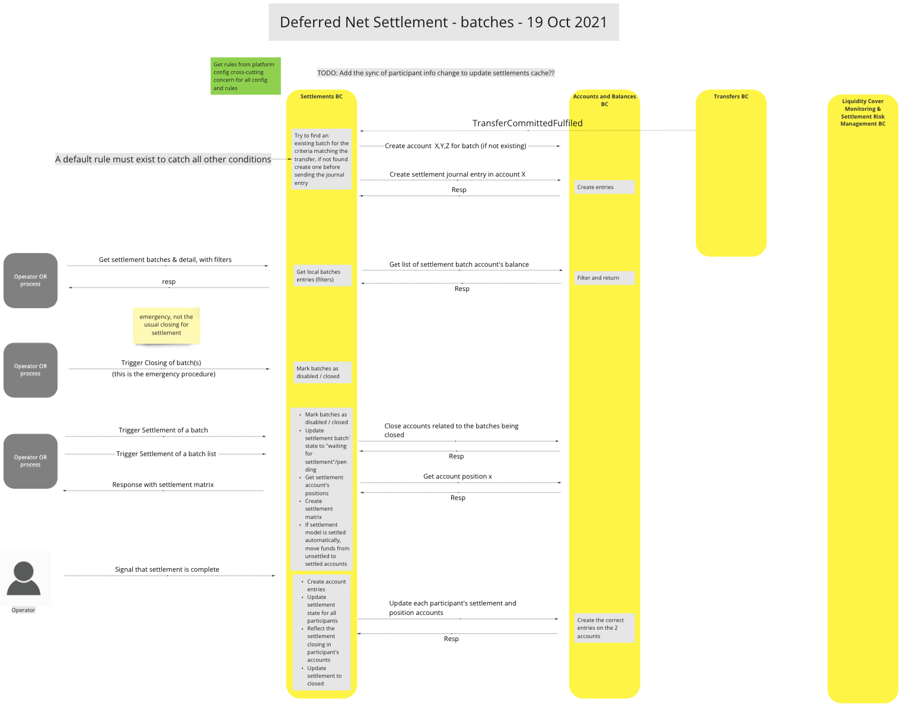
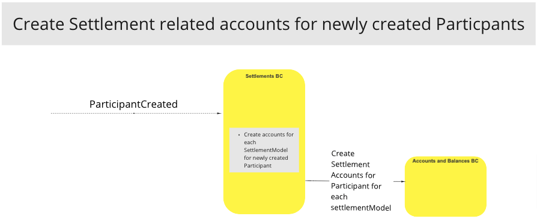

# Settlements BC

The Settlements BC is integral to settling Participant transfers using either Deferred Net Settlement or Immediate Gross Settlement methods. It is responsible for creating settlement windows, identifying and deploying the required settlement method (DNS/IGS), settling, closing, and updating batches, and recording all deposits and withdrawals to the appropriate ledger accounts in the Accounts and Balances BC.

## Terms

The following terms are used in this BC, also known as a domain.

| Term     | Description  |
| -------- | ------------ |
| **DNS** | Deferred Net Settlement |
| **IGS/RTGS** | Immediate Gross Settlement/Real-Time Gross Settlement |
| **Operator** | Person or System issuing instructions/requests |
| **Participant** | FSP/PISP or FSP Customer |
| **Account** | Ledger Journal Account (Cr/Dr) |

## Functional Overview

>

## Use Cases

### Deferred Net Settlement (DNS)

#### Description
Method of deferring payments to enable settlement on multiple batches according a predetermined schedule.  This is useful for environments involving multiple Participants to a transaction requiring a balance of payment due settlement approach.

#### Flow Diagram

>UC Workflow Diagram: Deferred Net Settlement - 19/10/2021

### Immediate Gross Settlement (IGS)

#### Description
Method to enable immediate settlement of batches.  This is useful for SME environments where quick payment turnarounds are often desirable in order to maximize their liquidity.  IGS is also known as Real-Time Gross Settlement (RTGS)

#### Flow Diagram

>UC Workflow Diagram: Immediate Gross Settlement

### Abort Settlement

#### Description
Method that enables the Settlement BC to abort a settlement as required, reversing Participant settlement accounts, updating the settlement status for settlement windows, and updating the settlement state.

#### Flow Diagram

>

### Create/Update the Settlement Model (DNS/IGS)

#### Description
Method that enables the Settlement BC to create or update the settlement method for a settlement batch based on the Participant Account Type.  Useful in instances where mixed Settlement Methods are required.

#### Flow Diagram

>

### Bootstrap (Startup) Settlement Model via Configuration

#### Description
Method that configures the Settlement Method (DNS/IGS) based upon the system startup configuration.  Useful in instances where all Settlement Models are the same, such as all DNS, or all IGS.

#### Flow Diagram

>UC Workflow Diagram: Bootstrap (Startup) Settlement Model via Configuration

### Create Settlement related accounts for newly created Particpants

#### Description
The system creates settlement accounts for new Participants to enable fund transfers to managed by the Switch.  This enables the Switch to exercise end-to-end management of all transfers irrespective of settlement method.

#### Flow Diagram

>

<!-- Footnotes themselves at the bottom. -->
<!-- ## Notes -->

[^1]: Common Interfaces: [Mojaloop Common Interface List](../../commonInterfaces.md)
