# Third Party API BC

The Third Party API BC has been implemented with the Mojaloop 2.0 Reference Architecture to enable third-party PISP Operators (typically applications) to interact with the platform.  Please note that unless otherwise stipulated, all BC references pertain to the various Mojaloop components or Bounded Contexts (BCs).

## Terms

The following common terms are used in this BC:

| Term | Description  |
| ---- | ------------ |
| **PISP** | Payment Initiation Service Provider (e.g. PayPal, ApplePay, GooglePay, etc.) |
| **DFSP** | Digital Financial Service Provider (e.g. Bank, Mobile Money Operator) |
| **User** | DFSP/PISP client (as indicated) |

## Use Cases

**Note:** Our Use Cases cover two specific scenarios:

| Scenarios | Description |
| --------- | ----------- |
| [Linking](#linking-scenarios) | PISP Housekeeping activities |
| [Transfer](#transfer-scenarios) | PISP Transfer initiation activities |

## Linking Scenarios

### PISP Gets supported DFSPs

#### Description

The workflow provided by this UC enables the Switch to handle authorized PISP User requests to obtain a list of DFSP Account Holders supported by the system.

#### Flow Diagram

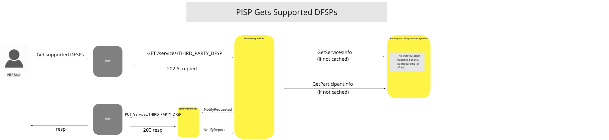
>UC Workflow Diagram: PISP Gets supported DFSPs

### PISP Gets list of accounts for a DFSP + Identifier

#### Description

The workflow provided by this UC enables the Switch to handle instances where  authorized PISP Users wish to lookup their DFSP Account Holder account details using their DFSP Account Holder Identifier to do so.  Typically the Identifier is embedded into a PISP-originated app or process.

#### Flow Diagram

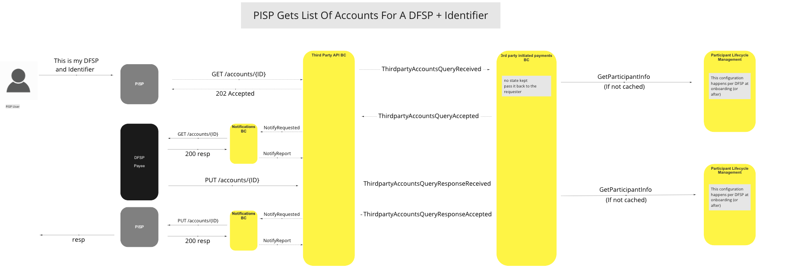
>UC Workflow Diagram: PISP Gets list of accounts for a DFSP + Identifier

### PISP Consent Request

#### Description

The workflow provided by this UC enables the Switch to handle instances where an authorised PISP User notifies their DFSP Account Holder of their intention to link one or more of their accounts to a PISP via a Consent Request.  The request is fulfilled via an out-of-band [Issue Consent](#dfsp-issue-consent) process upon receipt of an authorization confirmation request response.  The result of this process is the establishment of a trust relationship between the PISP User, the PISP, and the DFSP Account Holder.  The Switch updates participant account details accordingly.

#### Flow Diagram

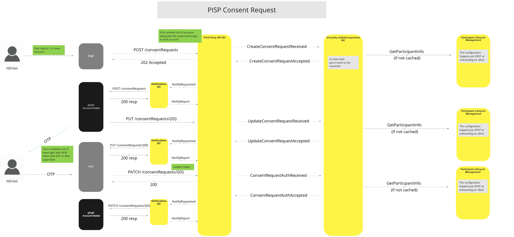
>UC Workflow Diagram: PISP Consent Request

### DFSP Issue Consent

#### Description

The workflow provided by this UC enables the Switch to handle instances in which a DFSP Account Holder responds to a Consent Request received from an authorised and authenticated PISP User.  The DFSP Account Holder issues a request to the PISP via the Switch for the PISP User to create an identifying Credential on their device.  Upon receipt of the identifying Credential, verified by the issuing DFSP Account Holder, both the Switch and the DFSP Account Holder Account records are updated with the PISP User Credential and linked Accounts, and the PISP User is notified that their DFSP Account Holder Account/s has/have been successfully linked to their PISP profile.

***Note:*** *The Consent Issue is in response to a Consent Request made by an authorised PISP User to link one or more of their DFSP Account Holder Accounts to their PISP profile and follows the workflow noted in the [PISP Consent Request](#pisp-consent-request) UC above*

#### Flow Diagram

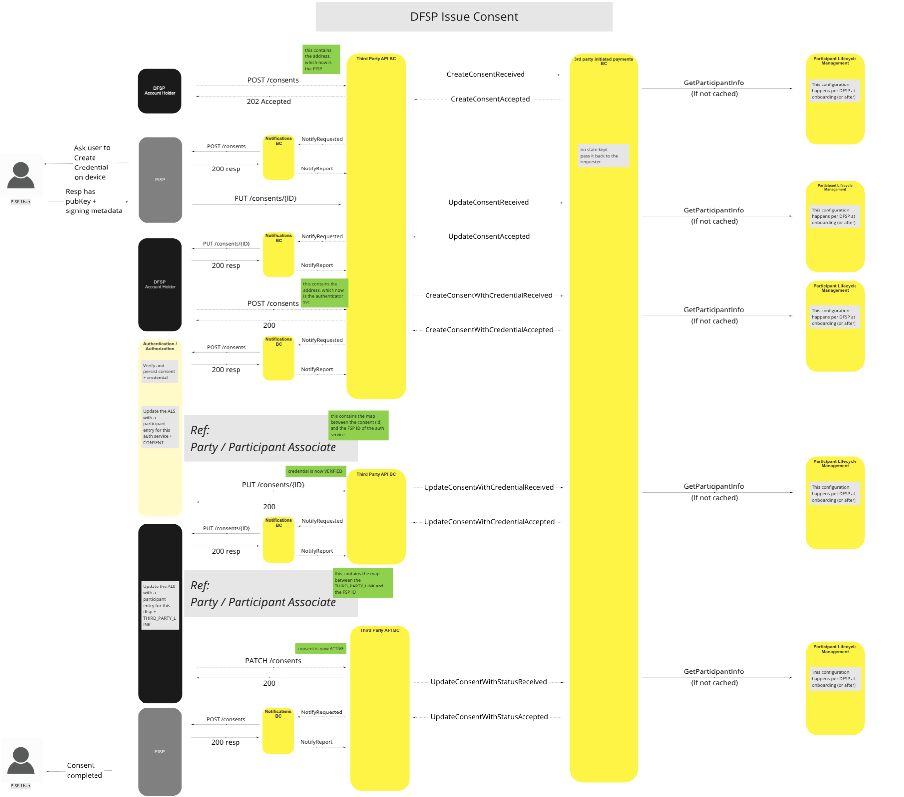
>UC Worflow Diagram - DFSP Issue Consent

### Unlink Accounts: Hub Hosted Auth

#### Description

The workflow provided by this UC enables the Switch to handle an authorised PISP/DFSP Account Holder request to revoke consent for a DFSP Account Holder Account to be linked to their PISP Profile, which the Switch acts upon by updating the system Account Lookup Service to disassociate the PISP Participant/DFSP Account association, and notifying both the DFSP Account Holder (who removes the ALS Participant entry and Link from their system), and the PISP Host who sends a fulfilment notification to the User.

#### Flow Diagram

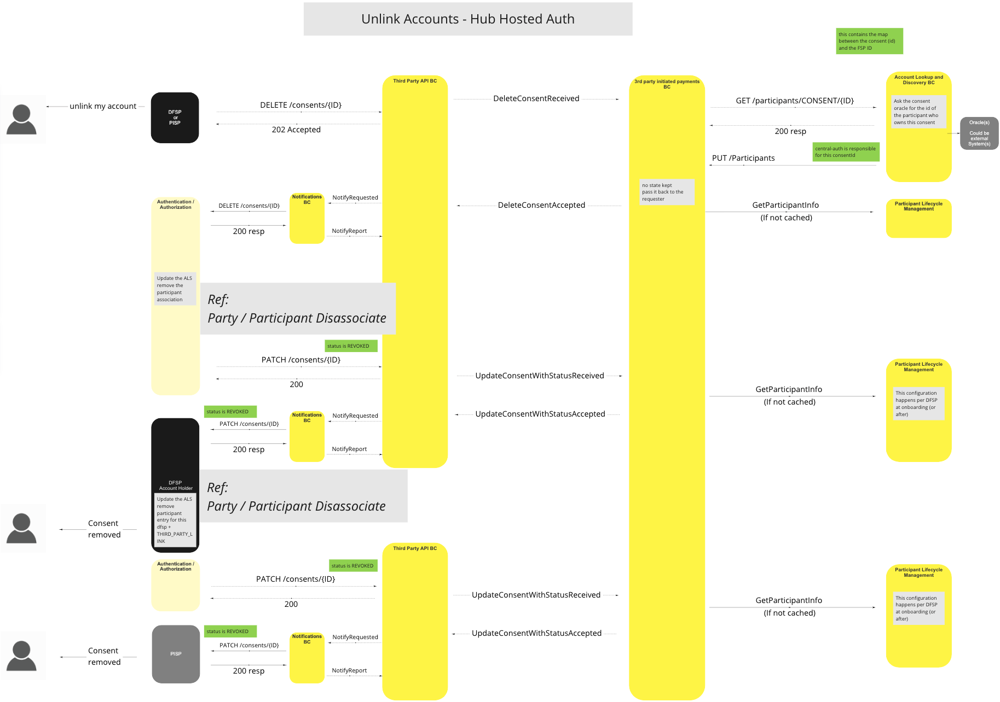
>UC Workflow Diagram: Unlink Accounts - Hub Hosted Auth

### Link Accounts - Account Discovery Failure

#### Description

The workflow provided by this UC enables the Switch to handle instances in which an authorised PISP User initiates a request to link a DFSP Account to their PISP Profile using an invalid DFSP/Identifier pair not recognized by the DFSP. The DFSP messages the Switch with an error, which notifies the appropriate PISP, and the User receives a message to try another DFSP/Indentifier pair.

#### Flow Diagram

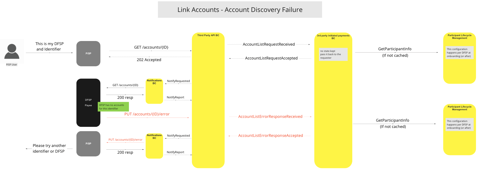
>UC Workflow Diagram: Link Accounts - Account Discovery Failure

### Link Accounts - DFSP Rejects Consent Request

#### Description

The workflow provided by this UC enables the Switch to correctly handle instances where an authorized PISP User requests one or more accounts to be linked to their PISP Profile by the DFSP Account Holder.  Where the DFSP Account Holder denies consent for the linking to go ahead for whatever reason, e.g.: a selected account does not support linking, it will message the Switch with an error condition.  The Switch notifies the appropriate PISP, and the PISP User receives a message, in-app or otherwise, to retry their request as the previous account linking request failed.

#### Flow Diagram

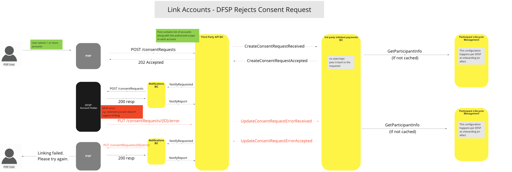
>UC Workflow Diagram: Link Accounts - DFSP Rejects Consent Request

### Credential Registration Error

#### Description

The workflow provided by this UC enables the Switch to handle instances where a DFSP Account Holder provides a PISP with a request for a (PISP) User to create a device-embedded credential in order to confirm a Consent Request, and where the credential, which when sent to the DFSP includes either an invalid signed challenge or signed metadata that is rejected.  In this instance the DFSP messages the error condition to the Switch, which messages the appropriate PISP who notifies the (PISP) User that the Consent credential was rejected.

#### Flow Diagram

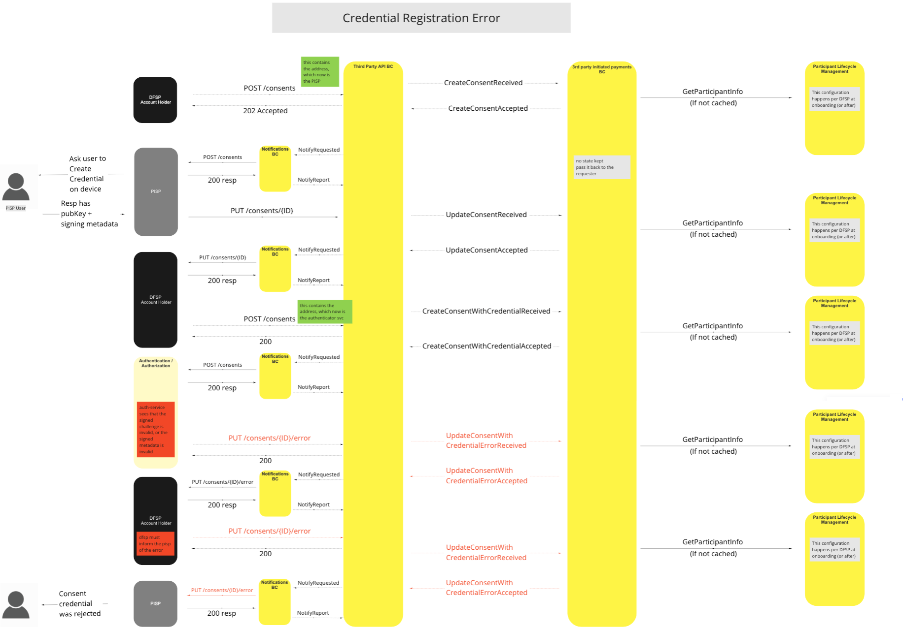
>UC Workflow Diagram: Credential Registration Error

### Unlink Accounts - Consent not found

#### Description

The workflow provided by this UC enables the Switch to handle instances where an authorized PISP User is asked to confirm a consent request issued via either the PISP or DFSP Account Holder to unlink their DFSP Account from their PISP Profile.  The Switch refers the consent request response to the Consent Oracle for confirmation of the Consent Owner ID.  In instances where the Oracle is unable to confirm the ID of the Consent Owner, the request is failed.  The PISP User is alerted via the DFSP Account Holder or PISP profile holder, that the DFSP Account that they sought to unlink from their PISP profile was not found.

#### Flow Diagram

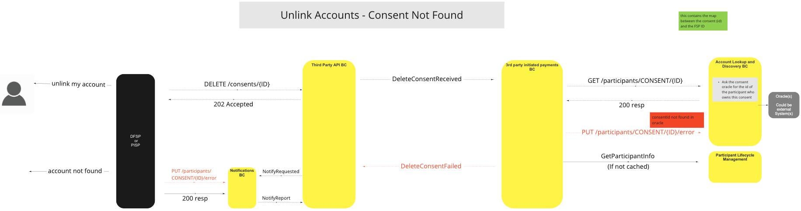
>UC Workflow Diagram: Unlink Accounts - Consent Not Found

### DSPF Rejects OTP/Auth Token from PISP

#### Description

The workflow provided by this UC enables the Switch to handle instances where an authorised PISP User requests one or more of their DFSP Account Holder Accounts to be linked to their PISP Profile.  The request is directed by the Switch to the DFSP Account Holder who issues an OTP/Web Login Flow to the PISP User for verification purposes which is returned via the PISP to the Switch, and then to the DFSP Account Holder for consent.  In instances where the response token is altered or expired, the DFSP Account Holder issues a error condition message to the Switch and the PISP User is notified that the DFSP Account linking request failed.

#### Flow Diagram

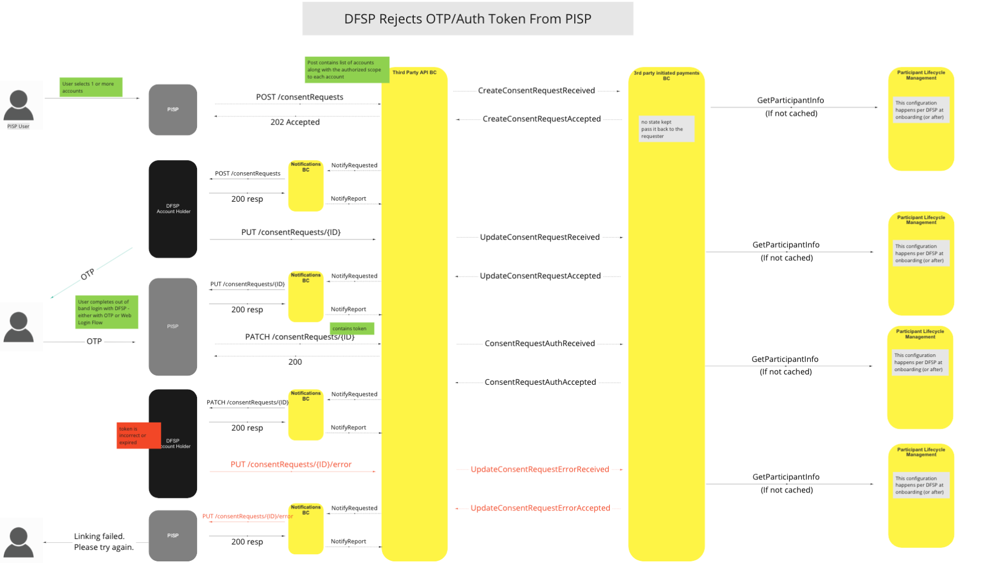
>UC Workflow Diagram: DFSP Rejects OTP/Auth Token from PISP

### Unlink Accounts - Downstream Failure

#### Description

The workflow provided by this UC enables the Switch to handle instances in which an authorised PISP User's DFSP Account unlink consent confirmation fails the Switch's Authentication/Authorisation process for whatever reason, example: a downstream FSPIOP API error.  The error is messaged by the Switch to the DFSP Account Holder who will review the error and determine how to respond.  Where an error has occured, the PISP User is notified by the Switch via the PISP that their request to unlink their DFSP Account failed.

#### Flow Diagram

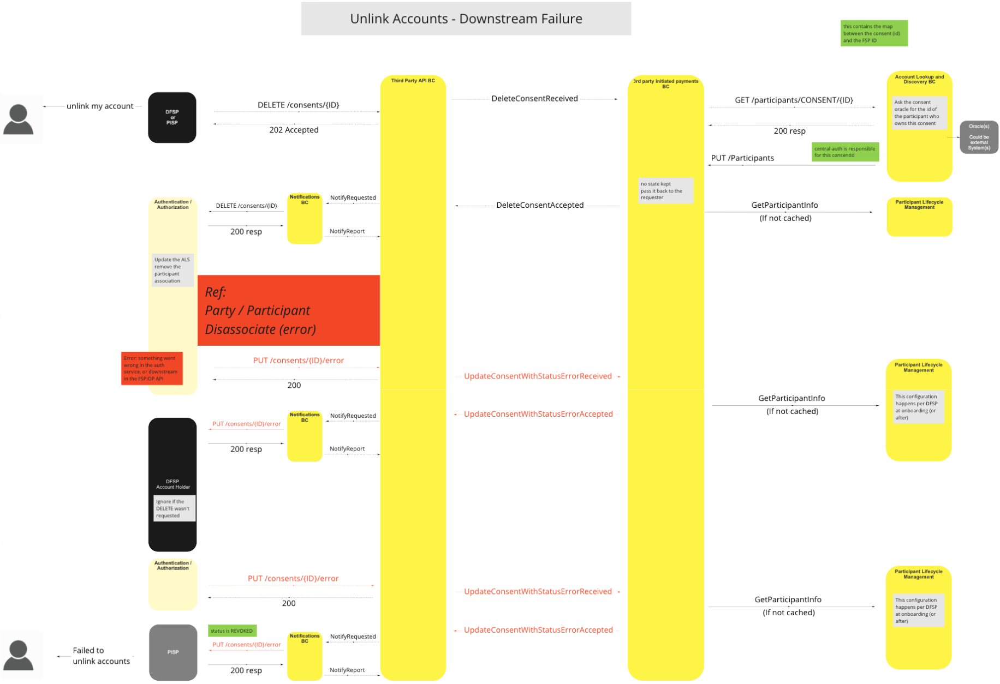
>UC Workflow Diagram: Unlink Accounts - Downstream Failure

## Transfer Scenarios

***Note:*** *In the interests of compacting this workflow description, the reader should note that the Third Party API and the 3rd-Party Initiated Payments BCs work in concert to maintain Participant Information.  The interaction between the two BCs will not be specifically noted, but is as follows: where the Third Party API BC updates the Transaction state, and where the Participant Information is not cached, the 3rd-Party Initiated Payments BC will request the missing Participant Information from the Participant Lifecycle Management BC and deliver it to the Third Party API BC for inclusion in the Transaction information being presented to the DFSP/PISP systems.*

### Third Party Initiated Transaction Request

#### Description

The workflow provided by this UC enables the Switch to permit authorized PISP Users/Apps to issue a request to a DFSP to execute a transaction on behalf of an Account Holder, typically the PISP User/App, in favor of a third-party recipient or recipients.  The transaction is vetted via a DFSP confirmation request to the Account Holder, and concluded upon successful receipt of confirmation.  The Switch, per DFSP instructions, manages the transaction and updates all accounts accordingly.

Some suggested applications of Third Party Payment Initiation UC include:

 - Peer to Peer Payments (e.g.: GPay in India)
 - Online checkouts for seamless end-user user experience (UX) (e.g.: PayPal)
 - Payroll Clearing Software

#### Flow Diagram

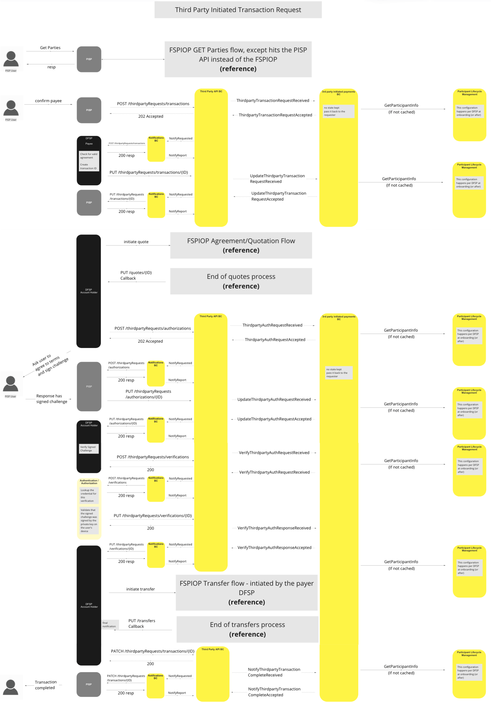
>UC Workflow Diagram: Third Party Initiated Transaction Request

### PISP Bulk Transaction Request

#### Description

The workflow provided by this UC enables the Switch to permit authorized PISP Users/Apps to issue a request to a DFSP to execute a number of bulk transactions on behalf of an Account Holder, typically the PISP User/App, in favor of a group of third-party recipients.  The transaction is vetted via a DFSP confirmation request sent to the Account Holder, and concluded upon successful receipt of confirmation.  The Switch, per DFSP instructions, manages the transaction and updates all accounts accordingly.

#### Flow Diagram

>UC Workflow Diagram: PISP Bulk Transaction Request

### Pay To A PISP - PISP As A Payee

#### Description

The workflow provided by this UC enables the Switch to permit authorized DFSP Users to initiate and execute payments in favor of PISPs as Payees via the Switch.  The workflow provides support for payments for both single or multiple PISP Payee/s.

#### Flow Diagram

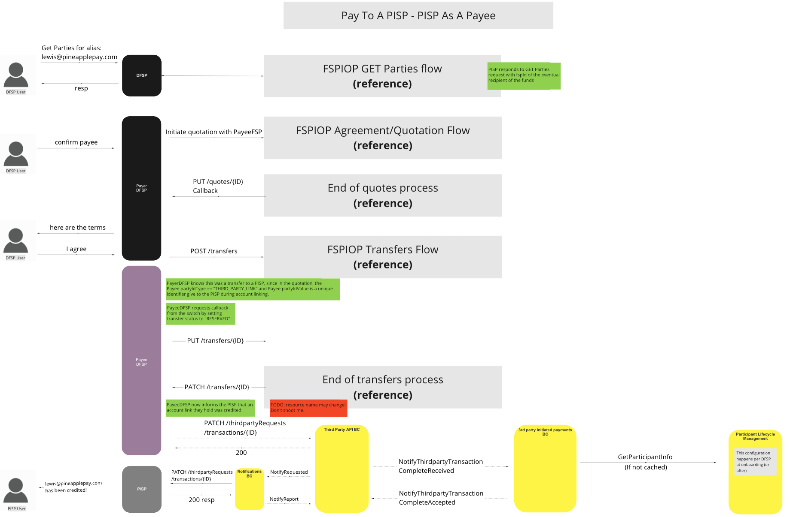
>UC Workflow Diagram: Pay To A PISP - PISP As Payee

### Third Party Transaction Request Failed - Bad Party Lookup

#### Description

The workflow provided by this UC enables the Switch to handle instances where an authorised PISP User initiates a transaction using an invalid Participant Identifier.  The Switch encounters the error during the Get Parties stage of the transaction preparation, and automatically terminates the request with notification sent to the request originating User indicating the failure and the reason.

#### Flow Diagram

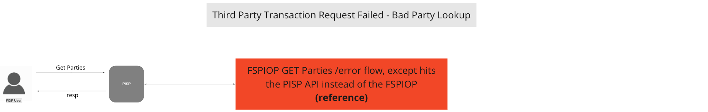
>UC Workflow Diagram: Third Party Transaction Request Failed - Bad Party Lookup

### Third Party Transaction Request Failed - Bad Transaction Request

#### Description

The workflow provided by this UC enables the Switch to handle instances where an authorised PISP User initiates a Third Party Transaction Request, correctly confirms the Payee details, but the Payee DFSP fails to locate a valid Agreement for the transaction.  The Switch rejects the request and sends notification to the request originating User indicating the failure and suggested follow-up actions.

#### Flow Diagram

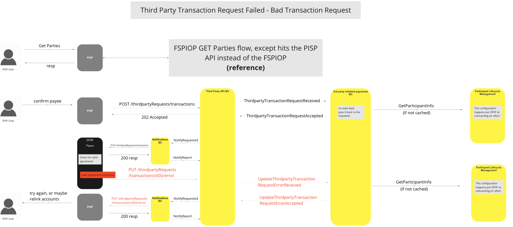
>UC Workflow Diagram: Third Party Transaction Request Failed - Bad Transaction Request

### Third Party Transaction Request Failed - Downstream FSPIOP Failure

#### Description
The workflow provided by this UC enables the Switch to handle instances where an authorized PISP User requests and confirms a transaction request, which when forwarded to the DFSP Account Holder fails for some reason during the quote process.  The Switch is alerted to the failure, and provides a notification to the PISP User via their PISP App/Process.

#### Flow Diagram

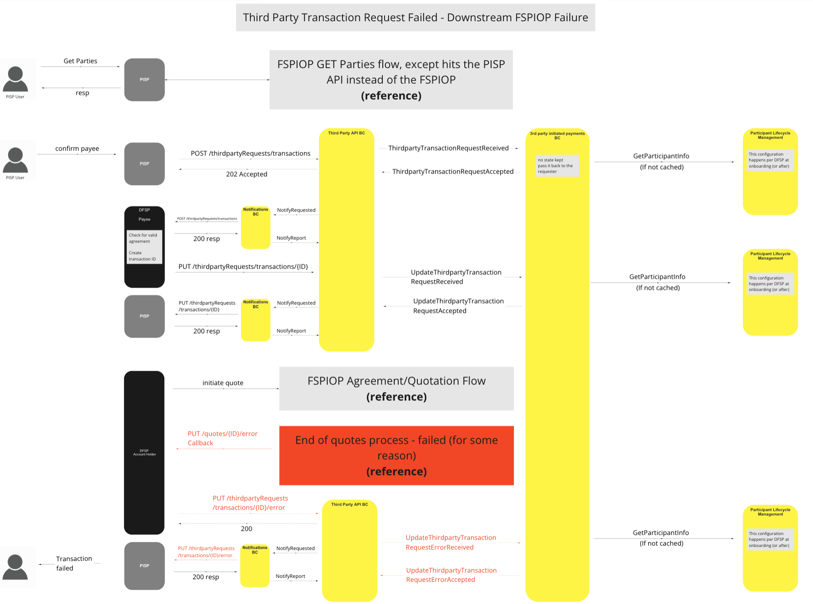
>UC Workflow Diagram: Third Party Transaction Request Failed - Downstream FSPIOP Failure

### Third Party Transaction Request Failed - Authorization Was Invalid

#### Description

The workflow provided by this UC enables the Switch to handle instances where a third-party transaction journey is initiated, then authorised by a PISP User on request from the DFSP Account Holder, and the Switch detects that the DFSP Challenge response received contained an invalid signature.  The Switch can then verify that the error has occurred and notify the DFSP Account Holder who in turn cancels the transaction and the notifies the PISP User via the Switch and their PISP profile holder.

#### Flow Diagram

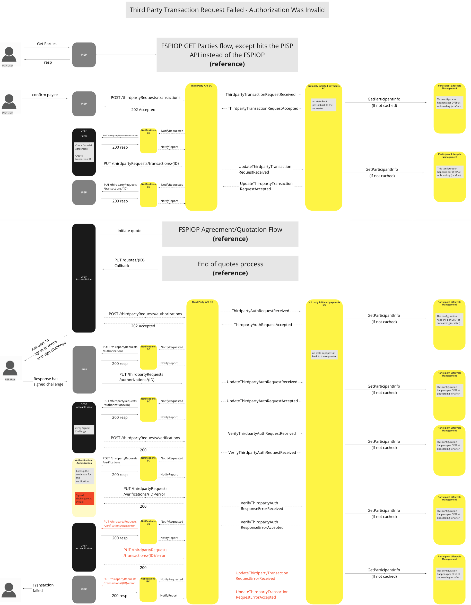
>UC Workflow Diagram: Third Party Transaction Request Failed - Authorization Was Invalid

### Third Party Transaction Request Rejected by user

#### Description

The workflow provided by this UC enables the Switch to handle instances where a PISP User initiates and confirms a transaction via their PISP, but then declines to complete it upon receipt of the DFSP Account Holder quotation acceptance and signature challenge.  Once the transaction is declined, the PISP notifies the DFSP Account Holder via the Switch, who proceeds to cancel the transaction and send a transaction cancellation confirmation notification to the originating PISP.

#### Flow Diagram

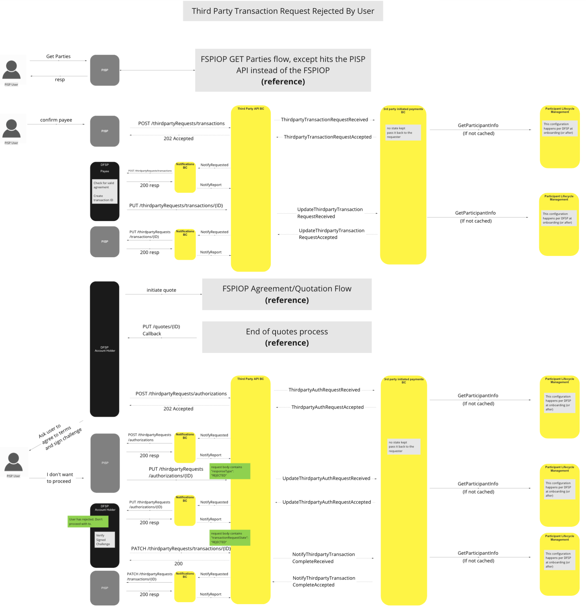
>UC Workflow Diagram: Third Party Transaction Request Rejected By User

### Third Party Transaction Request Failed - DFSP timeout

#### Description

The workflow provided by this UC enables the Switch to handle instances where a PISP User initiates and confirms a transaction via their PISP, but then fails to respond to the DFSP Account Holder quotation acceptance and signature challenge within a predetermined timeout period.  Once the timeout is exceeded, the PISP notifies the DFSP Account Holder via the Switch that the required response was not received, and the DFSP cancels the transaction, sending a notification to the PISP User advising them that their transaction request failed.

#### Flow Diagram

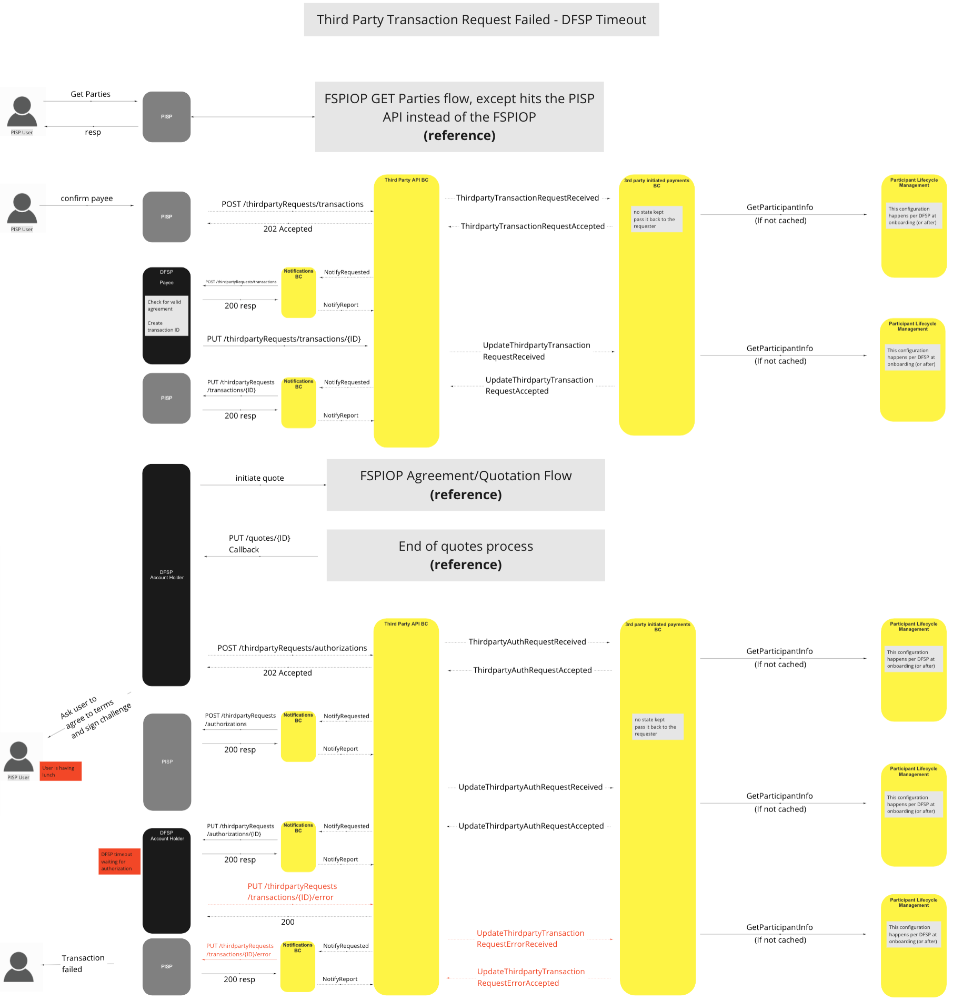
>UC Workflow Diagram: Third Party Transaction Request Failed - DFSP Timeout

<!-- Footnotes themselves at the bottom. -->
<!--## Notes

[^1]: Common Interfaces: [Mojaloop Common Interface List](../../commonInterfaces.md)
-->