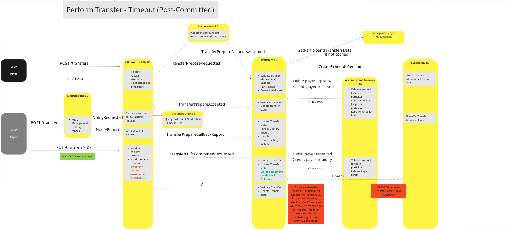

# Transfers BC

The Transfers BC is responsible for orchestrating transfer requests.  It works in concert with a number of other BCs, notably Settlements, Scheduling, Participant Lifecycle Management, Accounts & Balances, and the FSPIOP.

## Terms

The following terms are used in this BC, also known as a domain.

| Term | Description |
|---|---|
| **Accounts** | Refers to accounts used in all transfer activities.  They are used to record credit and debit positions, either temporarily in the case of accounts allocated for transfer purposes, or permanently in the case of final transfer updates to participant accounts. |
| **Participant/Actor** | Typically refers to DFSP Payer/Payee parties using Mojaloop. |
| **IGS** | Transfer settle method - Immediate Gross Settlement.  This process is typically used in high volume environments such as retail, and is used by individual and shared accounts.  In shared account environments, the system is capable of updating Participants balances by updating the proportional value of each Participants holds of the total funds available in the account |
| **DNS** | Transfer settlement method - Deferred Net Settlement. This process is frequently used in enviroments where a party of Participants engage in a single Transfer requiring settlement to all Participants. A typical example might include a scenario where raw materials are sold by Participant A to Participant B to manufacture into a finished product, which is then sold by Participant B back to Participant A. The switch calculates the proportional value that each Participant to the transaction is due, and settles this amount when the Settlement Window closes. |

## Functional Overview - Transfers - Bulk

>UC Workflow Diagram: Functional Overview - Transfers - Bulk

## Use Cases

### Perform Transfer (universal mode)

#### Description

The workflow provided by this UC enables the BC to effect a Transfer using a method that excludes Actor intervention.

#### Flow Diagram

>UC Workflow Diagram: Perform Transfer (Universal Mode)

### Perform Transfer with Payee Confirmation

#### Description

The workflow provided by this UC enables the BC to effect a Transfer using a method that includes Actor intervention.

#### Flow Diagram

>UC Workflow Diagram: Perform Transfer With Payee Confirmation

### Query (GET) Transfer

#### Description

The workflow provided by this UC enables the BC to effect a method by which a Participant status report Query can be completed.

#### Flow Diagram

>UC Flow Diagram: Query (GET) Transfer

### Perform Transfer - Duplicate POST (Resend)

#### Description

The workflow provided by this UC enables the BC to effect a method by which a Duplicate Transfer request is completed.

#### Flow Diagram

>UC Workflow Diagram: Perform Transfer - Duplicate POST (Resend)

### Perform Transfer - Duplicate POST (Ignore)

#### Description

The workflow provided by this UC enables the BC to effect a method through which to ignore a Duplicate Transfer request.

#### Flow Diagram

>UC Workflow Diagram: Perform Transfer - Duplicate POST (Ignore)

## Non-Happy Path Use Case Variations

### Perform Transfer - PayeeFSP Rejects Transfer

#### Description

The workflow provided by this UC enables the BC to effect a method through which a Transfer request rejected by the Payee is terminated.

#### Flow Diagram

>UC Workflow Diagram: Perform Transfer - PayeeFSP Rejects Transfer

### Perform Transfer - Timeout (Prepare)

#### Description

The workflow provided by this UC enables the BC to effect a method to terminate a Transfer Prepare request where a timeout threshold is exceeded.

#### Flow Diagram

>UC Workflow Diagram: Perform Transfer - Timeout (Prepare)

### Perform Transfer - Timeout (Pre-Committed)

#### Description

The workflow provided by this UC enables the BC to effect a method through which to terminate a Pre-Committed Transfer request where a timeout threshold is exceeded.

#### Flow Diagram

>UC Workflow Diagram: Perform Transfer - Timeout (Pre-Committed)

### Perform Transfer - Timeout (Post-Committed)

#### Description

The workflow provided by this UC enables the BC to effect a method through which to terminate a Post-Committed Transfer request where a timeout is exceeded.

#### Flow Diagram

>UC Workflow Diagram: Perform Transfer - Timeout (Post-Committed)

### Perform Transfer - Duplicate POST (None Matching)

#### Description

The workflow provided by this UC enables the BC to effect a method through which to terminate a Non-Matching Duplicate Transfer request where a timeout is exceeded.

#### Flow Diagram

>UC Workflow Diagram: Perform Transfer - Duplicate POST (None Matching)

### Perform Transfer - Payer FSP Insufficient Liquidity

#### Description

The workflow provided by this UC enables the BC to effect a method through which to terminate a Transfer request that is failed due to the Payer having insufficient liquidity to cover the transaction fully.

#### Flow Diagram

>UC Workflow Diagram: Perform Transfer - Payer FSP Insufficient Liquidity

### Perform Transfer - Transfer Prepare Validation Failure (Invalid Payer Participant)

#### Description

The workflow provided by this UC enables the BC to effect a method through which to terminate a Transfer Prepare request where the transaction validation is failed due to an invalid/non-existent Payer.

#### Flow Diagram

>UC Workflow Diagram: Perform Transfer - Transfer Prepare Validation Failure (Invalid Payer Participant)

### Perform Transfer - Transfer Prepare Validation Failure (Invalid Payee Participant)

#### Description

The workflow provided by this UC enables the BC to effect a method through which to terminate a Transfer Prepare request where the transaction validation is failed due to an invalid/non-existent Payee.

#### Flow Diagram

>UC Workflow Diagram: Perform Transfer - Transfer Prepare Validation Failure (Invalid Payee Participant)

### Query (GET) Transfer - Validation Failure (Invalid Payer Participant)

#### Description

The workflow provided by this UC enables the BC to effect a method through which to terminate a Transfer status query where validation fails due to an invalid/non-existent Payer.

<!--#### Flow Diagram

> UC Diagram TBC -->

### Query (GET) Transfer - Validation Failure (Invalid Payee Participant)

#### Description

The workflow provided by this UC enables the BC to effect a method through which to terminate a Transfer status query where validation fails due to an invalid/non-existent Payee.

<!--#### Flow Diagram

 
> UC Diagram TBC -->

### Query (GET) Transfer - Validation Failure (Transfer Identifier Not Found)

#### Description

The workflow provided by this UC enables the BC to effect a method through which to terminate a Transfer status query where validation fails due to a Transfer Identifier Token not being found.

<!--#### Flow Diagram

 
> UC Diagram TBC -->

## Canonical Model

Mojaloop uses two canonical models to manage funds transfers, one for non-bulk transfers, and one for bulk transfers.

### Standard Canonical Model

* Transfer
  * transferId
  * transferType
  * quoteld (optional)
  * settlementModelId
  * Participants
    * Payer
      * participantId
      * Accounts
        * Debit
          * accountId
          * accountType
          * currency
        * Credit
          * accountId
          * accountType
          * currency
    * Payee
      * ParticipantId
      * Accounts
        * Debit
          * accountId
          * accountType
          * currency
        * Credit
          * accountId
          * accountType
          * currency
  * Amount (Amount to transfer)
    * value (number)
    * currency (ISO currency code)
  * expiration (ISO dateTime)
  * ilpPacket
  * Extensions

### Bulk Canonical Model

* Transfers
  * bulkId
  * bulkQuoteId
  * Transfers[]
    * Transfer* (see above)

## Concluding Comments

* The Payer FSP should not be permitted to unilaterally time-out a transfer (irrespective of its expiration time), but should respect the Switch's timeout decisions.
* Validation of cryptographic conditions and fulfillment would be managed by the Transfers BC as it is a fundamental component of the "transfer" process (i.e.: function is not specific to the FSPIOP language)
* The Transfers BC will apply the same validation pattern as the Quoting & Party BC to validate Participants, to determine the ability of an Account to transact, or if a Participant is enabled as mutually exclusive.
* The Transfers BC is the single "source of truth" for all transfers, and is thus responsible for persisting the state/s of transfer's.
* Disabling Participants already in a "prepared" state should not hinder processing of current transfers, however new transfer instructions received by the Transfers BC via the TransferPrepareAccountAllocated events should be declined.

<!-- Footnotes themselves at the bottom. -->
<!--## Notes -->

[^1]: Common Interfaces: [Mojaloop Common Interface List](../../commonInterfaces.md)
