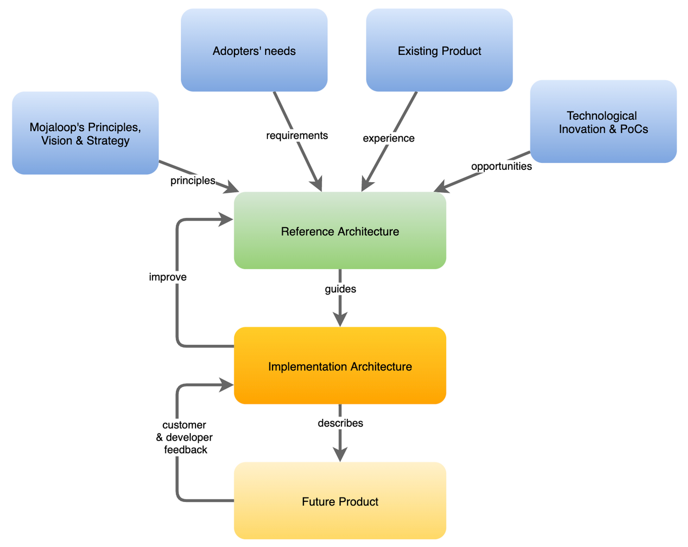

# Introduction

## What is a Reference Architecture?

In a software system, the Reference Architecture is a set of software design documents that capture the essence of the product and provide guidance to its technical evolution.

This concept can be further simplified:

_**The Reference Architecture is the architectural vision of the perfect design.**_

In normal conditions that perfect design is never achieved, partly because there is neither enough time nor resources to fully implement it, partly because that design can iterate and improve faster than it can be implemented.
It is the nature of a Reference Architecture to be a living document that is continuously updated and enhanced.

## What are the objectives of the Reference Architecture

The main objectives of the Reference Architecture are to:

* Identify abstractions, interfaces and standardization opportunities
* Propose solutions and patterns to common problems
* Help enforcing technical design principles
* Provide guidance to the implementation architectures
* Foster innovation and contribution, by defining what can be done and how

## What are the benefits of having a Reference Architecture

The first benefit is that it is the perfect foundation for a Technical Roadmap. By having the future vision in perspective, a phased Technical Roadmap can easily be created from it, ensuring resources and attention are focused on the long term value.

Another important benefit is the guidance it provides to decision-making regarding technology choices and implementation strategies.
With the Reference Architecture in mind we can frame any development decision as tactical or strategic:

* Tactical - something that is required right now which may have exceptions to the Reference Architecture for the sake of a high-value urgent requirement. These exceptions should be documented as technical debt which can be addressed in future.
* Strategic - something that is long-lasting and should be implemented in accordance to the Reference Architecture - should take the implementation closer to it.

Last but not less important, it ensures alignment between the technical vision and the more important product vision (see below regarding the process and ways of working).

## Process of creating and maintaining the Reference Architecture

While creating the initial version of the Reference Architecture, the team followed these steps:

1. Problem Space mapping - Document the different problem domains and subdomains, and how they are classified according to their importance
2. Solution Space Context mapping - Group similar problems together based on their purpose and context
3. Individual use case mapping - Discuss and document use cases in detail taking into consideration the entire solution

## How to keep a Reference Architecture up-to-date

The diagram below shows where a reference architecture exists in reference to other processes of the Mojaloop Platform; what it must incorporate and understand, not only the vision and the principles, but also the requirements, previous experience and even forster technical innovation.

> Introduction (Mojaloop 2.0 Reference Architecture): How to keep the Reference Architecture up to date

## Principles guiding this architecture

The Mojaloop 2.0 Reference Architecture design has been guided by Domain-Driven Design[^1] principles, and inspired by SOLID[^2] object-oriented programming principles for building software applications, especially the single responsibility principle (SRP).

To provide an understanding of the architecture interpretation by Mojaloop, we include a brief overview of Domain Driven Design architecture.

### DDD Inspired Architecture Overview

The DDD Inspired architecture implementation for Mojaloop includes the following concepts:

* **Problem Space** - Typically DDD-architecture recognises business requirements as belonging to separate domains.  For example an eCommerce system is seen as a **_Domain_**.  But an eCommerce system has several components in order to work such as an inventory, a shopping cart, checkout, etc.  Each component is categorised as a **_Subdomain_** that contributes value to the domain which is the eCommerce system.  Mojaloop uses a single domain - it is a switch.

  The Problem Space is one of two containers where all of the identified business problems (improvements/services) that need to be solved are contained.  Depending on the complexity of the Business Problem (improvement), or indeed the scale of problems needing to be solved, it is possible to devolve the initial subdomain structure into additional Subdomains.  Each problem is assigned to its own Subdomain.  Care should be exercised however, to ensure that each Subdomain is absolutely necessary, and focused on delivering value to the domain to avoid an unnecessary and confusing plethora of Subdomains filling the Problem Space.

  Each improvement/service thus contained in a separate Subdomain allows for different teams to develop manageable chunks of the system which is more efficient and less risk-prone than building an entire system in one structure.  A sizable benefit to this approach is that the entire development process can be centered around improving and adding value to the platform, and not just adding features.

  Typically, the Problem Space includes three containers which broadly indicate how, or what is going to be used to solve a particular problem, to which a fourth container has been added for Non-Functional Requirements (NFRs) -

  * Core - solutions dependent on internal builds for completion.
  * Supporting - solutions that can be implemented using off the shelf products - for example, secure login.
  * Generic - solutions that can use off the shelf products, but which need additional coding to implement, not just integration - for example, reporting and authentication
  * Non-functional Requirements (NFRs) - solutions that are required to address common needs, but that do not contribute directly to the value of the product

* **Solution Space** - A second major component of DDD-Architecture is the Solution Space.  It differs from the Problem-Space in that its focus is not on what to solve, but how a problem (improvement/service) is going to be solved, and how the multiple solutions relate to each other. The Solution Space thus necessarily includes more technical information and details for how the problems should be solved.
  
  * The Solution Space introduces a number of elements to aid and align problem-solving development efforts
  
  * Bounded Contexts were introduced to group cohesive sets of solutions with its specific language.

  Often mapping between Bounded Contexts and Subdomains will not be one-to-one.  As Subdomains belong to the Problem Space and Bounded Contexts to the Solution Space, it is quite possible that scenarios will occur where a Subdomain are solved by more than one Bounded Context, or where a Bounded Context may solve multiple Subdomains.

  Typically, and definitely in the Mojaloop environment, solutions are designed and implemented without knowledge of specific infrastructure dependencies or other inner workings of other Bounded Contexts.  This approach aids security, amongst other things by ensuring that each Bounded Context is only aware of its own environment, and its interfaces.  Communications between Bounded Contexts are all conducted via APIs and secured messaging.  Examples of Bounded Contexts (BCs) from the Mojaloop environment include Accounts \& Balances, Transfers \& Transactions, etc.

* **_Ubiquitous Language_** is an approach to encourage explicit, and commonly understood, language that everyone uses when describing problems and solutions, from end users to developers. There are two main objectives for a Ubiquitous Language:

  1. It ensures that unique terms are identified and understood to have a single meaning by all parties within its Bounded Context.  An example might include the word, “Account”, which could be understood as an Account Profile by one party, and a reference to an Accounting System Account by another. This is not a recommendation to search for an impossible, project or company-wide, universal set of unambiguous terms; instead it assures that each Bounded Context has its own set of terms.
  2. It ensures that the terms of the Ubiquitous Language are present from the user interface, to documentation, to other project related materials, and even in the code. The ubiquitous usage of the same terms everywhere, including in code, guarantees that everyone has the same understanding of the problems and solutions being described and solved.

* **_Cross Cutting Concerns_**[^3] are aspects of a software solution that must be solved by multiple Bounded Contexts (or functions/modules) and include items such as auditing, security, authentication, and platform (Business and Technical) configuration management. Our approach to these Cross Cutting Concerns, was to separate them from the BC's. Most Cross Cutting Concerns have a distributed nature in this design, with central components and client libraries. These are represented in this documentation as equivalent to Bounded Contexts.

### SOLID Principles

In addition to DDD-architecture, Mojaloop’s architecture approach has also been inspired by SOLID principles:

* Single responsibility and internal interfaces provide the ability to implement additional Domains, such as ISO, without needing to change the core architecture
* Software entities should be extended but never modified.  The rule is never hack core, always extend through add-on modules or nodes
* Functions using references to base classes should be able to use objects of derived classes without being aware of it
* Several client-specific interfaces are better than a single all-purpose interface
* Build dependencies on abstractions, not concretions

<!-- Footnotes themselves at the bottom. -->
### Notes

[^1]: Further reading: [Domain-driven design From Wikipedia, the free encyclopedia](https://en.wikipedia.org/wiki/Domain-driven_design)

[^2]: Further reading: [SOLID From WIkipedia, the free encyclopedia](https://en.wikipedia.org/wiki/SOLID)

[^3]: Further reading: [Cross-cutting Concern](https://en.wikipedia.org/wiki/Cross-cutting_concern#:~:text=Cross%2Dcutting%20concerns%20are%20parts,oriented%20programming%20or%20procedural%20programming.) - Publisher: Wikipedia, the free encyclopedia
