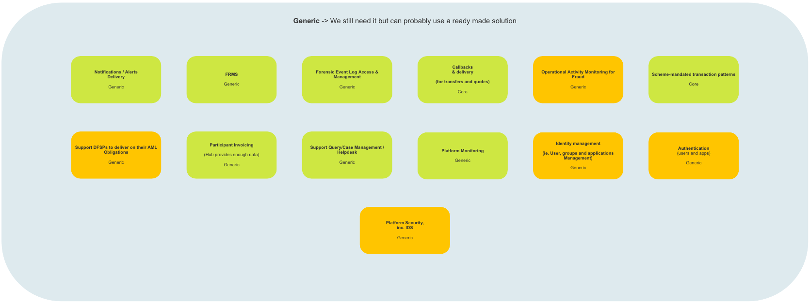

# Mojaloop Reference Architecture Overview

## Problem Space (_Problem space identification and map)_

As noted in the DDD-architecture overview, the Problem Space contains a number of solution-oriented containers identified by the system architects’ team which are being used to categorise subdomains where problems (improvements) have been identified.

### Core Problems

#### Description

A number of Core Problems (improvements) have been identified by (Business/Developers/Both Business & Developers).  In order to implement the improvements, “internal” development teams will be tasked with developing the required solutions.  Typically the Subdomains thus identified generate significant value for the Mojaloop system, therefore care is taken to ensure that the services they provide are not compromised.  Examples of Core Problem Subdomains include: Participant Lifecycle Management, Settlements, and Scheduling.

#### High-Level Map

> Reference Architecture (Mojaloop): Core Problems

### Generic Problems

#### Description

A number of Generic Problems (improvements) have been identified by (Business/Developers/Both Business & Developers).  In order to implement the improvements, off-the-shelf solutions will be implemented that require no further customization.  They will require integration with the Mojaloop.  Examples of Generic problem subdomains include Authentication, FRMS, and Platform Monitoring.

#### High-Level Map

> Reference Architecture (Mojaloop): Generic Problems

### Supporting Problems

#### Description

A number of Supporting Problems (improvements) have been identified by (Business/Developers/Both Business & Developers).  In order to implement the improvements, off-the-shelf solutions will be implemented, however in order to fully integrate them with the Mojaloop system and satisfy the identified problems (improvements) additional customization will be required for each of the integrated solutions.  Examples of Supporting Problem Subdomains include Access Policy Management, Reporting, and Authorization (Access Policy content verification).

#### High-Level Map

> Reference Architecture (Mojaloop): Supporting Problems

### Non-Functional Requirements

#### Description

A number of Non-Functional Requirements have been identified by (Business/Developers/Both Business & Developers).  Whilst they do not add direct value to Mojaloop, they are required in order to fulfil a number of business-related problems (improvements).  Examples of Non-Functional Requirements include security which does not occupy its own subdomain.  All system Subdomains will need to include elements of code pertaining to security in fulfillment of this requirement, alternatively, a central security management service will be implemented that includes centrally managed and constructed security profiles for each Subdomain in the system which they will download upon joining the Domain, or upon initiation, and/or which will be pushed down to them from the central service when updates occur.

#### High-Level Map

> Reference Architecture (Mojaloop): Non-Functional Requirements

### New and Unclassified (non-domain)

#### Description

A number of New and Unclassified (non-domain) problems have been identified by both Business and Developers).  Once Business and the System Architects have identified the required solution in order to solve the problem, they will be classified into one of the Problem containers and fulfilled in accordance with its processes.

#### High-Level Map

> Reference Architecture (Mojaloop): New and Unclassified Problems

## Solution Space (_High level description and the context map)_

#### Description

The Solution Space defined by DDD-architecture is focused on how the business problems (improvements) identified in the Problem Space are going to be solved.  As a result it necessarily contains more information and technical details than the Problem Space.  It includes elements such as Ubiquitous Language, Bounded Contexts, and Cross-Cutting Concerns.

#### High-Level Map

> Reference Architecture (Mojaloop): Solution Space

### Ubiquitous Language

#### Description

A challenge that most teams face is maintaining a clear understanding of terms that may not be unique with a particular Domain.  A classic example of a non-unique term is “account”: this term could refer to a set of financial accounts, entity profile, or a login name.

As noted in the overview, Ubiquitous Language is used to aid in the elimination of confusion and miscommunication between business and technical teams working to solve a business problem or group of business problems.  Whilst it is possible that that each Domain/Subdomain may contain terms that are not unique, as noted above, within a particular context, and in the instance of DDD-architecture, that would be a Bounded Context, it is important to ensure that all terms are unique, clearly understood by all participants, and correctly applied.

For insights and a description of each of the unique language terms used in the Mojaloop Domain, please refer to the [Glossary](../glossary/README.md) appended to this document.

### Bounded Contexts

The following Bounded Contexts have been identified and implemented in Mojaloop:

> This is a high-level description of each of the Bounded Contexts that have been identified and included in the Mojaloop Reference Architecture.  A more detailed view follows in the [Bounded Context](../boundedContexts/index.md) section of this document.

| Bounded Context            | Purpose                                                                                                                                                                         | Bounded Context                                       | Purpose                                                                                                                                                    |
| -------------------------- | ------------------------------------------------------------------------------------------------------------------------------------------------------------------------------- | ----------------------------------------------------- | ---------------------------------------------------------------------------------------------------------------------------------------------------------- |
| Settlements                | Performs Settlements  Configures settlement models  Calculate Settlements                                                                                               | Participant Lifecycle Management                      | Participant Onboarding  Participant Lifecycle Management  Participant Self-service  Participant Self-service UI                                |
| Account Lookup & Discovery | Internal Oracle core  Account lookup / discovery  Bulk transactions  Duplicate Identifier management  Inter-scheme connections (incl. settlements) cross-border | Accounts & Balances                                   | System of record of DFSP participant financial activity & balance                                                                                          |
| Transfers & Transactions   | Transfer processing  Liquidity check for each transfer  Bulk transactions  Multi-currency, incl.multi-hop transactions                                              | Agreement (Quoting)                                   | Agreement /quoting (core)  Bulk transactions  Multi-currency, incl.multi-hop transactions  Scheme Rule/Patterns Enforcement Happens in each BC |
| Scheduling                 | Scheduling time-based events of API calls (Core)                                                                                                                                | Notifications & Alerts                                | Notification state - priority & SLA aware (Core)  Trigger & alert management (Core)  Notifications delivery - priority and SLA aware (Generic)     |
| FSP Interop APIs           | ISO External API (Bulk; API, Callbacks triggering (transfers only, Missing in AS-IS)                                                                                            | Third Party Initiated Payments                        | PISP Account Linking  Consent Management  3rd Party Payment Initiation (Core)                                                                      |
| Third party API            |                                                                                                                                                                                 | PISP Mojaloop External API  PISP ISO External API |                                                                                                                                                            |

### Cross cutting concerns

The following Cross cutting concerns have been identified in Mojaloop:

| Cross Cutting Concern BC                 | Purpose                                                                                                                                                                                                                                                                                                                                                                                                                                   |
| ---------------------------------------- | ----------------------------------------------------------------------------------------------------------------------------------------------------------------------------------------------------------------------------------------------------------------------------------------------------------------------------------------------------------------------------------------------------------------------------------------- |
| AuthZ & AuthN and Identity Management BC | Manage all aspects of both user and system authentication (AuthN) and authorization (AuthZ). Planned solutions will fit into the Generic and Supporting categories                                                                                                                                                                                                                                                                        |
| Cryptographic BC                         | Manage all cryptographic related services including Key and Certificate Management and Storage Systems. Planned solutions will fit into the Generic category.                                                                                                                                                                                                                                                                             |
| Reporting and Auditing BC                | Manage all audit and reporting services including Compliance and Assurance Reporting, Forensic Event Logging and KMS, Forensic Event Log Access and Management, Process Monitoring and SLAs, and System Auditing. (Each BC will include auditing capability. The Reporting and Auditing BC will retain logs from all of the BCs). Planned solutions will fit into all of the Problem Space categories: Core, Supporting, and Generic.     |
| Platform Configuration (Business) BC     | Manage Scheme rule/patterns management process (Note; Scheme rule/patterns enforcement is maintained in each BC), Scheme mandated transaction patterns, application management and security, identity and access management (including user and team management), bizops API linking consent management, and access policy management. Planned solutions will fit into all of the Problem Space categories: Core, Supporting, and Generic |
| Technical Platform Management BC         | Manage platform monitoring, and platform management. Planned solutions will fit into the Generic category.                                                                                                                                                                                                                                                                                                                                |

<!-- Footnotes themselves at the bottom. -->
<!--### Notes

[^?]: Note goes here - "?" denotes a Footnote Reference-->