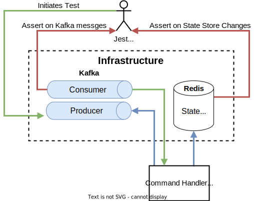
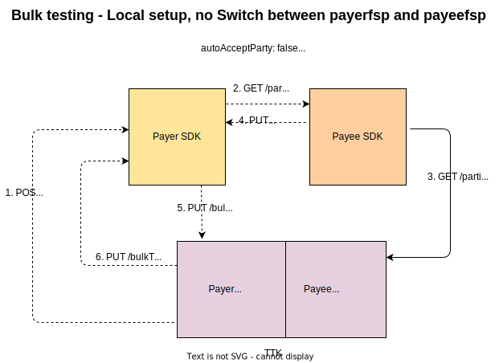

# SDK Support for Bulk Transfers - Tests
## Test Strategy
The quality of the delivered solution is as good a the quality of the tests and testing strategy adopbted. The distributed nature of this event sourcing solution affected the testing strategy chosen. Multiple types of test were created, each supporting the others and designed to pick bugs as quickly as possible.

The Command event handler and the domain event handler have both unit tests and narrow integration tests as the base testing. The FSPIOP API and backend API components have only unit tests.
Great emphasis was put on the functional tests which then tested the four components working together in both happy and unhappy path scenarios.

### Narrow integration tests
These tests are written in jest and assert for example the updated state store and produced events based on a command event generated.

**Command Handler Integration Test Harness**

### The functional test testharness
The functional test makes use of the TTK which simulates both the Payer and the Payee DFSP backends. 

:::tip Note
This test harness tests both the Payer SDK and the Payee SDK.
:::

:::tip Note
These test can be run on the local checked out monorepo, and are run in the CI pipeline, and are included in the helm as helm tests used to confirm deployment.
:::

## Payer DFSP Integration Test Matrix

|Test Cases|C1|C2|C3|C4|C5|C6|C7|C8|C9|C10|C11|C12|
|---|---|---|---|---|---|---|---|---|---|---|---|---|
|INT D-1||||x|||||||||
|INT D-2||x|||||||||||
|INT D-3||x|||||||||||
|INT D-4|x||||||||||||
|INT D-5|||x||||||||||
|INT D-6|||x||||||||||
|INT A-1||||||x|||||||
|INT A-2|||||x||||||||
|INT T-1|||||||||||x||
|INT T-2||||||||||x|||
|INT T-3|||||||||x||||
|INT T-4|||||||||||x||
|INT T-5|||||||x||||||
|INT T-6||||||||||||x|

## Payer DFSP Functional Test Matrix

|Test Cases|B1|B2|B3|B4|B5|F1|F2|F3|F4|F5|F6|F7|F8|F9|D1|D2|D3|D4|D5|D6|D7|D8|D9|D10|D11|D12|D13|D14|D15|D16|D17|D18|D19|D20|C1|C2|C3|C4|C5|C6|C7|C8|C9|C10|C11|C12|
|---|---|---|---|---|---|---|---|---|---|---|---|---|---|---|---|---|---|---|---|---|---|---|---|---|---|---|---|---|---|---|---|---|---|---|---|---|---|---|---|---|---|---|---|---|---|---|
|FUNC 1|x|x|x|x|x|x|x||x|x||x|x||x|x|x|x|x|x|x|x|x|x|x|x|x|||x|x|x|x|x|x|x|x|x|x|x|x||x|x|x|x
|FUNC 2|x|x||||x||x|||||||x|x|x|x|x||||||||||||||||x|x|x|||||||||
|FUNC 3|x|x||||x||x|||||||x|x|x|x|x||||||||||||||||x|x|x|||||||||
|FUNC 4|x|x||||x||x|||||||x|x|x|x|x||||||||||||||||x|x|x|||||||||
|FUNC 5|x|x||||x||x|||||||x|x|x|x|x||||||||||||||||x|x|x|||||||||
|FUNC 6|x|x||||x||x|||||||x|x|x|x|x||||||||||||||||x|x|x|||||||||
|TC-BQ1|x|x|x|||x|x||x||x||||x|x|x|x|x|x|x|x|x|x|||||||||||x|x|x|x|x|x|||||x|x
|TC-BQ2|x|x|x|||x|x||x|x|||||x|x|x|x|x|x|x|x|x|x|||||||||||x|x|x|x|x|x|||||x|x
|TC-BQ3|x|x|x|||x|x||x|x|||||x|x|x|x|x|x|x|x|x|x|x||||||||||x|x|x|x|x|x||||||
|TC-BQ4|x|x|x|||x|x||x|x|||||x|x|x|x|x|x|x|x|x|x|x||||||||||x|x|x|x|x|x||||||
|TC-BQ5|x|x|x|||x|x||x|x|||||x|x|x|x|x|x|x|x|x|x|x||||||||||x|x|x|x|x|x||||||
|TC-BQ6|x|x|x|||x|x||x|x|||||x|x|x|x|x|x|x|x|x|x|x||||||||||x|x|x|x|x|x||||||
|TC-BQ7|x|x|x|||x|x||x|x|||||x|x|x|x|x|x|x|x|x|x|x||||||||||x|x|x|x|x|x||||||
|TC-BQ8|x|x|x|||x|x||x|x|||||x|x|x|x|x|x|x|x|x|x|x||||||||||x|x|x|x|x|x||||||
|TC-BQ9|x|x|x|||x|x||x|x|x||||x|x|x|x|x|x|x|x|x|x|x||||||||||x|x|x|x|x|x||||||
|TC-BQ10|x|x|x|||x|x||x||x||||x|x|x|x|x|x|x|x|x|x|||||||||||x|x|x|x|x|x|||||x|x|
|TC-BQ11|x|x|x|||x|x||x|x|||||x|x|x|x|x|x|x|x|x|x|x||||||||||x|x|x|x|x|x|||||||
|TC-BQ13|x|x|x|||x|x||x|x|||||x|x|x|x|x|x|x|x|x|x|x||||||||||x|x|x|x|x|x|||||||
|TC-BT1|x|x|x|x|x|x|x||x|x||x||x|x|x|x|x|x|x|x|x|x|x|x|x|x|||x|x||||x|x|x|x|x|x|x||x|x|x|x|
|TC-BT2|x|x|x|x|x|x|x||x|x||x||x|x|x|x|x|x|x|x|x|x|x|x|x|x|||x|x||||x|x|x|x|x|x|x||x|x|x|x|
|TC-BT3|x|x|x|x|x|x|x||x|x|x|x||x|x|x|x|x|x|x|x|x|x|x|x|x|x|||x|x||||x|x|x|x|x|x|x||x|x|x|x|
|TC-BT4|x|x|x|x|x|x|x||x|x|x|x||x|x|x|x|x|x|x|x|x|x|x|x|x|x|||x|x||||x|x|x|x|x|x|x||x|x|x|x|
|TC-BT5|x|x|x|x|x|x|x||x|x||x||x|x|x|x|x|x|x|x|x|x|x|x|x|x|||x|x||||x|x|x|x|x|x|x||x|x|x|x|
|TC-BT6|x|x|x|x|x|x|x||x|x||x||x|x|x|x|x|x|x|x|x|x|x|x|x|x|||x|x||||x|x|x|x|x|x|x||x|x|x|x|
|TC-BT7|x|x|x|x|x|x|x||x|x||x||x|x|x|x|x|x|x|x|x|x|x|x|x|x|||x|x||||x|x|x|x|x|x|x||x|x|x|x|
|TC-BT8|x|x|x|x|x|x|x||x|x||x||x|x|x|x|x|x|x|x|x|x|x|x|x|x|||x|x||||x|x|x|x|x|x|x||x|x|x|x|

## Payer DFSP Features reference
|#|Outbound Features|Detail|
|---|---|---|
|B1|Backend API|POST /bulkTransactions SDKBulkRequest|
|B2|Backend API|Event SDKOutboundBulkAcceptPartyInfoRequested|
|B3|Backend API|PUT /bulkTransactions/{bulkTransactionId} Accept Party|
|B4|Backend API|PUT /bulkTransactions/{bulkTransactionId} Accept Quote|
|B5|Backend API|PUT /bulkTransactions/{bulkTransactionId} Results|
|F1|FSPIOP API|GET /parties|
|F2|FSPIOP API|PUT /parties/{Type}/{ID}|
|F3|FSPIOP API|PUT /parties/{Type}/{ID}/error|
|F4|FSPIOP API|POST /bulkQuotes|
|F5|FSPIOP API|PUT /bulkQuotes/{ID}|
|F6|FSPIOP API|PUT /bulkQuotes/{ID}/error|
|F7|FSPIOP API|POST /bulkTransfers|
|F8|FSPIOP API|PUT /bulkTransfers/{ID}|
|F9|FSPIOP API|PUT /bulkTransfers/{ID}/error|
|D1|Domain Event Handler|SDKOutboundBulkRequestReceived|
|D2|Domain Event Handler|SDKOutboundBulkPartyInfoRequested|
|D3|Domain Event Handler|PartyInfoCallbackReceived|
|D4|Domain Event Handler|PartyInfoCallbackProcessed|
|D5|Domain Event Handler|SDKOutboundBulkPartyInfoRequestProcessed|
|D6|Domain Event Handler|SDKOutboundBulkAcceptPartyInfoReceived|
|D7|Domain Event Handler|SDKOutboundBulkAutoAcceptPartyInfoRequested|
|D8|Domain Event Handler|SDKOutboundBulkAcceptPartyInfoProcessed|
|D9|Domain Event Handler|BulkQuotesCallbackReceived|
|D10|Domain Event Handler|BulkQuotesCallbackProcessed|
|D11|Domain Event Handler|SDKOutboundBulkQuotesRequestProcessed|
|D12|Domain Event Handler|SDKOutboundBulkAcceptQuoteReceived|
|D13|Domain Event Handler|SDKOutboundBulkAcceptQuoteProcessed|
|D14|Domain Event Handler|SDKOutboundBulkAutoAcceptQuoteRequested|
|D15|Domain Event Handler|SDKOutboundBulkAutoAcceptQuoteProcessed|
|D16|Domain Event Handler|BulkTransfersCallbackReceived|
|D17|Domain Event Handler|BulkTransfersCallbackProcessed|
|D18|Domain Event Handler|SDKOutboundBulkTransfersRequestProcessed|
|D19|Domain Event Handler|SDKOutboundBulkResponseSent|
|D20|Domain Event Handler|SDKOutboundBulkResponseSentProcessed|
|C1|Command Event Handler|ProcessSDKOutboundBulkRequest|
|C2|Command Event Handler|ProcessSDKOutboundBulkPartyInfoRequest|
|C3|Command Event Handler|ProcessPartyInfoCallback|
|C4|Command Event Handler|ProcessSDKOutboundBulkAcceptPartyInfo|
|C5|Command Event Handler|ProcessSDKOutboundBulkQuotesRequest|
|C6|Command Event Handler|ProcessBulkQuotesCallback|
|C7|Command Event Handler|ProcessSDKOutboundBulkAcceptQuote|
|C8|Command Event Handler|ProcessSDKOutboundBulkAutoAcceptQuote|
|C9|Command Event Handler|ProcessSDKOutboundBulkTransfersRequest|
|C10|Command Event Handler|ProcessBulkTransfersCallback|
|C11|Command Event Handler|PrepareSDKOutboundBulkResponse|
|C12|Command Event Handler|ProcessSDKOutboundBulkResponseSent|

## Test Cases reference

|Group|# test case|Test Type|Status|Detail|
|--- |--- |--- |--- |--- |
|**Happy Path:** (bulk-happy-path.json)|||||
|- 1 transfer with acceptParty and acceptQuote set to true|||||
||Func 1|Functional|Pass|Bulk transaction having a format error|
|**Parties Errors:** (bulk-parties-error-cases.json)|||||
|- 1 transfer in the request|||||
||Func 2|Functional|Pass|Receiver sends error for in parties response|
||Func 3|Functional|Pass|Senderfsp sends acceptParty: false|
|- 2 transfers in the request|||||
||Func 4|Functional|Pass|Receiver sends an error response for one of the transfers|
||Func 5|Functional|Pass|Receiver times out sending response for one of the transfers|
||Func 6|Functional|Pass|Do not get any response from the receiver for both the transfers|
|**Quotes Errors:** (bulk-quotes-error-cases.json)|||||
|- 2 transfers having the same receiver fsp id |||||
|- acceptParty for all transfers|||||
||TC-BQ1|Functional|Pass|Receiver fsp fails the entire batch - current state in the final PUT is not correct - no bug|
||TC-BQ2|Functional|Pass|Receiver fsp times out the entire batch - current state in the final PUT is not correct - response not coming in TTK.s|
||TC-BQ3|Functional|Pass|Receiver fsp sends only one response and skips the other|
||TC-BQ4|Functional|Pass|Receiver fsp sends one success response and one failure response|
|- acceptParty varying|||||
||TC-BQ5|Functional|Pass|One true, one false|
||TC-BQ6|Functional|FAIL|getting 2 PUT callbacks instead of 1 - final state should be AGREEMENT_COMPLETED, but not getting any PUT response back - missing implementation - #2982 all other asserts passing|
||TC-BQ7|Functional|Pass|True is sent only for one quote in PUT /bulkTxn acceptParty, ignoring second one - PASS|
||TC-BQ8|Functional|FAIL|false is sent only for one quote in PUT /bulkTxn acceptParty, ignoring second one - FAIL -[ need to add a story on validation in CC of the no.of request vs response tranfers.]|
|- 2 transfers having different receiver fsp ids - acceptParty for all transfers|||||
||TC-BQ9|Functional|FAIL|One batch sends an error - FAIL - getting details of only success transfers but not failures in PUT callbacks|
||TC-BQ10|Functional|Pass|Both batches sends error|
||TC-BQ11|Functional|FAIL|One batch times out - FAIL - no final PUT response|
|- 3 transfers with 2 transfers having 1 receiver fsp id and the other having a different one|||||
||TC-BQ13|Functional||- The batch with 2 transfers sends only 1 transfer response and the other batch sends the success response|
|**Transfers Errors:** (bulk-transfer-errors.json)|||||
|- One bulkTransfer with 2 transfers |||||
|- acceptQuote for all transfers|||||
||TC-BT1|Functional|Pass|Receiver fails the entire batch - Bug 2972. Also TTK rule for bulkQuotes not working as expected|
||TC-BT2|Functional|Pass|Receiver times out for the entire batch|
||TC-BT3|Functional|FAIL|Receiver fsp sends only one response and skips the other|
||TC-BT4|Functional|Pass|Receiver fsp sends one success response and one failure  - Bug 2974 Also TTK rule for bulkQuotes not working as expected|
|- acceptQuote varying|||||
||TC-BT5|Functional|FAIL|One true one false - TC2 - Bug 2958|
||TC-BT6|Functional|FAIL|All false - TC1|
||TC-BT7|Functional|Pass|True is sent only for one transfer in PUT /bulkTxn acceptParty, ignoring second one - working (if we can't send a different num than the no.of transfers in the POST, this is not a valid test case until we have the validation failure implemented)|
||TC-BT8|Functional|FAIL|false is sent only for one transfer in PUT /bulkTxn acceptParty, ignoring second one  (if we can't send a different num than the no.of transfers in the POST, this is not a valid test case until we have the validation failure implemented)|
