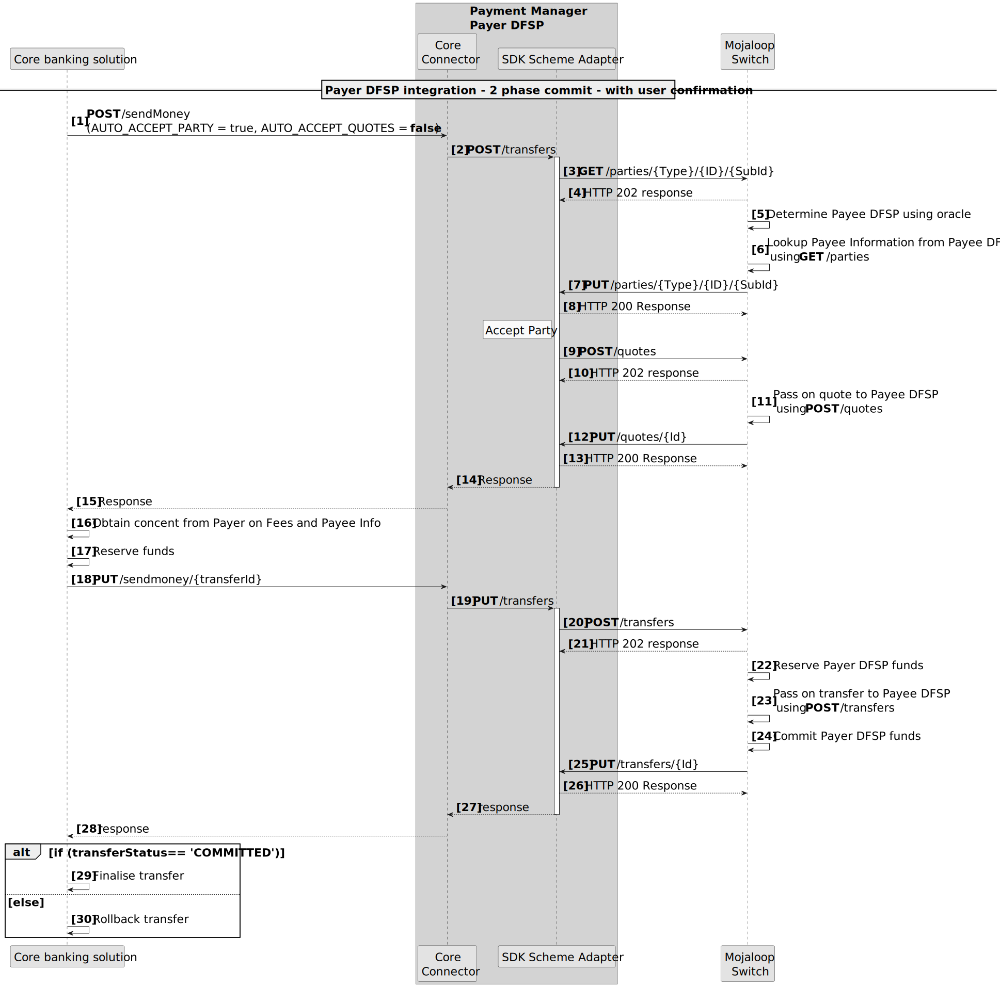
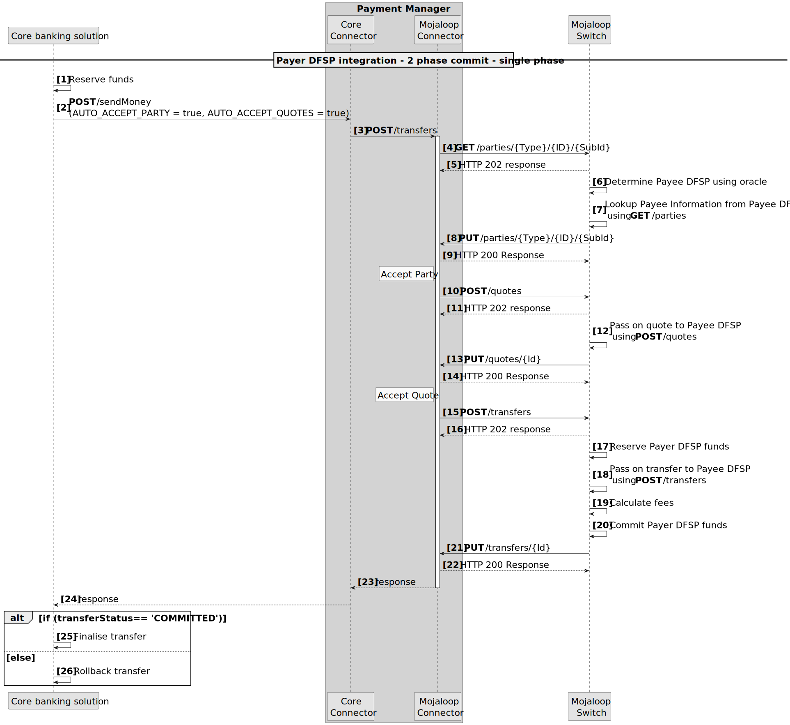
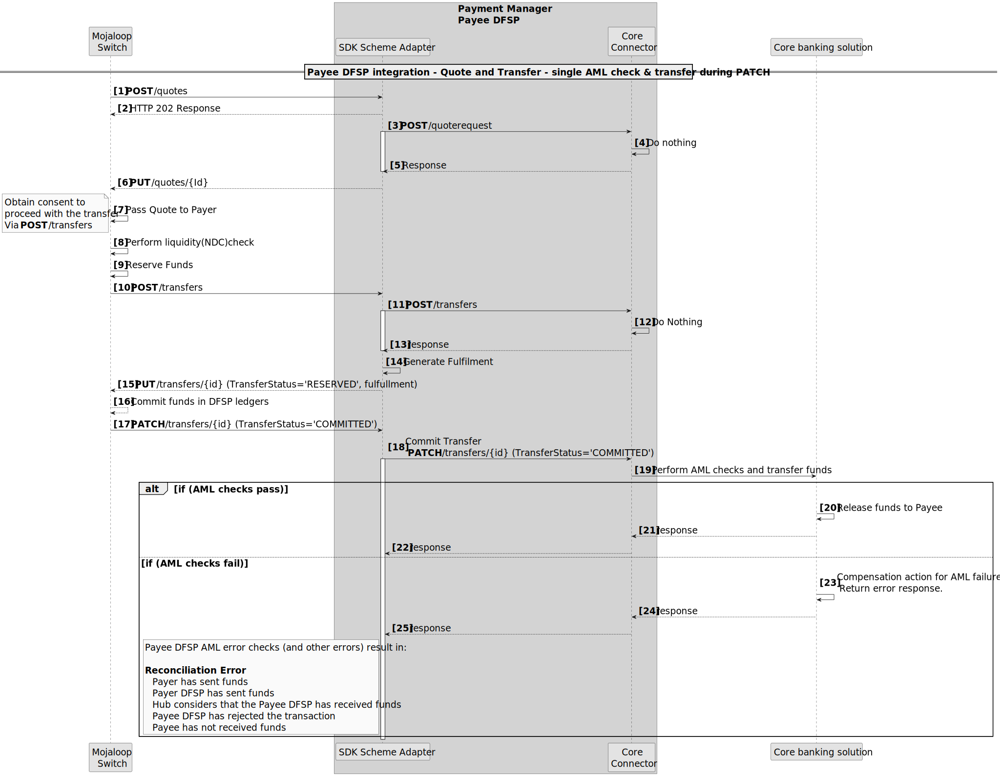
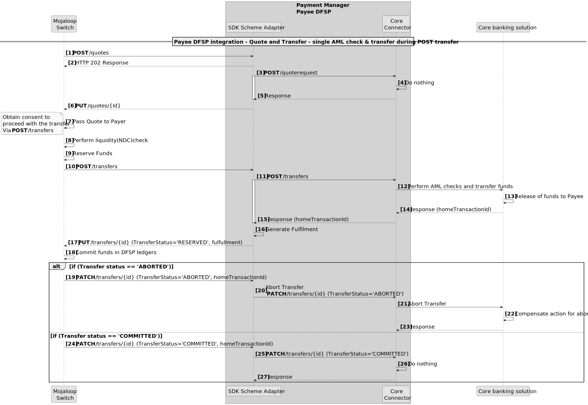

# Integrating Core Banking Systems to Mojaloop Patterns

When integrating core banking system into a modern, real-time, push based transaction flow can come with some challenges. These are largely based on what vendor provided integration API's are on offer. This documents discusses what an ideal integration should look like, some of the typical limitations seen in vendor API's, and flow patterns that are used to overcome some of these limitations and a discussion on the risks.

## Payer DFSP Integration Patterns

There are three patterns that can be used when building the Payer DFSP integrations
1. **Three phase** transfer integration. This aligns with the three Mojaloop transaction phases. I.e. Discovery, Agreement and Transfer.
1. **Two phase** integration. This pattern is described in detail in the sequence diagram below. It involves combining the Discovery and Agreement phases; as the first phase; the results are presented to the Payer for confirmation; following which the Transfer phase is executed as the second phase.

1. **Single phase** integrations. This pattern is described in detail in the sequence diagram below. Here all three phases are combined to produce a single synchronous transfer call.

::: tip 2-Phased Commit
All Payer DFSP Integration Patterns support a 2 phased (reservation and commit phase) commit.
:::

## Payee DFSP ideal integration pattern
Ideally a vendor's API's will provide the following.
1. To be able to perform AML checks ahead of and independent of the transfer.
1. To be able to calculate the fees of a transfer ahead of and independent of the transfer.
1. To be able to perform the transfer in two phases. I.e. A reserve phase, and then a committing phase.

If these are available in the Vendor's API, then an ideal integration can be built that reduces  reconciliation errors when unexpected errors occur, and has the lowest risk to the DFSP.

### Ideal Payee Integration Flow Pattern

Here the AML checks and fees are calculated in the Agreement Phase, and the transfer phase is performed in two phases namely a reserved and commit phase.

::: warning Common limitation
A common limitation in Vendor API's is that all these functions are combined into a single phase single API call to make a transfer.
:::

## Vendor API only supports Single API call
If the Core Banking Systems only support a single API call to perform all transfer related checks and phases, there there are two patterns that should be considered.
1. Call Transfer on the Patch Notification

A failure at anytime after the PATCH notification **[Step 17]** will result in a reconciliation error. This can be catered for by building in recompensation methods. E.g. initiate a refund transfer if an error occurs after step 17.
1. Call Transfer in the Transfer phase.

This pattern is usually not recommended as aborting a transfer is not normally possible. If the transfer is against an internal account e.g. for a loan repayment, then this pattern becomes favorable.
