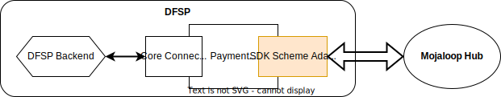
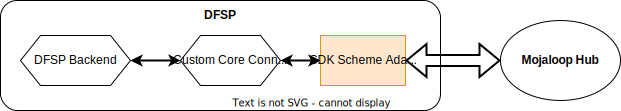
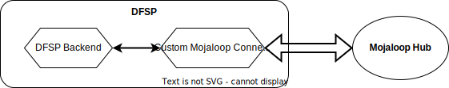

# SDK Scheme Adapter
A scheme adapter is a service that interfaces between a Mojaloop API compliant switch and a DFSP backend platform that does not natively implement the Mojaloop API.

The API between the scheme adapter and the DFSP backend is synchronous HTTP while the interface between the scheme adapter and the switch is native Mojaloop API. There is one exception to this, and that is the bulk integrations that can be configured to either be synchronous or asynchronous.

The SDK-Scheme-Adapter is supported by the Mojaloop Community, and is regarded as a reference for the best practice method for a DFSP to connect to a Mojaloop API. More commonly the SDK-Scheme-Adapter is used and deployed directly into the solution. Below is a summary of the different ways in which this can be done.

## SDK Adoption Models
Depending on the Scheme Rules, there are four common modes in which DFSPs interact with the central Mojaloop Hub. This summary highlights the role that the SDK-Scheme-Adpater plays in each of the modes and provides a brief overview of each mode and highlights how the DFSPs benefit.

### 1. DFSP using third party solution e.g. Payment Manager that makes use of the SDK Scheme Adapter 

There are a number of third party solutions that provide support, tooling and integrations into backend systems that makes use of the SDK-Scheme-Adapter in order to provide support for synchronous integration (using the Mojaloop best practice means) to connect to the Mojaloop API.

Payment Manager an open sourced* tool is an example of this. Payment manager provides additional benefits to this, more information can be found [here](https://rtplex.io/). Payment Manager deployments can be either Saas or self hosted.

- SDK Scheme Adapter is used directly in their custom integration implementation.
- As the SDK-Scheme-Adapter is maintained by the community, this tool provides an upgrade path for using new Mojaloop API versions.
- Standardised solution for rapid onboarding
- Core Connector developed jointly with System Integrators or Banking Software Vendors
- Payment Manager UX has supporting Bussiness Operations and Security Onboarding and Maintenance automation

:::tip Open Source Components
These are all Apache License v2.0. This was especially chosen as it would not violate many organizations' policies. Apache License v2.0 has no “copy-left” constraints, so adopters can customize elements, such as core connectors without having to share those private details back to the community.  
:::

### 2. DFSP using their own Core Connector with SDK Scheme Adapter

In this case the DFSP chooses to develop a custom Core Connector between their back-end and the Mojaloop SDK Scheme Adaptor. They are able to use the open source guidelines to develop the Core Connector .

- SDK Scheme Adapter is used directly in their custom integration implementation.
- As the SDK-Scheme-Adapter is maintained by the community, this tool provides an upgrade path for using new Mojaloop API versions.
- Developed using the Open source Core Connector guidelines
- Mojaloop Community Support
- Operated by DFSPs Technical Operations

### 3. DFPS Own built Mojaloop Connection Solution

There is no standard Connection used and the DFSP chooses to develop their own connection to the Mojaloop Hub.

- Developed using Open Source design documentation
- Mojaloop Community Support
- Operated by DFSP Tech Ops
- SDK Scheme Adapter is possibly used as a reference
- This implementation directly interacts with Mojaloop's asynchronous APIs

