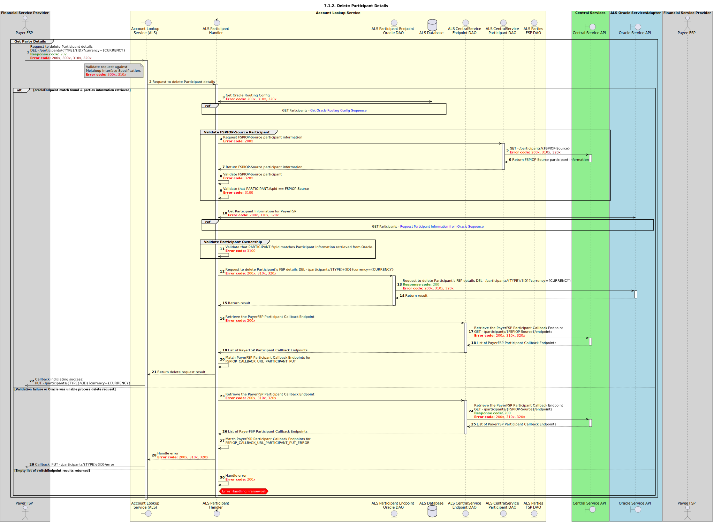

# DEL Participants

Design for the deletion of a Participant by a DFSP.

## Notes
- Reference section 6.2.2.4 - Note: The ALS should verify that it is the Party’s current FSP that is deleting the FSP information. ~ This has been addressed in the design by insuring that the Party currently belongs to the FSPs requesting the deletion of the record. Any other validations are out of scope for the Switch and should be addressed at the schema level.

## Sequence Diagram

