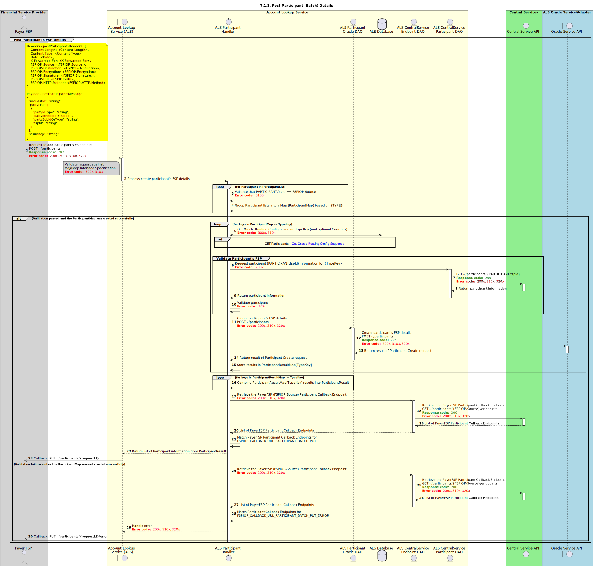

# Sequence Diagram for POST Participants (Batch)

Design for the creation of a Participant by a DFSP via a batch request.

## Notes
- Operation only supports requests which contain:
    - All Participant's FSPs match the FSPIOP-Source7
    - All Participant's will be of the same Currency, per the `POST /participants` call in the [Mojaloop FSPIOP API](/api/fspiop/v1.1/api-definition.html#post-participants)  
- Duplicate POST Requests with matching TYPE and optional CURRENCY will be considered an __update__ operation. The existing record must be completely **replaced** in its entirety. 

## Sequence Diagram

