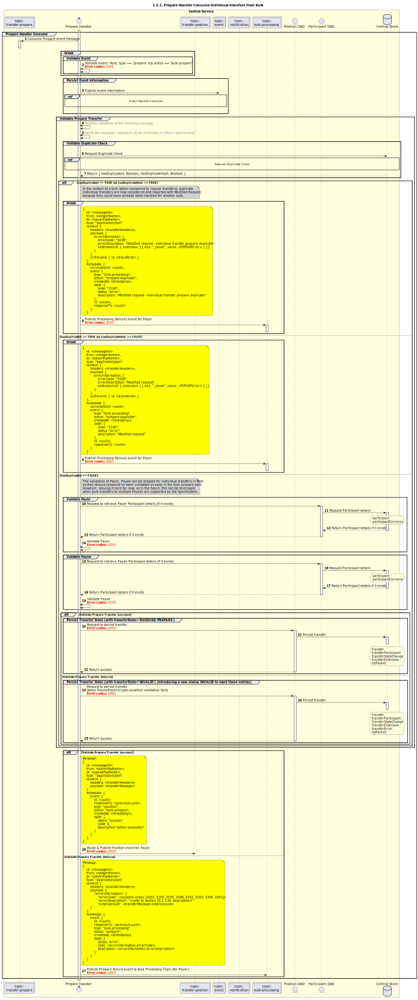

# Prepare handler consume [that includes individual transfers in a bulk]

Sequence design diagram for Prepare Handler Consume process

## References within Sequence Diagram

* [Event Handler Consume (9.1.0)](../../central-event-processor/9.1.0-event-handler-placeholder.md)

## Sequence Diagram

