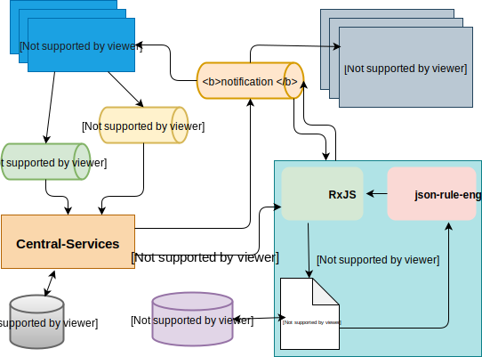

# Central Event Processor Service

The Central Event Processor (CEP) service provides the capability to monitor for a pre-defined/configured set of business rules or patterns.

In the current iteration, the rules are set to monitor for three criteria:

  1. Breaching of a threshold on the Limit of Net Debit Cap (which may be set as part of on-boarding),
  2. Adjustment of the limit - Net Debit Cap,
  3. Adjust of position based on a Settlement.

The CEP can then be integrated with a notifier service, to send out notifications or alerts. In this instance, it integrates with the email-notifier to send out alerts based on the aforementioned criteria.

