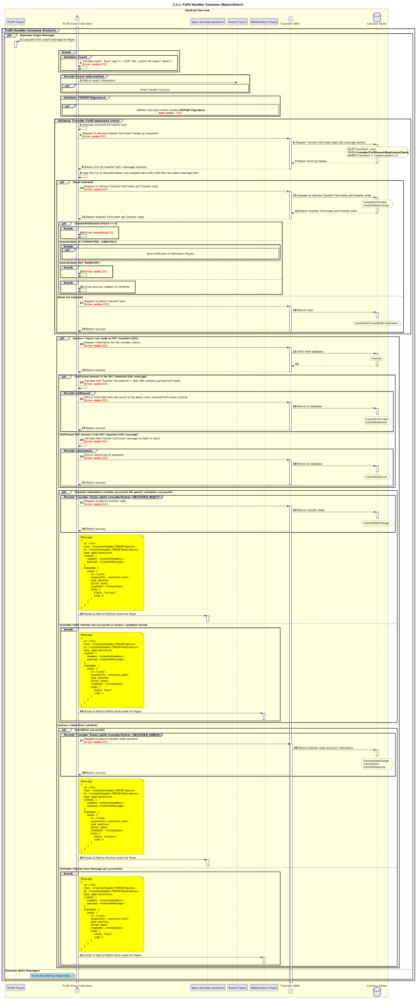

# Fulfil Handler Consume (Reject/Abort)

Sequence design diagram for the Fulfil Handler Consume Reject/Abort process.

## References within Sequence Diagram

* [Event Handler Consume (9.1.0)](../../central-event-processor/9.1.0-event-handler-placeholder.md)
* [seq-signature-validation](../../central-event-processor/signature-validation.md)
* [Send Notification to Participant (1.1.4.a)](1.1.4.a-send-notification-to-participant.md)

## Sequence Diagram

