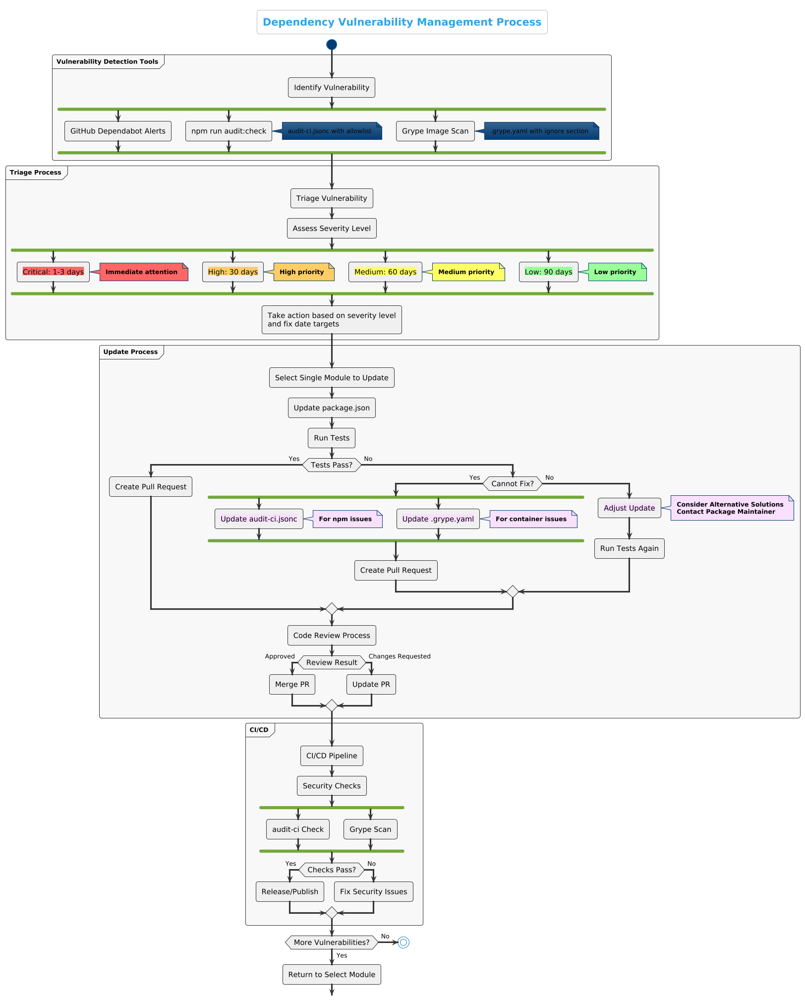

# Mojaloop Dependency Vulnerability Management Guide

This guide outlines the process for managing security vulnerabilities in dependencies of Mojaloop organization GitHub repositories.

## Table of Contents

- [Executive Summary](#executive-summary)
- [Overview](#overview)
- [Quickstart Guide](#quickstart-guide)
- [Detailed Guide](#detailed-guide)
  - [1. Understanding what is a Vulnerability and where to find them](#1-understanding-what-is-a-vulnerability-and-where-to-find-them)
  - [2. ProcessFlow for Handling Dependency Vulnerability Updates](#2-processflow-for-handling-dependency-vulnerability-updates)
  - [3. Practical Guide to package.json Updates](#3-practical-guide-to-packagejson-updates)
  - [4. Code Review Best Practices for Security PRs](#4-code-review-best-practices-for-security-prs)
  - [5. Developer Onboarding and Dependency Vulnerability Management Education](#5-developer-onboarding-and-dependency-vulnerability-management-education)
  - [6. Continuous Improvement](#6-continuous-improvement)
  - [7. Conclusion](#7-conclusion)
- [Tools and Resources](#tools-and-resources)
- [Related Documentation](#related-documentation)

## Executive Summary

This guide provides a structured approach for handling security vulnerabilities in dependencies of Mojaloop repositories. It addresses the current need for a standardized process that can help developers understand vulnerability reports (namely GitHub Dependabot alerts, results on npx audit and grype scans), implement proper fixes, and prioritize security updates across the codebase.

## Overview

Mojaloop's dependency vulnerability management process is designed to:
- Identify security vulnerabilities in dependencies and code
- Assess the impact and severity of vulnerabilities
- Prioritize remediation efforts
- Track and verify fixes
- Maintain security compliance

## Quickstart Guide

This quickstart provides essential steps for managing vulnerabilities in Mojaloop repositories without background information. For detailed explanations, see the comprehensive sections that follow.

### 1. Detect Vulnerabilities

- Run `npm run audit:check` to identify npm package vulnerabilities
- Check GitHub Dependabot alerts in the Security tab of your repository(if you have access to Security tab)
- Use Grype to scan container images, triggered automatically if using Mojaloop orb for CircleCI and report can be reviewed in CircleCI (if you have access to CircleCI)

### 2. Assess and Prioritize

- **Critical**: Fix within 1-3 business days
- **High**: Fix within 30 days
- **Medium**: Fix within 60 days
- **Low**: Fix within 90 days

### 3. Fix Process

1. Take action based on severity level and fix date targets
2. Select a single module to update
3. Update the vulnerable dependency in package.json
4. Run tests as intructed in repo's README to verify functionality
5. If tests pass, create a pull request
6. If tests fail and you cannot fix:
   - Add to allowlist in audit-ci.jsonc (for npm packages)
   - Add to ignore section in .grype.yaml (for container vulnerabilities)
7. Include complete fix vulnerability details in the PR

### 4. PR Template

```markdown
## Security Fix: [GHSA-ID or CVE-ID]

### Vulnerability Details
- Severity: [Critical/High/Medium/Low]
- Affected Package: [package-name]
- Vulnerable Versions: [version range]
- Fixed Version: [version number]

### Description
Brief description of the vulnerability and its potential impact.

### Changes
- Updated [package-name] from [old-version] to [new-version]

### Testing
- [X] Unit tests pass
- [X] Integration tests pass
- [X] Manual testing performed
```

### 5. Review and Merge

- Ensure version update properly fixes the vulnerability
- Verify minimum changes to package.json
- Confirm all tests pass
- Check for unintended side effects
- Merge after approval

## Detailed Guide

The following sections provide comprehensive explanations, background information, and detailed procedures for vulnerability management in Mojaloop repositories.

## 1. Understanding what is a Vulnerability and where to find them

A vulnerability is identified by a Common Vulnerabilities and Exposures (CVE) id, which is a standardized identifier for publicly known security vulnerabilities.

### Vulnerability Identifier Systems: CVE and GHSA

#### CVE (Common Vulnerabilities and Exposures)
CVEs are standardized identifiers for publicly known cybersecurity vulnerabilities, maintained by the MITRE Corporation and funded by the U.S. Department of Homeland Security. Each CVE has a unique identifier in the format CVE-YYYY-NNNNN (year-number).

#### GHSA (GitHub Security Advisory)
GHSA identifiers are GitHub-specific vulnerability identifiers used in the GitHub Advisory Database. They follow the format GHSA-XXXX-YYYY-ZZZZ, where X, Y, and Z are alphanumeric characters.

#### Relationship Between CVE and GHSA
- A GHSA may reference one or more CVEs, as GitHub may consolidate multiple related vulnerabilities
- Not all GHSAs have corresponding CVEs, especially for newly discovered vulnerabilities
- GitHub often assigns a GHSA identifier before a CVE is assigned by MITRE
- Both systems describe the same vulnerabilities but may contain slightly different information:
  - CVEs are the industry standard used across security tools and databases
  - GHSAs often contain more ecosystem-specific information and may include remediation advice for GitHub users

#### How Identifiers Appear Across Tools

- **GitHub Dependabot Alerts**: Display both the GHSA and CVE identifiers (when a CVE is assigned)
- **npm run audit:check**: Results show GHSA identifiers for vulnerabilities
- **Grype Scan**: Displays vulnerabilities with GHSA identifiers

#### Accessing Detailed Vulnerability Information

GHSA identifiers can be used as direct URLs to access detailed vulnerability information. Simply append the GHSA ID to the GitHub security advisory base URL:

```
https://github.com/[owner]/[repo]/security/advisories/[GHSA-ID]
```

or use the generic GitHub Advisory Database URL:

```
https://github.com/advisories/[GHSA-ID]
```

For example, a vulnerability in the multer package can be accessed at:
https://github.com/expressjs/multer/security/advisories/GHSA-44fp-w29j-9vj5

Similarly, when a CVE has been assigned to a vulnerability, you can access the official CVE record using the CVE ID in the following URL format:

```
https://www.cve.org/CVERecord?id=[CVE-ID]
```

For the same multer vulnerability example, corresponding CVE information can be found at:
https://www.cve.org/CVERecord?id=CVE-2025-47935

#### Vulnerability Information Sources

**GitHub Security Advisory pages include:**
- Detailed vulnerability descriptions
- Affected and patched versions
- CVE IDs (when assigned)
- Severity scores (typically CVSS)
- Remediation guidance
- References to related issues and commits

**CVE Record pages include:**
- Official vulnerability descriptions
- References to related resources
- Affected products and versions
- Standardized severity information
- Attribution information

When investigating vulnerabilities, it's often valuable to check both sources as they may contain complementary information.

When working with Mojaloop vulnerabilities, you may encounter both types of identifiers:
- CVEs in general security bulletins and tools like npm audit
- GHSAs in GitHub Dependabot alerts and in .grype.yaml configuration files

GitHub Dependabot alerts section in a GitHub repo can be found by navigating to the Security tab on the top menu and then under Vulnerability alerts, click on Dependabot. Here you will find a list of alerts. Finally, click one of the alerts to review details. 

Note: Please notice that your GitHub account must have granted permission to access Security tab. Also, Dependabot must be enabled for the given repo. Please contact Mojaloop GitHub Admin if need help with these.

### 1.1 Vulnerability Severity Levels

Vulnerabilities are classified using the following four severity levels:

- **Critical**: Vulnerabilities that require immediate attention. These typically include remote code execution, authentication bypasses, or other severe flaws that could lead to a complete system compromise.
- **High**: Serious vulnerabilities that should be addressed before the end of a Program Increment (PI), with a target of 30 days. These may include injection vulnerabilities, insecure deserialization, or cross-site scripting issues that could lead to significant data exposure.
- **Medium**: Moderate risk vulnerabilities that should be addressed within the current PI if possible, with a target of 60 days. These may include information disclosure, cross-site request forgery, or other vulnerabilities with mitigating factors.
- **Low**: Minor issues that pose minimal risk. These should still be addressed but at a lower priority, with a target of 90 days.

**Note on CVE IDs**: When a vulnerability report does not include a CVE, it may mean:
1. The vulnerability is newly discovered and hasn't yet been assigned a CVE
2. The issue is specifically related to the way code is implemented in your project
3. The vulnerability is in a development dependency that doesn't affect production environments

A missing CVE doesn't mean the vulnerability isn't important - it should still be assessed based on its severity and potential impact.

### 1.2 Understanding Package/Dependency Version Ranges in Dependabot alerts

Version ranges in Dependabot alerts define which versions of a package/dependency are affected. Please noticed how in a Dependabot alert the what is refer to as package corresponds to a dependency in the package.json of the NodeJS project. Dependencies and there pacakges follwong Semantic Versioning. Understanding these notations is crucial:

- **`<=M.m.p`**: All versions less than or equal to the specified version are vulnerable.
  - Example: `<=1.2.3` means all versions up to and including 1.2.3 are vulnerable.

- **Range using `>M.m.p <M.m.p`**: Defines a range between two versions where all included versions are vulnerable.
  - Example: `>1.0.0 <1.2.0` means all versions after 1.0.0 and before 1.2.0 are vulnerable.

Other common version specifiers you'll encounter include:

- **Caret (`^`)**: Allows changes that don't modify the leftmost non-zero digit.
  - Example: `^1.2.3` allows updates to any version from 1.2.3 up to but not including 2.0.0.
  - For `^0.2.3`, allows updates to any version from 0.2.3 up to but not including 0.3.0.
  - For `^0.0.3`, allows updates to any version from 0.0.3 up to but not including 0.0.4.

- **Tilde (`~`)**: Allows patch-level changes if a minor version is specified.
  - Example: `~1.2.3` allows updates to any version from 1.2.3 up to but not including 1.3.0.

## Vulnerability Sources

Vulnerabilities can be introduced through:
1. Direct dependencies
2. Transitive dependencies
3. Runtime environments
4. Infrastructure components
5. Custom code

## Detection and Assessment

### Vulnerability Detection Tools

Mojaloop employs multiple tools to detect vulnerabilities:

1. **GitHub Dependabot Alerts**
   - Automatic detection of vulnerabilities in GitHub repositories
   - Provides detailed information about affected versions and available fixes
   - Available in the Security tab of GitHub repositories
   - **Assets Scanned**: NodeJS application dependencies declared in package.json files within GitHub repositories

2. **npm audit via audit-ci**
   - Run locally using `npm run audit:check`
   - Configurable via `audit-ci.jsonc` with allowlist for known issues
   - Integrated in CI/CD pipelines to prevent vulnerable code from being deployed
   - **Assets Scanned**: Direct and transitive NodeJS dependencies in package.json and package-lock.json files

3. **Grype Image Scanning**
   - Container image vulnerability scanner
   - Configurable through `.grype.yaml` with an ignore section for known issues
   - Scans for vulnerabilities in container images and dependencies
   - **Assets Scanned**: Docker container images, including base images, installed OS packages, and application dependencies
   - NOTE: Please notice that grype also scans Docker image if the given repo produces one and vulnerabilities can be found in images, if so, please be aware that an update to base image at Mojaloop CircleCI orb is needed. 

### Configuration Files for Vulnerability Management

1. **audit-ci.jsonc**
   - Contains an allowlist of vulnerabilities that can be temporarily ignored
   - Used when a vulnerability cannot be fixed immediately
   - Uses GHSA IDs to identify vulnerabilities to ignore
   - Should include justification and tracking information for each allowed vulnerability
   - Example format:
     ```json
     {
       "allowlist": [
         {
           "id": "GHSA-XXXX-YYYY-ZZZZ",
           "reason": "No patch available yet, workaround implemented, tracking in issue #123"
         }
       ]
     }
     ```

2. **.grype.yaml**
   - Configuration file for Grype container scanning
   - Contains ignore section with GHSA vulnerability IDs
   - Uses GHSA IDs to specify which vulnerabilities should be ignored
   - Used for container-specific vulnerabilities that cannot be immediately addressed
   - Example format:
     ```yaml
     ignore:
       - vulnerability: GHSA-XXXX-YYYY-ZZZZ
         package:
           name: package-name
           version: 1.2.3
         until: "2023-12-31"
         reason: "Investigating alternative solutions, not exploitable in our context"
     ```

### Automated Scanning
- Regular dependency scanning using npm audit
- Container image scanning
- Infrastructure vulnerability scanning
- Static code analysis

### Manual Review
- Security code reviews
- Penetration testing
- Threat modeling
- Compliance audits

## 2. ProcessFlow for Handling Dependency Vulnerability Updates

The following diagram illustrates the dependency vulnerability management process for Mojaloop repositories:



### 2.1 Standard Process

1. **Triage**
   - Regularly review GitHub Dependabot alerts.
   - Classify/Review based on severity (Critical, High, Medium, Low).
   - Track vulnerabilities in the existing private GitHub project repository dedicated to security vulnerabilities. Access to this repository is restricted and granted only on a need-to-know basis. Contact the Mojaloop Security Committee if you need access.

2. **Update Process**
   - **Step 1**: Choose a single module(a mojaloop service or library) with a reported vulnerability.
   - **Step 2**: Make the required dependency update in the package.json.
   - **Step 3**: Perform smoke tests to ensure functionality is not broken. Please follow details on this on the given repo README file.
   - **Step 4**: If tests pass, proceed create a pull request.
   - **Step 5**: Create Pull Requests for each module with the single security patch.
   - **Step 6**: Include detailed information in the PR about the vulnerability being fixed, including its CVE ID and the dependencies being updated in the package.json along with any details as needed.

3. **Important Principles**
   - **Isolation**: Handle one vulnerability fix at a time.
   - **No Bundling**: Don't bundle multiple unrelated security patches together.
   - **Clean History**: Rebase commits for a clean history.
   - **Thorough Testing**: Always run tests after making changes as instructed in README file for the given repo.

### 2.2 Prioritization Framework

- **Critical Severity**: Immediate attention required; aim to fix within 1-3 business days.
- **High Severity**: Fix before the end of the current Program Increment (PI), target 30 days.
- **Medium Severity**: Fix before the end of the current PI if possible, target 60 days.
- **Low Severity**: Address during regular maintenance cycles, target 90 days.

### 2.3 Vulnerability Assessment Criteria

Mojaloop follows OpenSSF and OWASP practices when assessing vulnerabilities. The ultimate decisions regarding vulnerability management are taken by the Mojaloop Security Committee.

When determining whether to fix or allowlist/ignore a vulnerability:
- When a vulnerability fix exists, it should be applied.
- A vulnerability should only be allowlisted or ignored if the fix breaks existing functionality, which must be confirmed by either automated tests (as descrcribed on the given repo README) failing or through manual testing.
- For zero-day vulnerabilities, the Mojaloop Security Committee will provide guidance on handling procedures as necessary on a case by case basis.

## 3. Practical Guide to package.json Updates

### 3.1 Recommended Tools

- **npm run audit:check**: To scan for vulnerabilities the audit:check script should help you identify vulnerabilities and should match those listed in GitHub Dependabot
  ```bash
  npm run audit:check
  ```

- **npm run dep:check & npm run dep:update**: To help manage dependency updates, can be used, be mindful of making changes in bulk as it will be harder to track what breaks functionality. NOTE: Updating dependencies needs its own management guide.

- **.ncurc.yaml**: To declare which dependencies should reject upgrade as it might break functionality. Used as last resource.


### 3.2 Step-by-Step Process

1. **Identify the vulnerable package**:
   ```bash
   npm audit
   ```

2. **Update a single package**:
   ```bash
   # For direct dependencies
   npm update [package-name]
   
   # For fixing specific vulnerabilities
   npm run audi:fix
   
   # For more complex cases with breaking changes
   npm audit fix --force  # Use with caution
   ```

3. **Test the update**:
   ```bash
   npm test
   # Run other project-specific tests
   ```

4. **Commit changes and create a PR**:
   ```bash
   git checkout -b fix/security-vulnerability-[CVE-ID]
   git add package.json package-lock.json
   git commit -m "fix: update [package] to fix [CVE-ID]"
   git push origin fix/security-vulnerability-[CVE-ID]
   ```

### 3.3 Handling Challenging Cases

When `npm run audit:fix` doesn't resolve the issue:

1. **For dependencies without patches available**:
   - Check if the vulnerability is actually exploitable in your specific use case.
   - Consider alternative packages.
   - Contact the package maintainer to report the issue.
   - Document the vulnerability with a detailed explanation of risk assessment.

2. **When fixes break functionality**:
   - If tests fail after dependency updates and no immediate solution is available:
     - For npm package vulnerabilities: Add to the allowlist in `audit-ci.jsonc`
     - For container vulnerabilities: Add to the ignore section in `.grype.yaml`
   - Document the reasons for allowlisting/ignoring and include:
     - Issue tracking number
     - Detailed explanation of the risk
     - Target date for resolution
     - Any mitigating controls implemented

3. **CI/CD Integration**:
   - Security checks are integrated into CI/CD pipelines
   - Critical vulnerabilities will fail the pipeline unless properly allowlisted/ignored
   - All allowlisted/ignored vulnerabilities should be regularly reviewed
   - Regular scanning should be performed to detect new vulnerabilities

### 3.4 Container Vulnerability Management

When working with Docker containers:

1. **Grype Configuration**:
   - Grype is used for scanning container images for vulnerabilities
   - For detailed guidance on configuring Grype, use Mojaloop CircleCI Orb and refer to the [Mojaloop CI Config Orb documentation](https://github.com/mojaloop/ci-config-orb-build?tab=readme-ov-file#vulnerability-image-scan-configuration)

2. **Base Image Security**:
   - Mojaloop services typically use Node.js Alpine images
   - The current base image used can be found at: [node:22.15.1-alpine3.21](https://hub.docker.com/layers/library/node/22.15.1-alpine3.21/images/sha256-d1068d8b737ffed2b8e9d0e9313177a2e2786c36780c5467ac818232e603ccd0)
   - This page lists any vulnerabilities present in the base image, and the grype image scan also detect any vulnerabilities.

## Update Strategy

When addressing vulnerabilities:
1. Follow the repository update sequence as outlined in the [Mojaloop Repository Update Guide](./mojaloop-repository-update-guide.md)
2. Prioritize critical and high-severity vulnerabilities
3. Consider the impact on dependent services
4. Test thoroughly in non-production environments
5. Plan for coordinated updates across affected services

## 4. Code Review Best Practices for Security PRs

1. **Focused PRs**: PRs should address a single vulnerability.

2. **Required Information in PRs**:
   - CVE ID or vulnerability identifier
   - Severity level
   - Description of the vulnerability
   - Description of the fix
   - Testing performed
   - Potential impact assessment

3. **Review Checklist**:
   - Verify the version update actually fixes the vulnerability
   - Check for minimum changes to package.json
   - Ensure tests still pass
   - Verify smoke tests were performed per README and leverage test code harness
   - Check for unintended side effects

4. **Example PR Description Template**:
   ```markdown
   ## Security Fix: [CVE-ID]
   
   ### Vulnerability Details
   - Severity: [Critical/High/Medium/Low]
   - Affected Package: [package-name]
   - Vulnerable Versions: [version range]
   - Fixed Version: [version number]
   
   ### Description
   Brief description of the vulnerability and its potential impact.
   
   ### Changes
   - Updated [package-name] from [old-version] to [new-version]
   
   ### Testing
   - [X] Unit tests pass
   - [X] Integration tests pass
   - [X] Manual testing performed
   - [X] Leverage test code harness in developers laptop
   - [X] CI/CD test code harness and/or Golden Path tests
   
   ### Additional Notes
   Any other relevant information.
   ```

## Reporting and Communication

- Centralize vulnerability tracking and control access
- Document all identified issues
- Track remediation status
- Communicate updates to stakeholders
- Follow responsible disclosure practices

## 5. Developer Onboarding and Dependency Vulnerability Management Education

To use vulnerability management as an entry point for new Mojaloop developers:

### 5.1 Educational Resources

- Create a dedicated section in documentation about vulnerability management
- Include practical examples and walkthroughs
- Provide links to external resources about Node.js security

### 5.2 Mentoring Process

1. **Assign Simple Vulnerabilities**: Start new developers with low-priority vulnerability fixes.
2. **Paired Reviews**: Have experienced developers review PRs from newcomers.
3. **Progressive Responsibility**: Gradually assign more complex security issues.

### 5.3 Documentation Updates

- Maintain a knowledge base of common vulnerability patterns in the codebase
- Document lessons learned from previous vulnerability fixes
- Update this dependency vulnerability management guide as processes evolve

### 5.4 Security in Daily Development

During the developer onboarding process, this dependency vulnerability management document will be shared with all developers and adherence will be enforced through code reviews during PRs. Several open source security scanning tools for IDE integration are currently under investigation to further improve developer workflow.

## Best Practices

1. **Prevention**
   - Regular dependency updates
   - Security-focused development practices
   - Automated security testing
   - Secure coding guidelines

2. **Response**
   - Clear escalation paths
   - Defined response timelines
   - Regular security reviews
   - Continuous monitoring

3. **Documentation**
   - Vulnerability tracking
   - Remediation procedures
   - Security incident reports
   - Lessons learned

## 6. Continuous Improvement

### 6.1 Regular Security Reviews

- Conduct weekly reviews of new vulnerability reports
- Track metrics on time-to-fix by severity level
- Compare performance against industry standards

### 6.2 Automation Opportunities

- Explore adoption of open source DefectDojo to centralize and automate vulnerability lifecycle management
  - [DefectDojo Community](https://defectdojo.com/community)
  - [DefectDojo GitHub Repository](https://github.com/DefectDojo/django-DefectDojo)
  - [OWASP DefectDojo Project](https://owasp.org/www-project-defectdojo/)
  - [DefectDojo Documentation](https://docs.defectdojo.com/en/about_defectdojo/about_docs/)
- Implement pre-commit hooks for dependency checking
- Set up scheduled jobs for regular security audits

### 6.3 Knowledge Sharing

- Create and maintain documentation and training on vulnerability management
- Create walkthrough videos for common vulnerability fixes
- Establish a security champions program within the community

## 7. Conclusion

By implementing this structured approach to dependency vulnerability management, the Mojaloop community can ensure consistent, timely, and effective responses to security issues. This process not only improves the security posture of the codebase but also provides an excellent opportunity to onboard new developers and build security awareness throughout the community.

Dependency vulnerability management is not just about fixing issues, it's about building a security mindset.

## Tools and Resources

- [What is a CVE (Common Vulnerabilities and Exposures)?](https://www.ibm.com/think/topics/cve)
- [Mojaloop Documentation](https://docs.mojaloop.io/)
- [Node.js Security Best Practices](https://nodejs.org/en/learn/getting-started/security-best-practices)
- [npm Audit Documentation](https://docs.npmjs.com/cli/v10/commands/npm-audit)
- [Semantic Versioning Specification](https://semver.org/)
- [npm Semver Calculator](https://semver.npmjs.com/)
- [GitHub Security Features](https://docs.github.com/en/code-security)
- [GitHub Dependabot quickstart guide](https://docs.github.com/en/code-security/getting-started/dependabot-quickstart-guide)
- [Mojaloop CI Config - Vulnerability Image Scan Configuration](https://github.com/mojaloop/ci-config-orb-build?tab=readme-ov-file#vulnerability-image-scan-configuration)
- [DefectDojo Community](https://defectdojo.com/community)
- [DefectDojo GitHub Repository](https://github.com/DefectDojo/django-DefectDojo)
- [OWASP DefectDojo Project](https://owasp.org/www-project-defectdojo/)
- [DefectDojo Documentation](https://docs.defectdojo.com/en/about_defectdojo/about_docs/)
- npm audit
- GitHub Security Advisories
- Container scanning tools
- Static analysis tools
- Security monitoring systems

## Related Documentation

- [Upgrade Strategy Guide](./upgrade-strategy-guide.md)
- [Mojaloop Repository Update Guide](./mojaloop-repository-update-guide.md)
- [Deployment Troubleshooting](./deployment-troubleshooting.md)
- [Mojaloop Coordinated Vulnerability Disclosure Policy](https://docs.mojaloop.io/community/contributing/cvd.html) 

## Appendix: Mojaloop Code Vulnerability Management

This guide focuses primarily on dependency vulnerabilities. For vulnerabilities discovered in Mojaloop's own code (rather than in dependencies), please email detailed information to security@mojaloop.io and follow the Coordinated Vulnerability Disclosure (CVD) policy.

The Mojaloop CVD policy provides a structured process for reporting, validating, and remediating security vulnerabilities in Mojaloop code. It ensures responsible disclosure that balances the need to protect users while providing transparent information about security issues. The policy includes clear timelines for response, validation, remediation, and public disclosure, allowing the Mojaloop Security team to address vulnerabilities in a coordinated manner that minimizes risk to adopters and users of the software. 