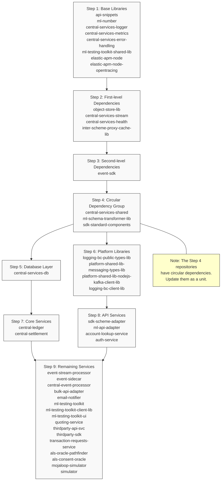

The following diagram illustrates the recommended update sequence for Mojaloop repositories, taking into account their dependencies and relationships:

This diagram provides a visual representation of the update sequence, showing:
1. The logical grouping of repositories
2. Dependencies between different groups
3. Special cases like circular dependencies
4. Parallel update possibilities
5. Different types of dependencies to consider 