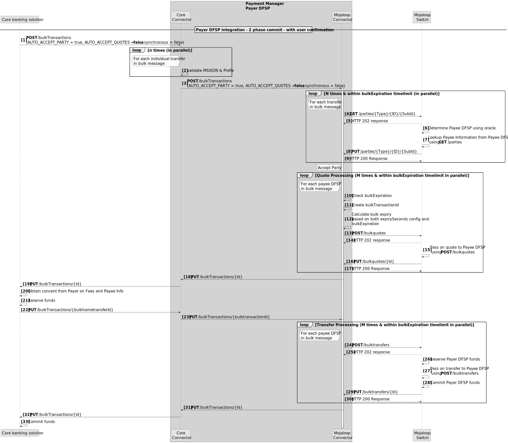
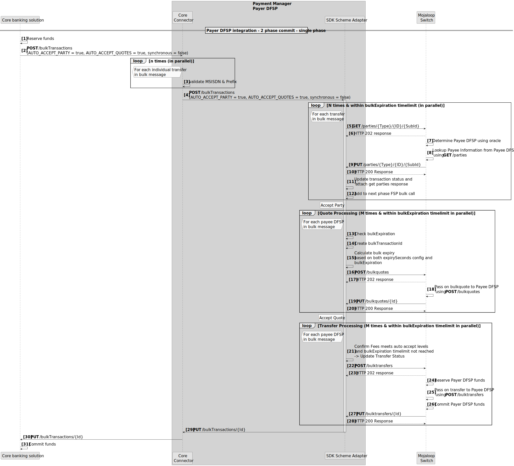
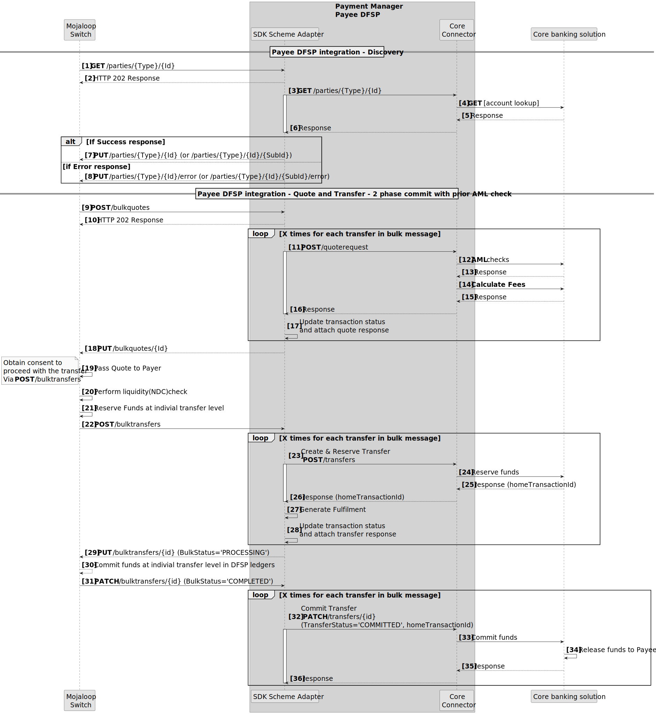
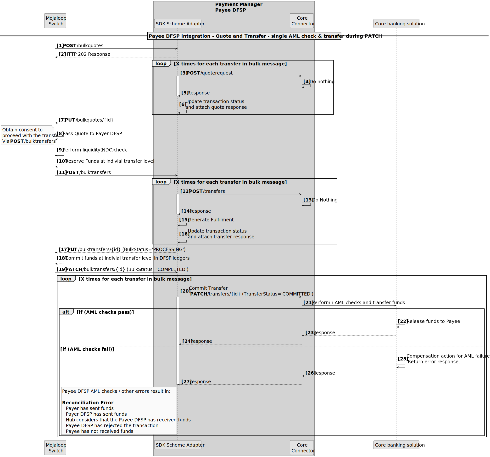

# Integration Core Banking Systems using Bulk transfers
There are three patterns that can be used when building the Payer DFSP integrations for bulk transfers.
1. **Three phase** transfer integration. This aligns with the three Mojaloop transaction phases. I.e. Discovery, Agreement and Transfer.
1. **Double API Integration** integration. This pattern is described in detail in the sequence diagram below. It involves combining the Discovery and Agreement phases; as the first phase; the results are presented to the Payer for confirmation; following which the Transfer phase is executed as the second phase.

1. **Single API Integration** integrations. This pattern is described in detail in the sequence diagram below. Here all three phases are combined to produce a single synchronous transfer call.

::: tip 2-Phased Commit
All Payer DFSP Integration Patterns support a 2 phased (reservation and commit phase) commit.
:::

## Payee DFSP requirements
The updates to the SDK Scheme Adapter will ensure that DFSP that have build integrations in to Mojaloop will not be required to make any change in order to support the receiving of bulk transfers. I.e. the SDK scheme adapter will receive bulk transfer messages and convert them to individual transfer messages.
If a Payee DFSP would like to take advantage of the bulk transfer message, integration for bulk messages can be implemented when it makes sense to do so for each Payee DFSP.

## Ideal Payee Integration Flow Pattern

Here the AML checks and fees are calculated in the Agreement Phase, and the transfer phase is performed in two phases namely a reserved and commit phase.

## Vendor API only supports Single API call
If the Core Banking Systems only support a single API call to perform all transfer related checks and phases. This is the pattern that is most commonly supported.
### Call Transfer on the Patch Notification

A failure at anytime after the PATCH notification **[Step 19]** will result in a reconciliation error. This can be catered for by building in recompensation methods. E.g. initiate a refund transfer if an error occurs after step 19.
