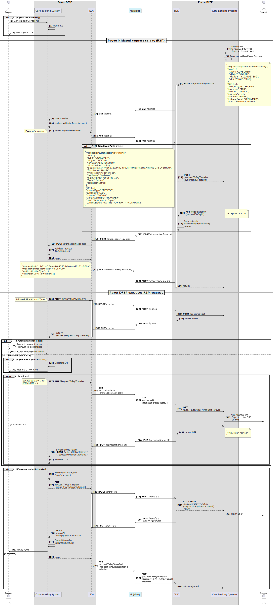

# Request To Pay (R2P) - use-case support

This documentation describes how the SDK Scheme Adaptor supports the request to pay use case. The request to pay use case is the bases for all Payee initiated transfers. Support for this use-case requires every DFSP in a Mojaloop switch to automatically process a transfer once a request to perform a transfer is received and validated. Having support for this use-case in the SDK-scheme-adapter is important as it minimised the development effort that each DFSP needs to make if a Scheme mandates participant support for this use case. This use case is particularly interesting from a testing perspective, as it enables remote testing as both a Payer DFSP and a Payee DFSP.

> Important:
>
> 1. Not all features have been fully tested and aligned to the FSPIOP Specification, please refer to the following epic for progress on this: [#3344 - Enhance SDK Scheme Adaptor to support the request to Pay use case](https://github.com/mojaloop/project/issues/3344);
> 2. There are currently no end-to-end tests verifying the full functionality which includes Authentication via OTP. See the following [Testing Toolkit Test Case collection release](https://github.com/mojaloop/testing-toolkit-test-cases/releases) for what is currently tested: [testing-toolkit-test-cases@v15.0.1](https://github.com/mojaloop/testing-toolkit-test-cases/releases/tag/v15.0.1); and
> 3. Not all failure cases may have been fully implemented. Once again refer to the epic [#3344](https://github.com/mojaloop/project/issues/3344).
>

## Sequence Diagram

1. The Payee DFSP initiates the R2P use case with **POST** /RequestToPay API call. 
2. The Payee DFSP optionally can validate the Payer. 
3. The Payer DFSP executes the R2P request with a **POST** /requestToPayTransfer API call. If the Authentication type is not provided in this call, then the flow assumes that the Payer will confirm the transfer and terms through a **PUT** /requestToPayTransfer, otherwise the appropriate authentication flow is executed. 

The diagram summarises this flow.

## Detailed sequence diagram

Below is a more detailed sequence diagram for the request to pay use case and the SDK Scheme Adapter API calls.

