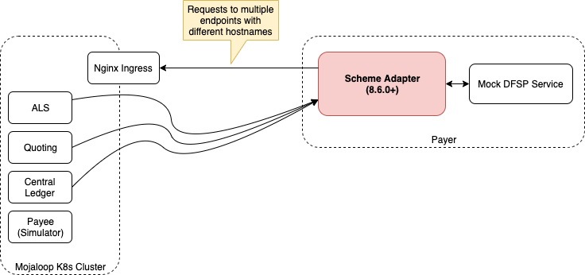

# Overview
A scheme adapter is a service that interfaces between a Mojaloop API compliant switch and a DFSP backend platform that does not natively implement the Mojaloop API.

The API between the scheme adapter and the DFSP backend is synchronous HTTP while the interface between the scheme adapter and the switch is native Mojaloop API.

This document provides different ways of setups that a DFSP can test using the scheme adapter.

# Scenarios
There are number of scenarios those we tested and documented as follows.

* [[Scheme Adapter + Mock DFSP Backend] -> [Scheme Adapter + Mojaloop Simulator]](./scheme-adapter-to-scheme-adapter/README.md)
* [[Scheme Adapter + Mock DFSP Backend] -> [Local K8S cluster]](./scheme-adapter-and-local-k8s/README.md)
* [[Scheme Adapter + Mojaloop Simulator] -> [Public hosted WSO2 enabled Mojaloop Switch]](./scheme-adapter-and-wso2-api-gateway/README.md)

## [Scheme Adapter + Mock DFSP Backend] -> [Scheme Adapter + Mojaloop Simulator]

The scheme adpater can be used in combination with some already implemented mock backends "Mock DFSP Backend" and "Mojaloop Simulator". The below are the links for the repositories.

https://github.com/mojaloop/sdk-mock-dfsp-backend.git

https://github.com/mojaloop/mojaloop-simulator.git

The idea is to combine scheme adapter with mock DFSP backend on oneside and with mojaloop simulator on another side. Consider one side is payer dfsp and another side is payee dfsp. By following this example, you can send and recieve funds from one dfsp to another.

Please [click here](./scheme-adapter-to-scheme-adapter/README.md) for the documentation.

## [Scheme Adapter + Mock DFSP Backend] -> [Local K8S cluster]

Then if we want to include a switch inbetween the DFSPs, we can simulate that environment using a local K8S cluster. Please follow the onboarding documentation of local K8S cluster here (https://mojaloop.io/documentation/deployment-guide/).

Please [click here](./scheme-adapter-and-local-k8s/README.md) for the documentation.

## [Scheme Adapter + Mojaloop Simulator] -> [Public hosted WSO2 enabled Mojaloop Switch]

If you have access to the WSO2 Mojaloop API, you can test that by the following documentation. In the above two scenarios, we didn't use token authentication and SSL encryption capabilities of scheme adapter. We are going to use those capabilites in this section.

Please [click here](./scheme-adapter-and-wso2-api-gateway/README.md) for the documentation.

