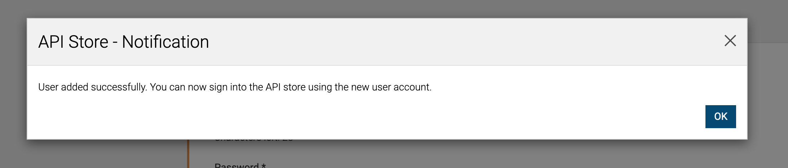
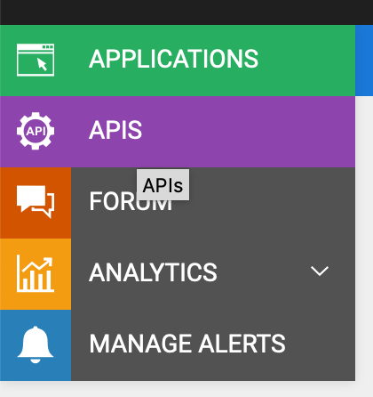

# ModusBox Mojaloop Lab
## Getting started with the Lab

>***Note:** This document is specific to the ModusBox lab provided for the Include Everyone hackathon, but may generalize well in the future*


## 1.0 Obtaining an Access Token

- 1.1 Go to the public gateway (the link has been removed as this environment is not public).

- 1.2 Click “Sign Up”, and go through the steps to create a new account


- 1.3 Click “Sign Up” > follow the dialog box to the sign in page > Enter your details and “Sign In”

</br>


- 1.4 In the top left, select “Applications”


- 1.5 Select “Default Application” from the list


- 1.6 Navigate to “Production Keys” > set the validity of the key to “-1” > “Generate Keys”

</br>


- 1.7 Your access key along with a token will be created. Click “Show keys”


- 1.8 Observe that your access token has been created. You can copy this for later reference


- 1.9 Navigate to APIs in the top left menu



- 1.10 From the list of APIs, select “CentralLedgerApi…”


- 1.11 You now need to subscribe the DefaultApplication to this api. You can do this in the top right > “Subscribe”

</br>


- 1.12 Navigate to “Api Console”. Your access token should already be pre-filled for you.


- 1.13 Now we can test out the `/health` endpoint of the central-ledger service. Browse down the list of endpoints > “Try it out” > “Execute”

</br>
</br>
</br>


1.14 You should see a response similar to the following:


```json
{
  "status": "OK",
  "uptime": 535767.333,
  "startTime": "2019-09-17T15:11:37.794Z",
  "versionNumber": "7.3.1",
  "services": [
    {
      "name": "datastore",
      "status": "OK"
    },
    {
      "name": "broker",
      "status": "OK"
    }
  ]
}
```