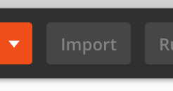
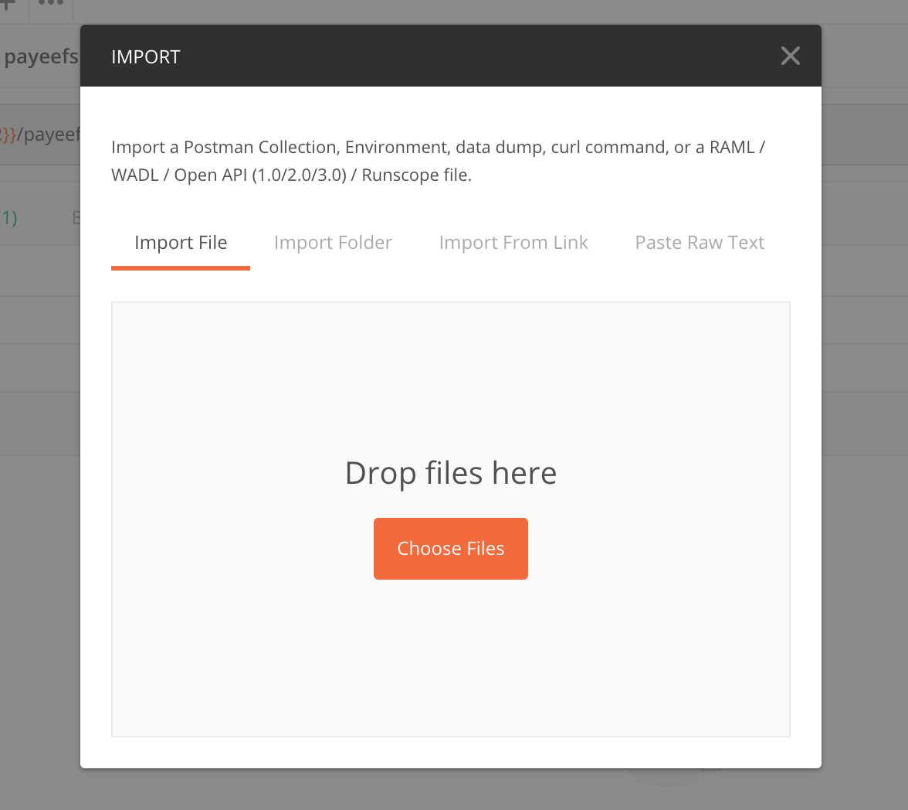

# Hackathon Pre-Read:
> Goal: A simple reading  and todo list for hackathon participants

## Compulsory Reading
>Time to complete: 15-30 minutes

- [Mojaloop Project Website](https://mojaloop.io/ )
	- Basic into the project
	- Intro video
- [Mojaloop Documentation](https://mojaloop.io/documentation/)
	- Overview
	- Onboarding doc [todo: this needs work]
	- Repo Details (get a lay of the land from the services)
- [Onboarding to the ModusBox Lab Environment](./lab_onboarding.md)
	- Logging in and using the environment
	- getting an access token and talking to the Lab from postman/curl

## Hackathon Onboarding Checklist
>Time to complete: 15-30 minutes

### Slack:
> The Mojaloop OSS Community uses Slack for all of its communications and announcements.

1. Go to [mojaloop-slack.herokuapp.com](mojaloop-slack.herokuapp.com) > Enter your Email address and press "Join"
2. Follow the steps in the email to set up your Slack account
3. Go [here](https://slack.com/intl/en-gm/downloads/) to download slack for your computer  
_Optional: You can also go to the Play Store or App Store and install Slack on your phone as well_
4. Once Slack is installed, select "Channels" in the left bar and search for the `#this-hackathon-name` channel  
_[todo: update this doc and replace `#this-hackathon-name` with a channel name specific for the hackathon]_

### Postman
>Postman is a REST API testing and automation tool which we use to interact with the Lab environment and Mojaloop itself

1. Go to [Postman Downloads](https://www.getpostman.com/downloads/) to download Postman for your machine
2. Clone or Download the [mojaloop/postman](https://github.com/mojaloop/postman) repository. This contains a number of postman 'Collections' which will help you to interact with Mojaloop and the Lab environment
3. Open Postman, and select "Import" from the top left and navigate to where you cloned the Postman repo

4. Drag and drop all of the `collection.json` files into the dialog, and they will be imported into your environment

5. Do the same as above with the files in `./environment`. These files specify the environment variables for the collections
6. Now that the collections and environment are set up, we will use the Collection Runner to run one of the test collections. The Collection Runner will run through a list of HTTP requests inside of a collection, which we use to automate or test different processes.
7. Select "Runner" from the top left (next to import), and select the  
_[todo: fill this section in after getting the Lab environment test runner]_

## Extended Reading

- Mojaloop API Specification + Use Cases. For a better understanding of the API and how the API can be used to implement various interoperable payment use cases
	- [Mojaloop API Spec v1.0](https://github.com/mojaloop/mojaloop-specification/blob/master/API%20Definition%20v1.0.pdf)
	- [Mojaloop Use Cases](https://github.com/mojaloop/mojaloop-specification/blob/master/Use%20Cases.pdf)

- Getting a local Mojaloop Environment up and Running On Kubernetes. For running Mojaloop yourself, either on a local machine, or cloud server
  - [Mojaloop Deployment Guide](https://mojaloop.io/documentation/deployment-guide/)

- Getting started with contributing to Mojaloop:
  - [Mojaloop Contributor's Guide](https://mojaloop.io/documentation/contributors-guide/)
  - _[todo: Github + Zenhub setup]_

- Digging into the code:
  - [central-ledger service](https://github.com/mojaloop/central-ledger)
  - [ml-api-adpater service](https://github.com/mojaloop/ml-api-adapter)