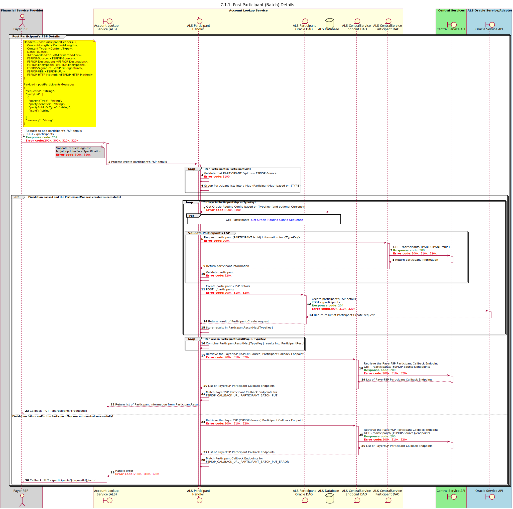

# Sequence Diagram for POST Participants (Batch)

Design for the creation of a Participant by a DFSP via a batch request.

## Notes

- Operation only supports requests which contain:
  - All Participant's FSPs match the FSPIOP-Source
  - All Participant's will be of the same Currency as per the [Mojaloop {{ book.importedVars.mojaloop.spec.version }} Specification]({{ book.importedVars.mojaloop.spec.uri.doc }})
- Duplicate POST Requests with matching TYPE and optional CURRENCY will be considered an __update__ operation. The existing record must be completely __replaced__ in its entirety.

## Sequence Diagram

