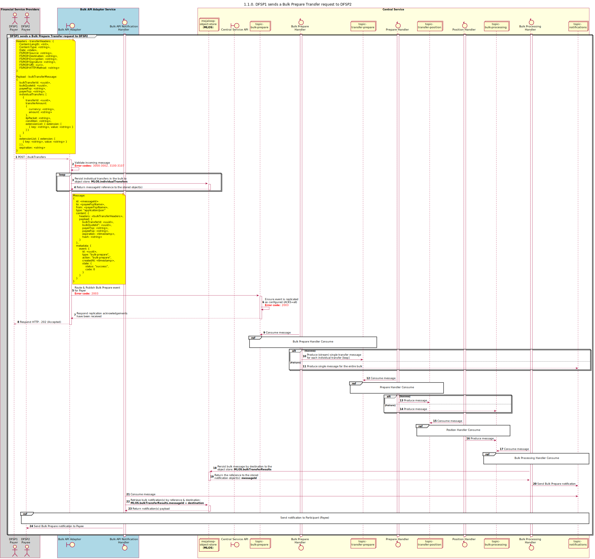

# Bulk Prepare Transfer Request [Overview] [includes individual transfers in a bulk]

Sequence design diagram for Prepare Transfer Request process.

## References within Sequence Diagram

* [Bulk Prepare Handler Consume (1.1.1)](1.1.1-bulk-prepare-handler-consume.md)
* [Prepare Handler Consume (1.2.1)](1.2.1-prepare-handler-consume-for-bulk.md)
* [Position Handler Consume (1.3.0)](1.3.0-position-handler-consume-overview.md)
* [Bulk Processing Handler Consume (1.4.1)](1.4.1-bulk-processing-handler.md)
* [Send notification to Participant (1.1.4.a)](1.1.4.a-send-notification-to-participant.md)

## Sequence Diagram

