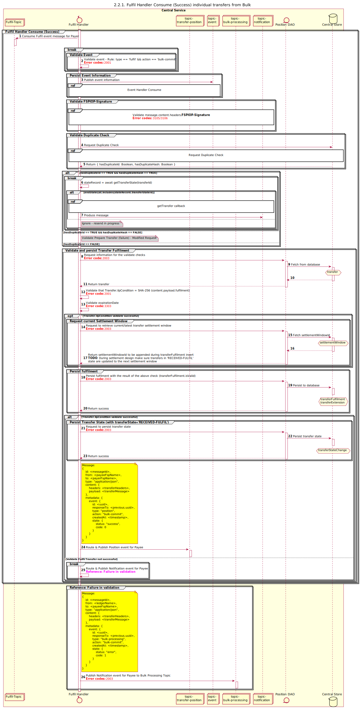

# Payee sends a Bulk Fulfil Transfer request - Bulk is broken down into individual transfers

Sequence design diagram for the Bulk Fulfil Transfer for the Commit option

## References within Sequence Diagram

* [Event Handler Consume (9.1.0)](../../central-event-processor/9.1.0-event-handler-placeholder.md)

## Sequence Diagram

