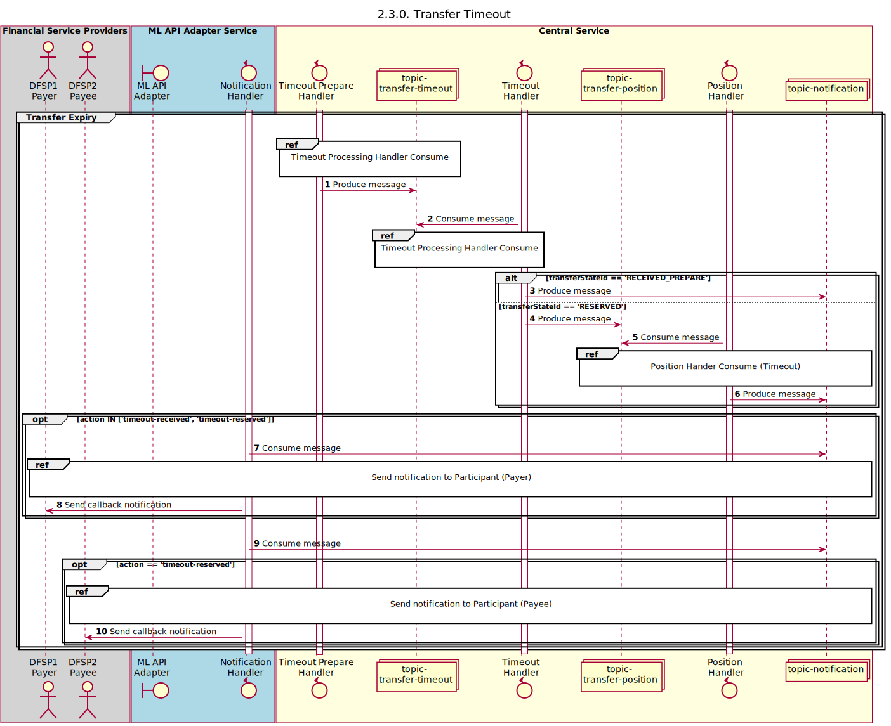

## Transfer Timeout

Sequence design diagram for the Transfer Timeout process.

## References within Sequence Diagram

* [Timeout Handler Consume (2.3.1)](2.3.1-timeout-handler-consume.md)
* [Position Handler Consume (Timeout)(1.3.3)](1.3.3-abort-position-handler-consume.md)
* [Send Notification to Participant (1.1.4.a)](1.1.4.a-send-notification-to-participant.md)

## Sequence Diagram

