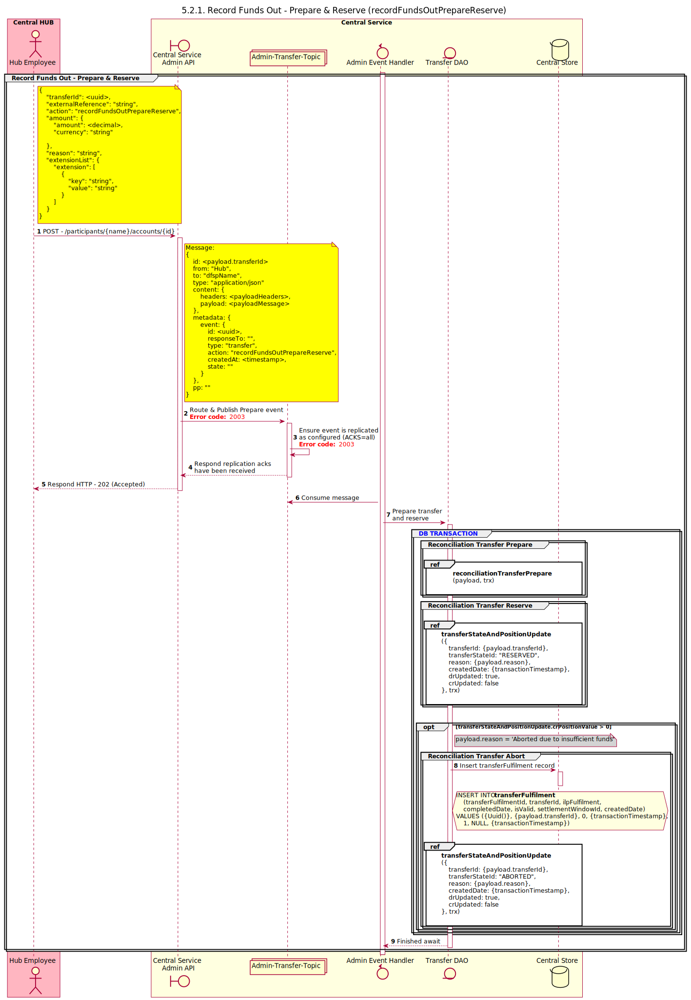

# Funds Out - Prepare & Reserve

Funds Out operation performs the prepare and reserve stages of the transfer at once. But the commit of the transfer or the abort operation are separate processes.

## Sequence Diagram

