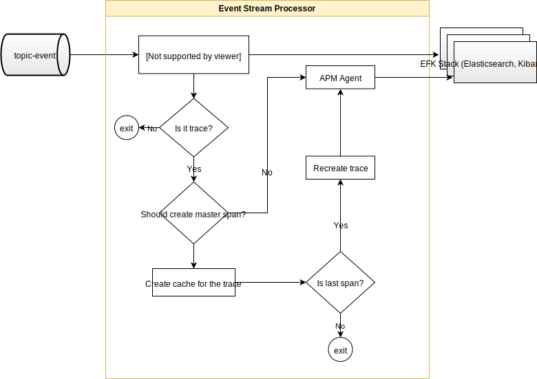
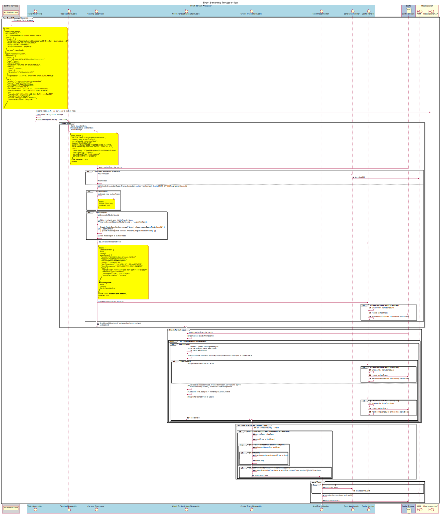

# Event Stream Processor Service

Event Stream Processor consumes event messages from the `topic-events` topic as a result of messages published by the [event-sidecar](https://github.com/mojaloop/event-sidecar) service. Refer to [Event Framework](../event-framework/README.md) for more information on the overall architecture.

The Service delivers logs, including audits, and traces to EFK stack with enabled APM plugin. Based on the event message type, the messages are delivered to different indexes in the Elasticsearch.

## 1. Prerequisites

The service logs all the events to Elasticsearch instance with enabled APM plugin. Sample docker-compose of the Elastic stack is available [here](https://github.com/mojaloop/event-stream-processor/blob/master/test/util/scripts/docker-efk/docker-compose.yml). The logs and audits are created under custom index template, while the trace data is stored to the default `apm-*` index.
Please, ensure that you have created the `mojatemplate` as it is described into the [event-stream-processor](https://github.com/mojaloop/event-stream-processor#111-create-template) service documentation.

## 2. Architecture overview

### 2.1. Flow overview

### 2.2 Trace processing flow sequence diagram

