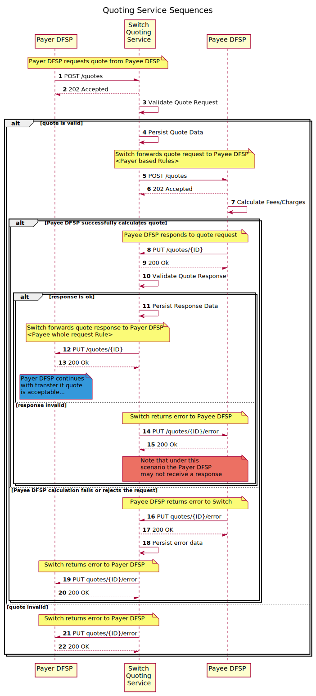

# Quoting Service Overview
The **Quoting Service** (**QS**) _(refer to section `5.1`)_ as per the [Mojaloop {{ book.importedVars.mojaloop.spec.version }} Specification]({{ book.importedVars.mojaloop.spec.uri.doc }}) implements the quoting phase of the various use-cases.

_Note: In addition to individual quotes, the quoting service supports bulk quotes as well._

## Sequence Diagram

