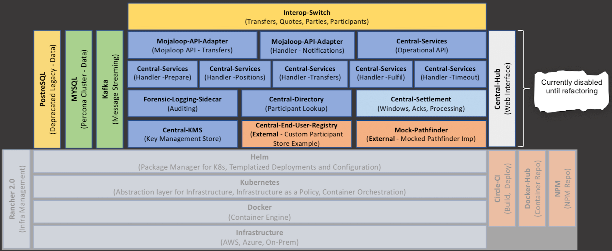
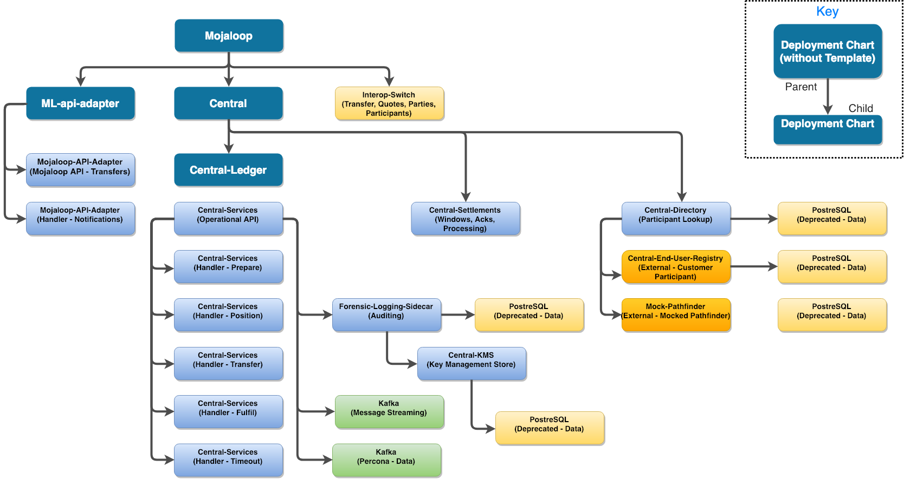
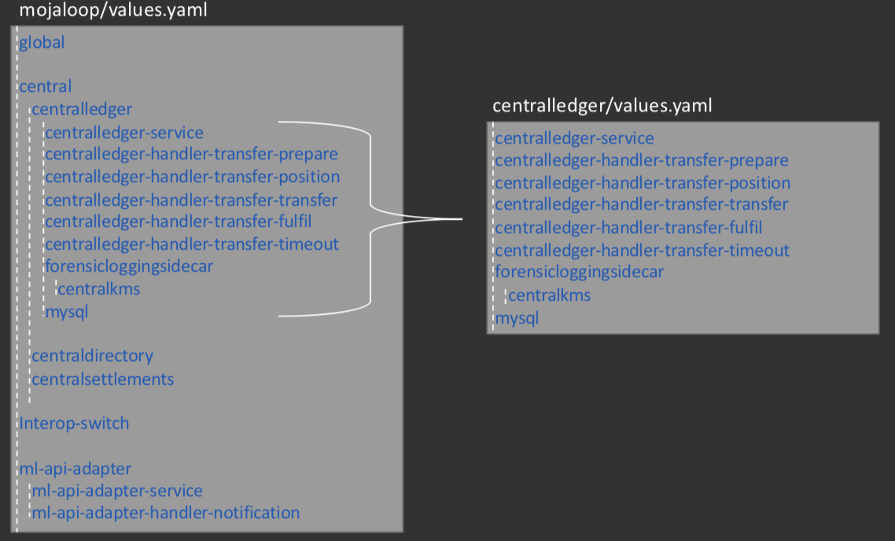

# Helm

For more information on [Helm](https://helm.sh/) refer to the following page: [https://helm.sh/](https://helm.sh/)

The purpose of this document is to provide:

* an overview of the current helm charts,
* the hierarchy relationship between the charts,
* the hierarchy of values.

Refer to [Releases](../deployment-guide/releases.md) for available versions.

## Helm Chart Overview

* Helm Chart Repo: [http://mojaloop.io/helm/repo](http://mojaloop.io/helm/repo) 
* Helm Github: [http://github.com/mojaloop/helm](http://github.com/mojaloop/helm)

## Helm Hierarchy Relationship

## Helm Hierarchy of Values

