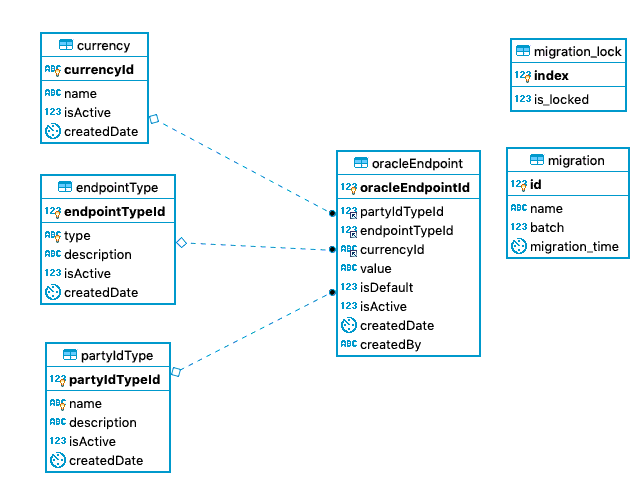

# Central-Ledger Services

The Account Lookup Service _(refer to section `6.2.1.2`)_ as per the [Mojaloop {{ book.importedVars.mojaloop.spec.version }} Specification]({{ book.importedVars.mojaloop.spec.uri.doc }}) implements the following use-cases:

* Participant Look-up 
* Party Look-up
* Manage Participants Registry information
    * Adding Participant Registry information
    * Deleting Participant Registry information
* Admin Operations
    * Manage Oracle End-point Routing information
  
## 1. Design Considerations

### 1.1 Account Lookup Service (ALS)
The ALS design provides a generic Central-Service component as part of the core Mojaloop. The purpose of this component is to provide routing and alignment to the Mojaloop API Specification. This component will support multiple Look-up registries (Oracles). This ALS will provide an Admin API to configure routing/config for each of the Oracles similiar to the Central-Service API for the End-point configuration for DFSP routing by the Notification-Handler (ML-API-Adapter Component). The ALS will in all intense purpose be a switch with a persistence store for the storage/management of the routing rules/config.

The routing configuration will be based on the following:
* PartyIdType - See section `7.5.6` of the Mojaloop Specification
* PartyIdentifier - See section `7.3.24` of the Mojaloop Specification
* Currency - See section `7.5.5` of the Mojaloop Specification. Currency code defined in [ISO 4217](https://www.iso.org/iso-4217-currency-codes.html) as three-letter alphabetic string. This will be optional, and must provide a "default" config if no Currency is either provided or provide a default if the Currency is provided, but only the "default" End-point config exists.

### 1.2 ALS Oracle Service/Adapter
The ALS Oracle Service or Adapter (semantic dependant on use - Mediation = Adapter, Service = Implementation) will provide a look-up registry component with similar functionality of the `/participants` Mojaloop API resources. It has however loosely based on the ML API specification as it's interface implements a sync pattern which reduces the correlation/persistence requirements of the Async Callback pattern implemented directly by the ML API Spec. This will provide all ALS Oracle Services/Adapters with a standard interface which will be mediated by the ALS based on its routing configuration.  
This component (or back-end systems) will also be responsible for the persistence & defaulting of the Participant details.

* [ALS Oracle Service v1 Interface Contract](../assets/InterfaceContracts/OracleServiceSwaggerv1.yaml)

## 2. Participant Lookup Design

### 2.1 Architecture overview


### 2.2 Sequence diagram

#### 2.2.1 GET Participant

```puml { src="./assets/Diagrams/SequenceDiagrams/seq-acct-lookup-get-participant-7.1.0.plantuml" }
```

#### 2.2.2 POST Participant

#### Notes
- Operation only supports requests which contain:
    - All Participant's FSPs match the FSPIOP-Source
    - All Participant's TYPEs are the same

```puml { src="./assets/Diagrams/SequenceDiagrams/seq-acct-lookup-post-participants-7.2.1.plantuml" }
```

## 3. Party Lookup Design

### 3.1 Architecture overview


### 3.2 Sequence diagram

#### 3.2.1 GET Parties

```puml { src="./assets/Diagrams/SequenceDiagrams/seq-acct-lookup-get-parties-7.2.0.plantuml" }
```

## 4. Database Design

### 4.1 ALS Database Schema

#### Notes
- `partIdType` - Values are currently seeded as per section _`7.5.6`_ [Mojaloop {{ book.importedVars.mojaloop.spec.version }} Specification]({{ book.importedVars.mojaloop.spec.uri.doc }}).
- `currency` - See section `7.5.5` of the Mojaloop Specification. Currency code defined in [ISO 4217](https://www.iso.org/iso-4217-currency-codes.html) as three-letter alphabetic string. This will be optional, and must provide a "default" config if no Currency is either provided or provide a default if the Currency is provided, but only the "default" End-point config exists.
- `endPointType` - Type identifier for the end-point (e.g. `URL`) which provides flexibility for future transport support.
- `migration*` - Meta-data tables used by Knex Framework engine.



* [Acount Lookup Service DBeaver ERD](../assets/Diagrams/EntityRelationshipDiagrams/AccountLookupDB-schema-DBeaver.erd)
* [Acount Lookup Service MySQL Workbench Export](../assets/Diagrams/EntityRelationshipDiagrams/AccountLookup-ddl-MySQLWorkbench.sql)

### 4.2 Oracle Database Schema

This is optional & is dependant on the Oracle's requirements & design.
