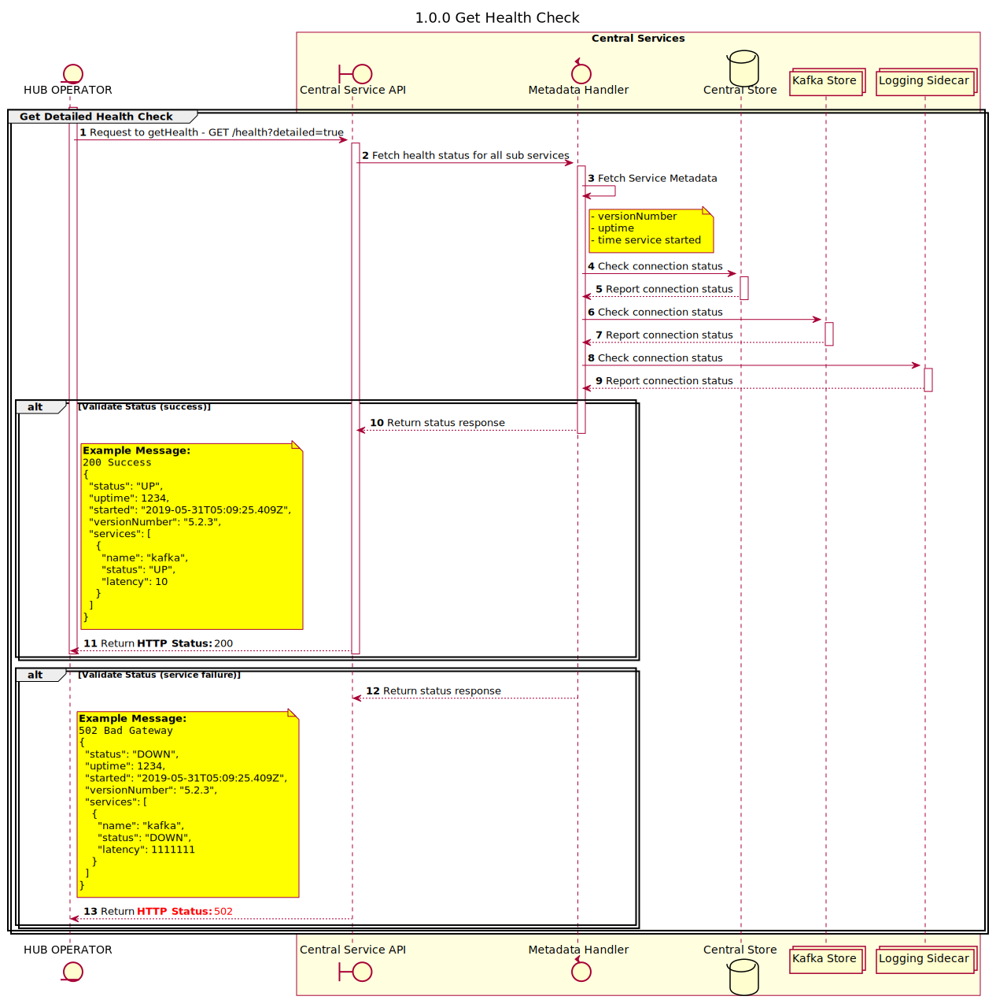

# GET Health Check

Design discussion for new Health Check implementation.


## Objectives

The goal for this design is to implement a new Health check for mojaloop switch services that allows for a greater level of detail.

It Features:
- Clear HTTP Statuses (no need to inspect the response to know there are no issues)
- Backwards compatibility with existing health checks
- Information about the version of the API, and how long it has been running for
- Information about sub-service (kafka, logging sidecar and mysql) connections

## Request Format

`/health`  

Defaults to non verbose health check. This ensures backwards compatability with existing deployments

`/health?detailed=true`

Uses the newly implemented health check.

Responses Codes:
- `200` - Success. The API is up and running, and is sucessfully connected to necessary services.
- `502` - Bad Gateway. The API is up and running, but the API cannot connect to necessary service (eg. `kafka`).
- `503` - Service Unavailable. This response is not implemented in this design, but will be the default if the api is not and running

## Response Format

| Name  | Type | Description | Example |
| --- | --- | --- | --- |
| `status`        | `statusEnum`                       | The status of the service. Options are `OK` and `DOWN`. _See `statusEnum` below_. | `"OK"`   | 
| `uptime`        | `number`                           | How long (in seconds) the service has been alive for.  | `123456`                     |
| `started`       | `string` (ISO formatted date-time) | When the service was started (UTC)                     | `"2019-05-31T05:09:25.409Z"` | 
| `versionNumber` | `string` (semver)                  | The current version of the service.                    | `"5.2.5"`                    |
| `services`      | `Array<serviceHealth>`             | A list of services this service depends on, and their connection status | _see below_ |


### serviceHealth

| Name  | Type | Description | Example |
| --- | --- | --- | --- |
| `name`    | `enum`   | The service name. Options are `kafka`, `mysql` and `sidecar`. | `"kafka` | 
| `status`  | `enum`   | The status of the service. Options are `OK` and `DOWN`        | `"OK"` | 
| `latency` | `number` | Latency (ms) when connecting to the service.                  | `459"` | 

### statusEnum

The status enum represents status of the system or sub-service.

It has two options:
- `OK`    -> The service or sub-service is healthy.
- `DOWN`  -> The service or sub-service is unhealthy

When a service is `OK`: the API is considered healthy, and all sub-services are also considered healthy.

If __any__ sub-service is `DOWN`, then the entire health check will fail, and the API will be considered `DOWN`.

## Swagger Definition 

>_Note: These will be added to the existing swagger definitions for the following services:_
> - `ml-api-adapter`
> - `central-ledger`
> - `central-settlement`
> - `central-event-processor`
> - `email-notifier`

```json
{
  /// . . . 
  "/health": {
    "get": {
      "operationId": "getHealth",
      "tags": [
        "health"
      ],
      "responses": {
        "default": {
          "schema": {
              "$ref": "#/definitions/health"
          },
          "description": "Successful"
        }
      }
    }
  },
  // . . .
  "definitions": {
    "health": {
      "type": "object",
      "properties": {
        "status": {
          "type": "string",
          "enum": [
            "OK",
            "DOWN"
          ]
        },
        "uptime": {
          "description": "How long (in seconds) the service has been alive for.",
          "type": "number",
        },
        "started": {
          "description": "When the service was started (UTC)",
          "type": "string",
          "format": "date-time"
        },
        "versionNumber": {
          "description": "The current version of the service.",
          "type": "string",
          "example": "5.2.3",
        },
        "services": {
          "description": "A list of services this service depends on, and their connection status",
          "type": "array",
          "items": {
            "$ref": "#/definitions/serviceHealth"
          }
        },
      },
    },
    "serviceHealth": {
      "type": "object",
      "properties": {
        "name": {
          "description": "The service name.",
          "type": "string",
          "enum": [
            "kafka",
            "mysql",
            "sidecar"
          ]
        },
        "status": {
          "description": "The connection status with the service.",
          "type": "string",
          "enum": [
            "OK",
            "DOWN"
          ]
        },
        "latency": {
          "description": "Latency (ms) when connecting to the service.",
          "type": "number"
        }
      }
    }
  }
}
```


### Example Requests and Responses:

__Successful Legacy Health Check:__

```bash
GET /health HTTP/1.1
Content-Type: application/json

200 SUCCESS
{
  "status": "OK"
}
```


__Successful New Health Check:__

```
GET /health?detailed=true HTTP/1.1
Content-Type: application/json

200 SUCCESS
{
  "status": "OK",
  "uptime": 0,
  "started": "2019-05-31T05:09:25.409Z",
  "versionNumber": "5.2.3",
  "services": [
    {
      "name": "kafka",
      "status": "OK",
      "latency": 238
    }
  ]
}
```

__Failed Health Check, but API is up:__

```
GET /health?detailed=true HTTP/1.1
Content-Type: application/json

502 BAD GATEWAY
{
  "status": "DOWN",
  "uptime": 0,
  "started": "2019-05-31T05:09:25.409Z",
  "versionNumber": "5.2.3",
  "services": [
    {
      "name": "kafka",
      "status": "DOWN",
      "latency": 1111111
    }
  ]
}
```

__Failed Health Check:__

```
GET /health?detailed=true HTTP/1.1
Content-Type: application/json

503 SERVICE UNAVAILABLE
```


## Sequence Diagram

Sequence design diagram for the GET Health




