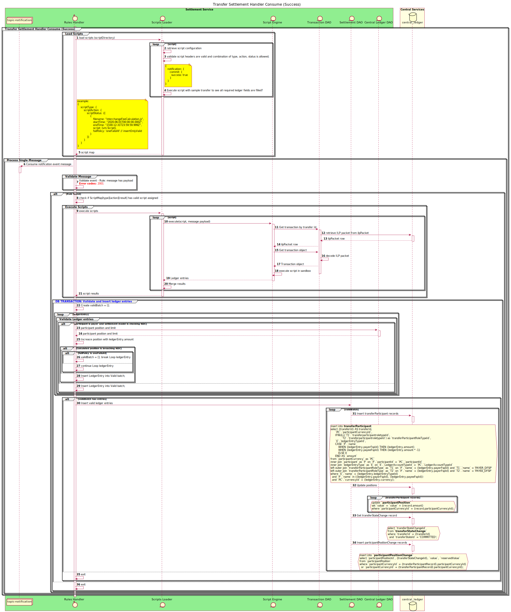

Rules Handler. Interchange fees example. File format.
-----------------------------------------------------

## Rules Handler

The Rules handler provides the capability to execute different actions in case of certain event happend.
Here we are giving example with Interchange fee calculation.

Sequence design diagram for the rules handler.

## Sequence Diagram



### Interchange fee case

In order to support the various options for accumulating interchange or other fees, we need to generate
and settle liabilities incurred as a consequence of making transfers between
particular types of customer. The general form of an example rule, that we are using to illustrate how it works is as follows:

-   If the transaction is a wallet-to-wallet P2P transaction, then the receiver
    DFSP pays the sender DFSP 0.6% of the amount of the transaction.

-   No interchange fees are levied for on-us transactions.

The business decisions around this requirement are:

1.  The definition of whether or not a payee account is a wallet is
    returned by the payee DFSP as part of customer discovery. 

2.  Interchange fees are captured by the switch when there is a matching trigger condition.

3.  Interchange fees have the ledger entry type INTERCHANGE_FEE and are
    recorded in accounts whose type is INTERCHANGE_FEE. 

4.  Interchange fees are settled multilaterally, net and deferred.

    _Make sure Settlement type and ledger account type for the INTERCHANGE FEE records are availabe_

This functionality is implemented as a general
process for defining and executing rules, and for taking actions based on the
outcome of evaluation of a rule.

### Evaluating a rule

The process of evaluating a rule is based on the following assumptions:

1.  There is a standard form of rule evaluation with the following
    structure:

    1.  A transaction object is passed as the parameter to the rule
        evaluation function.

    2.  The rule evaluation itself uses a complex if statement.

    3.  If the rule evaluates to TRUE, then an action should be executeds

An example of a rule function to evaluate an interchange fee rule could be:

```js
function evaluateInterchangeFee (transaction) {

    if(

        (transaction.payee.fspId.toLowerCase() != transaction.payer.fspId.toLowerCase())

        && (transaction.extensionList[“payerAccountType”].toLowerCase() ==
        "Wallet".toLowerCase()

        && transaction.extensionList[“payeeAccountType”].toLowerCase() ==
        "Wallet".toLowerCase())

        && (transaction.transactionType.scenario.toLowerCase() ==
        "TRANSFER".toLowerCase()

        && transaction.transactionType.initiator.toLowerCase() == "PAYER".toLowerCase()

        && transaction.transactionType.initiatorType.toLowerCase() ==
        "CONSUMER".toLowerCase())

    ) {

        // Do some good stuff
    };
};
```

### Taking action after evaluating a rule

If a rule evaluates to TRUE, then
appropriate action is taken. In the case of the immediate example of
interchange fees, the action taken should be to add two entries to the
participants’ interchange fee accounts, on recording the debit from the payee of
the interchange fee amount and the other recording the credit to the payer of
the interchange fee amount.

There is defined class with methods that represent the actions to be taken.
The rule evaluation instatiates the calss and calls the appropriate functions.

In the case of the interchange fees, we have defined an action called
addLedgerEntry, with the following parameters:

1.  The transfer ID for which the ledger entry is being created

2.  The ledger entry type to be used

3.  The currency in which the amount is denominated
P
4.  The amount of the fee

5.  The FSP ID of the credit party

6.  The FSP ID of the debit party

This might appear in the rule evaluation function as:

myAction.addLedgerEntry(transaction.transactionId,

transaction.transactionId,

"INTERCHANGE_FEE“,

transaction.currency,

transaction.amount\*0.006,

transaction.payer.fspId,

transaction.payee.fspId);

### Providing rules

The files should be placed in a scripts directory, configured by the value of the environmental variable `SETTINGS__SCRIPTS_FOLDER`  
Each rule file should be valid JS with the following header content:

```js
/* eslint-disable no-undef */
// ********************************************************
// Name: Interchange fee calculation
// Type: notification
// Action: commit
// Status: success
// Start: 2020-06-01T00:00:00.000Z
// End: 2100-12-31T23:59:59.999Z
// Description: This script calculates the interchange fees between DFSPs where the account type is "Wallet"
// ********************************************************

// ## Globals:
// payload: The contents of the message from the Kafka topic.
// transfer: The transfer object.

// # Functions:
// ## Data retrieval functions:
// getTransfer(transferId): Retrieves a mojaloop transfer from the central-ledger API.

// ## Helper functions:
// getExtensionValue(list, key): Gets a value from an extension list
// log(message): allows the script to log to standard out for debugging purposes

// Math functions:
// multiply(number1, number2, decimalPlaces): Uses ml-number to handle multiplication of money values

// Ledger functions:
// addLedgerEntry: Adds a debit and credit ledger entry to the specified account to the specified DFSPs

log(JSON.stringify(transfer))
const payerFspId = transfer.payer.partyIdInfo.fspId
const payeeFspId = transfer.payee.partyIdInfo.fspId

if ((payeeFspId !== payerFspId) &&
  (getExtensionValue(transfer.payee.partyIdInfo.extensionList.extension, 'accountType') === 'Wallet' &&
    getExtensionValue(transfer.payer.partyIdInfo.extensionList.extension, 'accountType') === 'Wallet') &&
  (transfer.transactionType.scenario === 'TRANSFER' &&
    transfer.transactionType.initiator === 'PAYER' &&
    transfer.transactionType.initiatorType === 'CONSUMER')) {
  log(`Adding an interchange fee for Wallet to Wallet from ${payerFspId} to ${payeeFspId}`)
  addLedgerEntry(payload.id, 'INTERCHANGE_FEE', // Ledger account type Id
    'INTERCHANGE_FEE', // Ledger entry type Id
    multiply(transfer.amount.amount, 0.006, 2),
    transfer.amount.currency,
    payerFspId,
    payeeFspId)
}

```

| Header | Description | Required |
| :- | :- | :-: |
| Name |  Rule name | true |
| Type | Message event type. Corresponds to Kafka topic | true |
| Action | Message event action. ex. Commit, Prepare, Log, etc | true |
| Status | Status of the operation: success or failure | true |
| Start | Time to start abiding the rule | true |
| End |  Until when the rule is valid | true |
| Description | Rule description | false |
