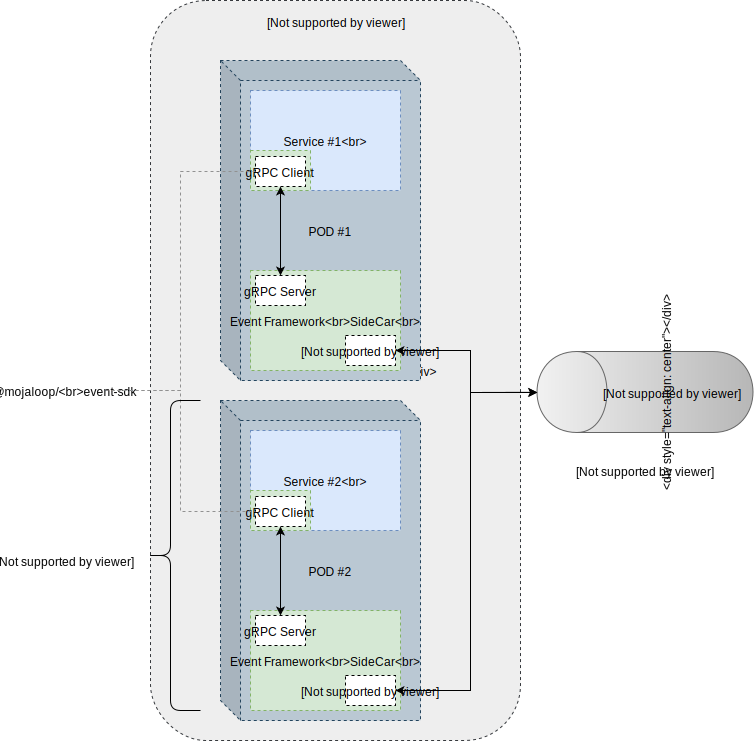

# Event Framework

The purpose of the Event Framework is to provide a standard unified architecture to capture all Mojaloop events.

_Disclaimer: This is experimental and is being implemented as a PoC. As such the design may change based on the evolution of the PoC's implementation, and any lessons learned._


## 1. Requirements

- Events will be produced by utilising a standard common library that will publish events to a sidecar component utilising a light-weight highly performant protocol (e.g. gRPC).
- Sidecar module will publish events to a singular Kafka topic that will allow for multiple handlers to consume and process the events as required.
- Kafka partitions will be determined by the event-type (e.g. log, audit, trace, errors etc).
- Each Mojaloop component will have its own tightly coupled Sidecar.
- Event messages will be produced to Kafka using the Trace-Id as the message key. This will ensure that all the messages part of the same trace (transaction) are stored in the same partition in order.


## 2. Architecture

### 2.1 Overview


### 2.2 Micro Service Pods



### 2.3 Event Flow


## 3. Event Envelope Model

## 3.1 JSON Example

```JSON
{
    "from": "noresponsepayeefsp",
    "to": "payerfsp",
    "id": "aa398930-f210-4dcd-8af0-7c769cea1660",
    "content": {
        "headers": {
            "content-type": "application/vnd.interoperability.transfers+json;version=1.0",
            "date": "2019-05-28T16:34:41.000Z",
            "fspiop-source": "noresponsepayeefsp",
            "fspiop-destination": "payerfsp"
        },
        "payload": "data:application/vnd.interoperability.transfers+json;version=1.0;base64,ewogICJmdWxmaWxtZW50IjogIlVObEo5OGhaVFlfZHN3MGNBcXc0aV9VTjN2NHV0dDdDWkZCNHlmTGJWRkEiLAogICJjb21wbGV0ZWRUaW1lc3RhbXAiOiAiMjAxOS0wNS0yOVQyMzoxODozMi44NTZaIiwKICAidHJhbnNmZXJTdGF0ZSI6ICJDT01NSVRURUQiCn0"
    },
    "type": "application/json",
    "metadata": {
        "event": {
            "id": "3920382d-f78c-4023-adf9-0d7a4a2a3a2f",
            "type": "trace",
            "action": "span",
            "createdAt": "2019-05-29T23:18:32.935Z",
            "state": {
                "status": "success",
                "code": 0,
                "description": "action successful"
            },
            "responseTo": "1a396c07-47ab-4d68-a7a0-7a1ea36f0012"
        },
        "trace": {
            "service": "central-ledger-prepare-handler",
            "traceId": "bbd7b2c7-3978-408e-ae2e-a13012c47739",
            "parentSpanId": "4e3ce424-d611-417b-a7b3-44ba9bbc5840",
            "spanId": "efeb5c22-689b-4d04-ac5a-2aa9cd0a7e87",
            "startTimestamp": "2015-08-29T11:22:09.815479Z",
            "finishTimestamp": "2015-08-29T11:22:09.815479Z",
            "tags": {
              "transctionId": "659ee338-c8f8-4c06-8aff-944e6c5cd694",
              "transctionType": "transfer",
              "parentEventType": "bulk-prepare",
              "parentEventAction": "prepare"
            }
        }
    }
}
```

## 3.2 Schema Definition

### 3.2.1 Object Definition: EventMessage

| Name | Type | Mandatory  (Y/N) | Description | Example |
| --- | --- | --- | --- | --- |
| id | string | Y | The id references the related message. |  |
| from | string | N | If the value is not present in the destination, it means that the notification was generated by the connected node (server). |  |
| to | string | Y | Mandatory for the sender and optional in the destination. The sender can ommit the value of the domain. | |
| pp | string | N | Optional for the sender, when is considered the identity of the session. Is mandatory in the destination if the identity of the originator is different of the identity of the from property. | |
| metadata | object `<MessageMetadata>` | N | The sender should avoid to use this property to transport any kind of content-related information, but merely data relevant to the context of the communication. Consider to define a new content type if there's a need to include more content information into the message. | |
| type | string | Y | `MIME` declaration of the content type of the message. | |
| content | object \<any\> | Y | The representation of the content. | |

##### 3.2.1.1 Object Definition: MessageMetadata

| Name | Type | Mandatory  (Y/N) | Description | Example |
| --- | --- | --- | --- | --- |
| event | object `<EventMetadata>` | Y | Event information. |  |
| trace | object `<EventTraceMetaData>` | Y | Trace information. |  |

##### 3.2.1.2 Object Definition: EventMetadata

| Name | Type | Mandatory  (Y/N) | Description | Example |
| --- | --- | --- | --- | --- |
| id | string | Y | Generated UUIDv4 representing the event. | 3920382d-f78c-4023-adf9-0d7a4a2a3a2f |
| type | enum `<EventType>` | Y | Type of event. | [`log`, `audit`, `error` `trace`] |
| action | enum `<LogEventAction, AuditEventAction, TraceEventAction, NullEventAction>` | Y | Type of action. | [ `start`, `end` ] |
| createdAt | timestamp | Y | ISO Timestamp. | 2019-05-29T23:18:32.935Z |
| responseTo | string | N | UUIDv4 id link to the previous parent event. | 2019-05-29T23:18:32.935Z |
| state | object `<EventStateMetadata>` | Y | Object describing the state. |  |

##### 3.2.1.3 Object Definition: EventStateMetadata

| Name | Type | Mandatory  (Y/N) | Description | Example |
| --- | --- | --- | --- | --- |
| status | enum `<EventStatusType>` | Y | The id references the related message. | success |
| code | number | N | The error code as per Mojaloop specification. | 2000 |
| description | string | N | Description for the status. Normally used to include an description for an error. | Generic server error to be used in order not to disclose information that may be considered private. |

##### 3.2.1.4 Object Definition: EventTraceMetaData

| Name | Type | Mandatory  (Y/N) | Description | Example |
| --- | --- | --- | --- | --- |
| service | string | Y | Name of service producing trace | central-ledger-prepare-handler |
| traceId | 32HEXDIGLC | Y | The end-to-end transaction identifier. | 664314d5b207d3ba722c6c0fdcd44c61 |
| spanId | 16HEXDIGLC | Y | Id for a processing leg identifier for a component or function. | 81fa25e8d66d2e88 |
| parentSpanId | 16HEXDIGLC | N | The id references the related message. | e457b5a2e4d86bd1 |
| sampled | number | N | Indicator if event message should be included in the trace `1`. If excluded it will be left the consumer to decide on sampling. | 1 |
| flags | number | N | Indicator if event message should be included in the trace flow. ( Debug `1` - this will override the sampled value ) | 0 |
| startTimestamp | datetime | N | ISO 8601 with the following format `yyyy-MM-dd'T'HH:mm:ss.SSSSSSz`. If not included the current timestamp will be taken. Represents the start timestamp of a span.| 2015-08-29T11:22:09.815479Z |
| finishTimestamp | datetime | N | ISO 8601 with the following format `yyyy-MM-dd'T'HH:mm:ss.SSSSSSz`. If not included the current timestamp will be taken. Represents the finish timestamp of a span | 2015-08-29T11:22:09.815479Z |
| tags | object `<EventTraceMetaDataTags>` | Y | The id references the related message. | success |

_Note: HEXDIGLC = DIGIT / "a" / "b" / "c" / "d" / "e" / "f" ; lower case hex character. Ref: [WC3 standard for trace-context](https://www.w3.org/TR/trace-context/#field-value)._

##### 3.2.1.5 Object Definition: EventTraceMetaDataTags

| Name | Type | Mandatory  (Y/N) | Description | Example |
| --- | --- | --- | --- | --- |
| transactionId | string | N | Transaction Id representing either a transfer, quote, etc | 659ee338-c8f8-4c06-8aff-944e6c5cd694 |
| transactionType | string | N | The transaction type represented by the transactionId. E.g. (transfer, quote, etc) | transfer |
| parentEventType | string | N | The event-type of the parent Span. | bulk-prepare |
| parentEventAction | string | N | The event-action of the parent Span. | prepare |
| `<string>` | string | N | Arbitary Key-value pair for additional meta-data to be added to the trace information. | n/a |

##### 3.2.1.6 Enum: EventStatusType

| Enum | Description |
| --- | --- |
| success | Event was processed successfully |
| fail | Event was processed with a failure or error |

##### 3.2.1.7 Enum: EventType

| Enum | Description |
| --- | --- |
| log | Event representing a general log entry. |
| audit | Event to be signed and persisted into the audit store. |
| trace | Event containing trace context information to be persisted into the tracing store. |

##### 3.2.1.8 Enum: LogEventAction

| Enum | Description |
| --- | --- |
| info | Event representing an `info` level log entry. |
| debug | Event representing a `debug` level log entry. |
| error | Event representing an `error` level log entry. |
| verbose | Event representing a `verbose` level log entry. |
| warning | Event representing a `warning` level log entry. |
| performance | Event representing a `performance` level log entry. |

##### 3.2.1.9 Enum: AuditEventAction

| Enum | Description |
| --- | --- |
| audit | Event action for audits. |

##### 3.2.1.10 Enum: TraceEventAction

| Enum | Description |
| --- | --- |
| span | Event action representing a span of a trace. |


## 4. Tracing Design

### 4.1 HTTP Transports

Below find the current proposed standard HTTP Transport headers for tracing.

Mojaloop has yet to standardise on either standard, or if it will possible support both.

#### 4.1.1 WC3 Http Headers

Refer to the following publication for more information: https://w3c.github.io/trace-context/

| Header | Description | Example |
| --- | --- | --- |
| traceparent | Dash delimited string of tracing information: \<version\>-\<trace-id\>-\<parent\/span-id\>-\<trace-flags\> | 00-4bf92f3577b34da6a3ce929d0e0e4736-00f067aa0ba902b7-00 |
| tracestate | Comma delimited vendor specific format captured as follows: \<vendor\>=\<base64-encoded-state\>| congo=t61rcWkgMzE,rojo=00f067aa0ba902b7 |

Note: Before this specification was written, some tracers propagated X-B3-Sampled as true or false as opposed to 1 or 0. While you shouldn't encode X-B3-Sampled as true or false, a lenient implementation may accept them.

#### 4.1.2 B3 HTTP Headers

Refer to the following publication for more information: https://github.com/apache/incubator-zipkin-b3-propagation

| Header | Description | Example |
| --- | --- | --- |
| X-B3-TraceId | Encoded as 32 or 16 lower-hex characters. | a 128-bit TraceId header might look like: X-B3-TraceId: 463ac35c9f6413ad48485a3953bb6124. Unless propagating only the Sampling State, the X-B3-TraceId header is required. |
| X-B3-SpanId | Encoded as 16 lower-hex characters. | a SpanId header might look like: X-B3-SpanId: a2fb4a1d1a96d312. Unless propagating only the Sampling State, the X-B3-SpanId header is required. |
| X-B3-ParentSpanId | header may be present on a child span and must be absent on the root span. It is encoded as 16 lower-hex characters. | A ParentSpanId header might look like: X-B3-ParentSpanId: 0020000000000001 |
| X-B3-Sampled | An accept sampling decision is encoded as `1` and a deny as `0`. Absent means defer the decision to the receiver of this header. | A Sampled header might look like: X-B3-Sampled: 1. |
| X-B3-Flags | Debug is encoded as `1`. Debug implies an accept decision, so don't also send the X-B3-Sampled header. | |

### 4.2 Kafka Transports

Refer to `Event Envelope Model` section. This defines the message that will be sent through the Kafka transport.

Alternatively the tracing context could be stored in Kafka headers which are only supports v0.11 or later. Note that this would break support for older versions of Kafka.

### 4.3 Known limitations

- Transfer tracing would be limited to each of the transfer legs (i.e. Prepare and Fulfil) as a result of the Mojaloop API specification not catering for tracing information. The trace information will be send as part of the callbacks by the Switch, but the FSPs will not be required to respond appropriately with a reciprocal trace headers.
