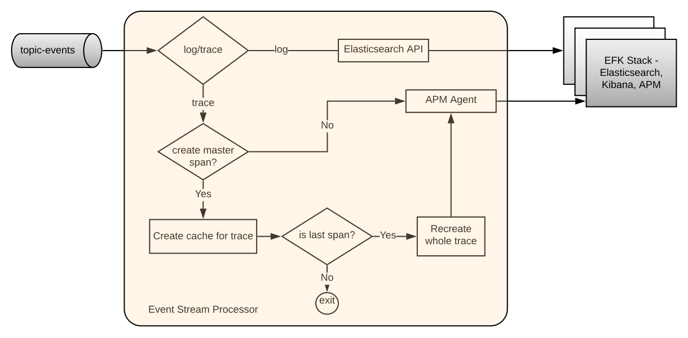

# Event Stream Processor Service

Event Stream Processor consumes event messages from the `topic-events` topic as a result of messages published by the [event-sidecar](https://github.com/mojaloop/event-sidecar) service. Refer to [Event Framework](../event-framework/README.md) for more information on the overall architecture.

The Service delivers logs, including audits, and traces to EFK stack with enabled APM plugin. Based on the event message type, the messages are delivered to different indexes in the Elasticsearch.


## 1. Pre-requisites

### 1.1 Elasticsearch

Ensure that you have created the `mojatemplate` based on the following config: [template](https://github.com/mojaloop/event-stream-processor/blob/master/config/template-mojaloop.json).

#### 1.1.1 Create Template
 ```curl
 curl -X PUT "http://elasticsearch:9200/_template/mojatemplate?pretty" -H 'Content-Type: application/json' -d @config/template-mojaloop.json'
 ```

#### 1.1.2 Delete Template
_Note: only needed if you need to remove the template_
 ```curl
 curl -X DELETE "http://elasticsearch:9200/_template/mojatemplate"
 ```
 
 #### 1.1.3 Get Template
 _Note: useful for debugging template issues_
 ```curl
 curl -X GET "http://elasticsearch:9200/_template/mojatemplate"
 ```
 
## 2. Architecture overview

### 2.1. Flow overview



### 2.2 Trace processing flow sequence diagram



