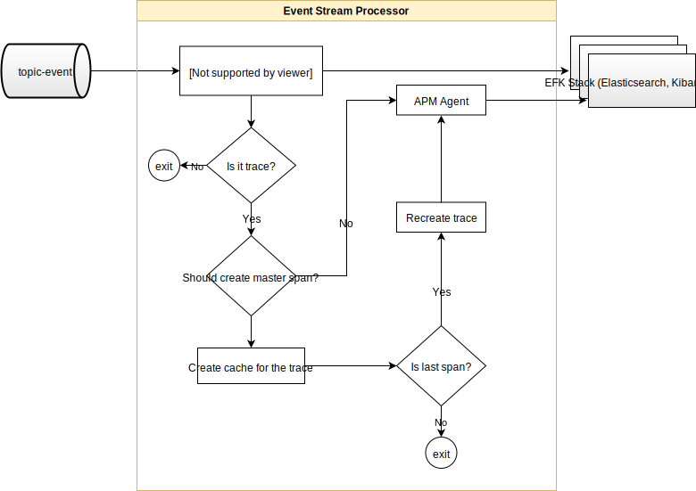

# Event Stream Processor Service

Event Stream Processor consumes event messages from all services side cars as they are created according to the [Event Framework](../event-framework/README.md).

The Service delivers logs, including audits, and traces to EFK stack with enabled APM plugin. Based on the event message type, the messages are delivered to different indexes in the Elasticsearch.

## Trace processing flow sequence diagram



