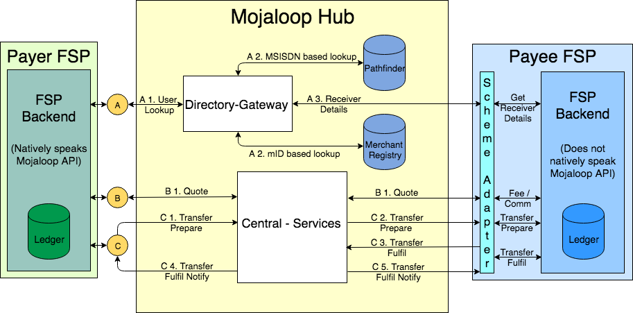

# Mojaloop Hub

There are several components that make up the Mojaloop ecosystem.  The Mojaloop Hub is the primary container and reference we use to describe the core Mojaloop components.  

These consist of:

* The Central Services provide the set of interfaces required to move money from one DFSP to another. This is similar to how money moves through a central bank or clearing house in developed countries. The Central Services contains the core Central Ledger logic to move money but also will be extended to provide fraud management and enforce scheme rules.
* The Directory Gateway provides a look-up account service and routes each payment to the correct service/provider in the ecosystem.  This system leverages Pathfinder and a Merchant Registry to find this information.
* The Mojaloop API's provide the standard set of interfaces a DFSP can implement to connect to the system. A DFSP that wants to connect up can adapt our example code or implement the standard interfaces into their own software. The goal is for it to be as straightforward as possible for a DFSP to connect to the interoperable network.

On either side of the Mojaloop Hub there is sample open source code to show how a DFSP can send and receive payments and the client that an existing DFSP could host to connect to the network.

