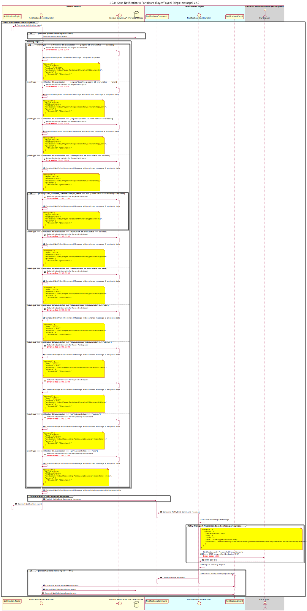

# Notifications

This document will discuss the architecture and design of Mojaloop's Notification-engine.

| Versrion | Date | Name(s) | Description |
| --- | --- | --- | --- |
| v1.0-draft.0 | 2021-02-25 | Miguel de Barros | Initial version. |
| v1.0-draft.1 | 2021-03-15 | Miguel de Barros | Incorporated comments from DA, and expanded on detailed design elements. |
| v1.0-draft.2 | 2021-03-31 | Miguel de Barros | Re-aligned to the Reference Architecture Stream - updates to diagram, seq, etc. Added new NotifyReady domain event, and added expiration capability to the Notification Engine to ensure consistency. Updated scenarios to include failures, and added additional multiple context example. |
|   |   |   |   |


## 1. Requirements

```
1.1. Notification messages must support
    a. Config included to indicate that the message must be reliably delivered
    b. Notification transport (i.e. HTTP, gRPC, Email, etc)
    c. End-point details to deliver the notification

1.2. Reliability
    a. Notification-engine must support retries based on a configuration
    b. HTTP keep-alive must be configured for HTTP transports
    c. A delivery-report must be published to a kafka event topic indicating the result of the notification:
        i. success / error
        ii. meta-data: request-timestamp, delivery-timestamp, request-latency
    d. Delivery-reports events must be persisted into a data-store
    
1.3. Notification-engine must be support the following ingress:
    a. Consuming event messages from a Kafka topic
        i. Notification message JSON schema
    b. An API for sending notifications
        ii. OpenAPI v3 YAML specification document
```


## 2. Design

### 2.1 Overview

This design proposes the seperation of the current Notification capabilities (transport vs mojaloop-contextual processing) into the following components:

| Components | Description | APIs | Notes |
| --- | --- | --- | --- |
| ML-Adapter Callback Handler | This component understands the context and semantics of the FSPIOP Specification. Consumes existing Notification (internal) events, then interprates (in context of Mojaloop use-cases) those events into an appropriate event message to some explicit receipient. Also handles feedback loop and compensating actions (defined by configurable rules) from Delivery Reports. It must also resolve any notification details required (i.e. URLs, transport type, etc) by querying the Central-Service's Admin API. This component is pluggable, and the design supports the possibility of several Callback Handlers existing for several specific transports or alternatively to support different context languages like ISO 20022. | N/A | This component is part of the "ML-API-Adapter" |
| Notification Evt Handler | Consumes existing Notification events, then interprates (without contextual dependencies) those events into an appropriate NotifyCmd. | API operations to request notifications (async & sync) and query stored deliveryReports | This component is a "Supporting-Service" |
| Notification Cmd Handler | This is responsible for the "notification-engine" capabilities. This will consume and process Notification Command message produced by the NotificationEvt Handler. This component is stateless, and has no dependency on any persistence or caching stores. This allows for multiple pluggable Cmd Handlers to exist to handle different combinations of transports (transport.type) and content-types(transpport.contentType) as required. This component will also manage message and transport security aspects such as TLS (Transport Layer Security) and JWS Signing for HTTP transports. | API operations to send notifications synchronously | This component is a "Supporting-Service" |


...

<!--

-->

### 2.2. Sequence Diagrams



### 2.3. Types of Notifications

| Event | Description | Notes |
| --- | --- | --- |
| Notification | Internal existing notification event currently produced by Central-Service components which is the result of some internal process (e.g. Transfer Prepared, Transfer Fulfiled, etc) |  |
| NotifyReady | Domain Event produced by context aware Callback Handler. This message is generic and not contextual. It containts everything that is needed for the notification to be processed by the Notification Engine, which includes the transport specific information required for delivery, and reliability configuration (i.e. delivery report enabled, retry attempts, etc). |  |
| NotifyCmd | Notification Command message produced by the Notification Evt Handler, which is consumed and processed by the Notification Cmd Handler as a result of the NotifyReady event. |  |
| NotifyReport | Domain event message to broadcast Delivery reports within the Notification Engine and Callback Handlers (for compensating actions). This event is consumed by the Notification Evt Handler and persisted for reporting and compensating purposes. |  |

### 2.4. Notification Aggregate

The Notification aggregate manages the Notification Entity with the following states:

| State | Description | Notes |
| --- | --- | --- |
| received | Indicates that the NotifyCmd event has been receivd by the Notification Cmd Handler. |  |
| in-progress | Indicates that the NotifyCmd event is being processed.  |  |
| success | Indicates that the NotifyCmd event processing has completed successfully, and the Notification was delivered. |  |
| failure | Indicates that the NotifyCmd event processing has failed, and the Notification was not delivered. |  |
| expired | Indicates that the NotifyCmd event processing has expired, and the Notification was not delivered. |  |

The aggregate-id should be used as the Kafka message-key for NotifyCmd events. This will optmize the notification processing by ensuring that a consistent Notification Cmd Handler instance will always process that specific entity, thereby allowing us to reduce repository access by leveraging in-memory caching capabilties for queries.

## 3. Models

#### 3.2.1. Events

#### 3.2.1.a. Notification - Notification event produced by Central-Services (Existing)
##### 3.2.1.a.ii. Examples

```JSON
{
    "from": "payerfsp",
    "to": "payeefsp",
    "id": "aa398930-f210-4dcd-8af0-7c769cea1660",
    "content": {
      "headers": {
          "content-type": "application/vnd.interoperability.transfers+json;version=1.0",
          "date": "2019-05-28T16:34:41.000Z",
          "fspiop-source": "payerfsp",
          "fspiop-destination": "payeefsp"
      },
      "payload": "data:application/vnd.interoperability.transfers+json;version=1.0;base64,ewogICJmdWxmaWxtZW50IjogIlVObEo5OGhaVFlfZHN3MGNBcXc0aV9VTjN2NHV0dDdDWkZCNHlmTGJWRkEiLAogICJjb21wbGV0ZWRUaW1lc3RhbXAiOiAiMjAxOS0wNS0yOVQyMzoxODozMi44NTZaIiwKICAidHJhbnNmZXJTdGF0ZSI6ICJDT01NSVRURUQiCn0"
    },
    "type": "application/json",
    "metadata": {
        "event": {
            "id": "3920382d-f78c-4023-adf9-0d7a4a2a3a2f",
            "type": "transfer",
            "action": "prepare",
            "createdAt": "2019-05-29T23:18:32.935Z",
            "state": {
                "status": "success",
                "code": 0,
                "description": "action successful"
            },
            "responseTo": "1a396c07-47ab-4d68-a7a0-7a1ea36f0012"
        },
        "trace": {
            "service": "central-ledger-prepare-handler",
            "traceId": "bbd7b2c7-3978-408e-ae2e-a13012c47739",
            "parentSpanId": "4e3ce424-d611-417b-a7b3-44ba9bbc5840",
            "spanId": "efeb5c22-689b-4d04-ac5a-2aa9cd0a7e87",
            "startTimestamp": "2015-08-29T11:22:09.815479Z",
            "finishTimestamp": "2015-08-29T11:22:09.815479Z",
            "tags": {
              "transctionId": "659ee338-c8f8-4c06-8aff-944e6c5cd694",
              "transctionType": "transfer",
              "parentEventType": "bulk-prepare",
              "parentEventAction": "prepare"
            }
        }
    }
}
```

#### 3.2.1.b. NotifyReady - Notification Ready produced by Mojaloop Adapter Callback Handler

##### 3.2.1.b.i. Schemas

[eventNotifyReady.schema.json](assets/schemas/eventNotifyReady.schema.json)

##### 3.2.1.b.ii. Examples

```JSON
{
  "msgId": "18efb9ea-d29a-42b9-9b30-59e1e7cfe216",
  "msgKey": "861b86e6-c3da-48b3-ba17-896710287d1f",
  "msgName": "NotifyReady",
  "msgType": "Domain",
  "msgTopic": "NotificationEvents",
  "msgPartition": null,
  "msgTimestamp": 1607677081837,
  "aggregateName": "Notifications",
  "aggregateId": "861b86e6-c3da-48b3-ba17-896710287d1f",
  "notifyId": "3920382d-f78c-4023-adf9-0d7a4a2a3a2f",
  "notifyType": "transferFulfiled",
  "transport": {
      "type": "HTTP",
      "method": "GET",
      "contentType": "application/vnd.interoperability.transfers+json;version=1.0",
      "recipient": {
          "endpoint": "http://fsp.com/parties/{{partyIdType}}/{{partyId}}}?key={{value}}",
          "params": {
              "partyIdType": "MSISDN",
              "partyId": "12345",
              "value": "ABCD"
          }
      },
      "options": {
          "deliveryReport": true,
          "retry": {
              "count": 3,
              "type": "noDelay|exponentialDelay",
              "condition": "isNetworkError|isIdempotentRequestError|isNetworkOrIdempotentRequestError"
          },
          "expiration": 2000
      }
  },
  "payload": {
      "headers": {
          "content-type": "application/vnd.interoperability.transfers+json;version=1.0",
          "date": "2019-05-28T16:34:41.000Z",
          "fspiop-source": "payeefsp",
          "fspiop-destination": "payerfsp"
      },
      "body": "data:application/vnd.interoperability.transfers+json;version=1.0;base64,ewogICJmdWxmaWxtZW50IjogIlVObEo5OGhaVFlfZHN3MGNBcXc0aV9VTjN2NHV0dDdDWkZCNHlmTGJWRkEiLAogICJjb21wbGV0ZWRUaW1lc3RhbXAiOiAiMjAxOS0wNS0yOVQyMzoxODozMi44NTZaIiwKICAidHJhbnNmZXJTdGF0ZSI6ICJDT01NSVRURUQiCn0"
  },
  "traceInfo": {
      "traceParent": "00-8e540e87060d56a2d2e0be5d732791e7-d96a5971b7c5cac6-21",
      "traceState": "acmevendor=eyJzcGFuSWQiOiJkOTZhNTk3MWI3YzVjYWM2IiwidGltZUFwaVByZXBhcmUiOiIxNjA3Njc3MDgxNzAwIiwidGltZUFwaUZ1bGZpbCI6IjE2MDc2NzcwODE4MTkifQ==",
      "service": "notification-evt-handler",
      "startTimestamp": 1607677081837,
      "finishTimestamp": 2007677081838
  }
}
```

#### 3.2.1.c. NotifyCmd - Notification Command produced by Notificant Evt Handler

##### 3.2.1.c.i. Schemas

[eventNotifyCmd.schema.json](assets/schemas/eventNotifyCmd.schema.json)

##### 3.2.1.c.ii. Examples

```JSON
{
  "msgId": "18efb9ea-d29a-42b9-9b30-59e1e7cfe216",
  "msgKey": "861b86e6-c3da-48b3-ba17-896710287d1f",
  "msgName": "NotifyCmd",
  "msgType": "Command",
  "msgTopic": "NotificationCommands",
  "msgPartition": null,
  "msgTimestamp": 1607677081837,
  "aggregateName": "Notifications",
  "aggregateId": "861b86e6-c3da-48b3-ba17-896710287d1f",
  "notifyId": "3920382d-f78c-4023-adf9-0d7a4a2a3a2f",
  "notifyType": "transferFulfiled",
  "transport": {
      "type": "HTTP",
      "method": "GET",
      "contentType": "application/vnd.interoperability.transfers+json;version=1.0",
      "recipient": {
          "endpoint": "http://fsp.com/parties/{{partyIdType}}/{{partyId}}}?key={{value}}",
          "params": {
              "partyIdType": "MSISDN",
              "partyId": "12345",
              "value": "ABCD"
          }
      },
      "options": {
          "deliveryReport": true,
          "retry": {
              "count": 3,
              "type": "noDelay|exponentialDelay",
              "condition": "isNetworkError|isIdempotentRequestError|isNetworkOrIdempotentRequestError"
          },
          "expiration": 2000
      }
  },
  "payload": {
      "headers": {
          "content-type": "application/vnd.interoperability.transfers+json;version=1.0",
          "date": "2019-05-28T16:34:41.000Z",
          "fspiop-source": "payeefsp",
          "fspiop-destination": "payerfsp"
      },
      "body": "data:application/vnd.interoperability.transfers+json;version=1.0;base64,ewogICJmdWxmaWxtZW50IjogIlVObEo5OGhaVFlfZHN3MGNBcXc0aV9VTjN2NHV0dDdDWkZCNHlmTGJWRkEiLAogICJjb21wbGV0ZWRUaW1lc3RhbXAiOiAiMjAxOS0wNS0yOVQyMzoxODozMi44NTZaIiwKICAidHJhbnNmZXJTdGF0ZSI6ICJDT01NSVRURUQiCn0"
  },
  "traceInfo": {
      "traceParent": "00-8e540e87060d56a2d2e0be5d732791e7-d96a5971b7c5cac6-21",
      "traceState": "acmevendor=eyJzcGFuSWQiOiJkOTZhNTk3MWI3YzVjYWM2IiwidGltZUFwaVByZXBhcmUiOiIxNjA3Njc3MDgxNzAwIiwidGltZUFwaUZ1bGZpbCI6IjE2MDc2NzcwODE4MTkifQ==",
      "service": "notification-evt-handler",
      "startTimestamp": 1607677081837,
      "finishTimestamp": 2007677081838
  }
}
```

#### 3.2.1.d. NotifyReport - Delivery-report Event produced by Notification Cmd Handler
##### 3.2.1.d.i. Schemas
[eventNotifyReport.schema.json](assets/schemas/eventNotifyReport.schema.json)

##### 3.2.1.d.ii. Examples

```JSON
{
    "msgId": "18efb9ea-d29a-42b9-9b30-59e1e7cfe216", // Generated by the NotificationEvtHandler
    "msgKey": "861b86e6-c3da-48b3-ba17-896710287d1f", // Mapped from the aggregateId, used by Kafka for Key-partitioning
    "msgName": "NotifyReport",
    "msgType": "Domain", // DomainEvents
    "msgTopic": "NotificationCommands", // Topic that the message will be published too
    "msgPartition": null, // Optional partition used for publishing the message to the msgTopic
    "msgTimestamp": 2007677081820, // UTC Time of message creation
    "aggregateName": "Notifications",
    "aggregateId": "861b86e6-c3da-48b3-ba17-896710287d1f", // Generated by the NotificationEvtHandler
    "notifyId": "3920382d-f78c-4023-adf9-0d7a4a2a3a2f", // Mapped from the metadata.event.id by the NotificationEvtHandler, used to correlate multiple NotifyCmd.
    "report": { // Transport information required by the notification-engine
      "requestTimestamp": 1507677081120, // UTC Timestamp of when request was received
      "deliveryTimestamp": 1607677081840, // UTC Timestamp of delivery
      "deliveryReqLatency": 100, // Request latency of the successful delivery in milliseconds (optional)
      "retryAttempts": 1, // Number of retries that were necessary to delivery the message
      "response": {
        "statusCode": "202", // status code from transport
        "statusDescription": "Accepted",
        "headers": {
          "content-type": "application/vnd.interoperability.transfers+json;version=1.0",
          "date": "2019-05-28T16:34:41.000Z"
        },
        "body": "{}"
      },
      "accepted": true,
      "errorInformation": { // Only applicable if "accepted"=false, and expected to occur if we are not able to deliver the notification due to a transport issues: connectivity, timeout or certificate.
        "errorCode": "408", // Internal error code
        "errorDescription": "ECONNABORTED\ntimeout of 2ms exceeded\nError: timeout of 2ms exceeded\n    at createError (/node_modules/axios/lib/core/createError.js:16:15)\n    at Timeout.handleRequestTimeout (/node_modules/axios/lib/adapters/http.js:252:16)\n    at listOnTimeout (timers.js:324:15)\n    at processTimers (timers.js:268:5)" // Can include a stringified stack trace.
      }
    },
    "traceInfo": {
        "traceParent": "00-8e540e87060d56a2d2e0be5d732791e7-d96a5971b7c5cac6-21",
        "traceState": "acmevendor=eyJzcGFuSWQiOiJkOTZhNTk3MWI3YzVjYWM2IiwidGltZUFwaVByZXBhcmUiOiIxNjA3Njc3MDgxNzAwIiwidGltZUFwaUZ1bGZpbCI6IjE2MDc2NzcwODE4MTkifQ==",
        "service": "notification-Cmd-handler",
        "startTimestamp": 1607677081837,
        "finishTimestamp": 2007677081838
    }
}
```

## 4. Scenarios

#### 4.1. Failure Scenarios

##### 4.1.1. Notification Cmd Handler Failure mid-processing

Notification Cmd Handler uses either a cached or persistent repository (depending on requirements) to store the Notification state.

Once the NotifyCmd is consumed by the Notification Cmd Handler, the managed state within the cached/persistent repository will ensure that the Handler will be able to recover from any mid-processing interruptions. The NotifyCmd event will trigger a re-load of the Notification state from the repository, and process the notification accordingly:

- The Notification will be ignored if the state.status is either `success`, `failed` or `expired`.
- The NotifyCmd will be processed from its last retry-attempt if the state.status = `in-progress`
- The NotifyCmd will be processed normally if state.status = `received` as no retry-atempts have been observed

The Notification Cmd Handler will only commit the Kafka message once a final state (i.e. `success`, `failed` or `expired`) has been persisted, thus ensuring the that the message will be re-processed as a result of any interupptions.

The expiration capability supported by the Notification Engine will ensure that a Notification Cmd Event will not be continously retried, and will instead end up in a final state of `expired` once the expiration lapses.

##### 4.1.2. Compensating Actions

The Mojaloop Adapter - FSPIOP Callback Handler (or any other Callback Handler) is able to action compensating actions by processing the NotifyReport domain event. Note that the NotifyReport will only be published by the Notification Engine if the transport.options.deliver-report field is set to true on the NotifyReady domain event.

The capabilities for the rule processor must support the following operations:
- Create a new (not a duplicate) NotifiyReady request event. This can be used by any Callback Handler to execute additional retry logic that is specific to its own context (i.e. FPSIOP, ISO20022, etc), or instead soley handle retry logic by disabling retries on the Notification Engine (i.e. transport.options.retry.count=0).
- Notify Central-Services of the NotifyReport results. This can be used by the Central-Services to inform the Timeout handler of the expiration.


##### 4.1.2. Callback Handlers

There are two approaches to handle unavailable/interruptions to Callback Handler processing:
- the existing Mojaloop Timeout process will manage any transfers that are not in a final commited or aborted state. This could result in a notification being delivered while in parallel the associated transfer is timed-out by the Central-Services, and thus to consistency issues.
- the existing Timeout process will ignore any transfers that are queued for notification, and instead wait for a compensating action from the FSPIOP Callback Handler. This will ensure consistency and is the recommended approach.

### 4.2. Multiple Transports


The above scenario depicts two FSPs each utilsing two different transports for FSPIOP Transfer interactions:
- FSP1 (payer) is using HTTP transport
- FSP2 (payee) is using gRCP transport

Each of the FSPs in this example have had their associated callbacks registered which includes their transport preference (i.e. HTTP vs gRPC).

```http
POST /participants/FSP1/endpoints HTTP/1.1
Host: central-ledger-admin-api.mojaloop.live
Content-Type: application/json

{
  "type": "FSPIOP_CALLBACK_URL_TRANSFER_POST",
  "value": "http://fsp2.com/transfers"
}
```

```http
POST /participants/FSP2/endpoints HTTP/1.1
Host: central-ledger-admin-api.mojaloop.live
Content-Type: application/json

{
  "type": "FSPIOP_CALLBACK_URL_TRANSFER_PUT",
  "value": "grpc://fsp2.com/transfers"
}
```

With this design it is possible to achieve this by introducing multiple Notification Cmd Handlers within the Notification Engine to handle different Transports (i.e. HTTP, gRPC). In addition, multiple matching ML-Adapters would need to similiar exist to support the associated inbound request.

Each of the Notification Cmd Handlers will only listen to event messages that match their intended transport types, and will thus discard non-applicable ones.

This therefore allows the Central-Ledger components to be isolated from the transport specific logic (and transformations if applicable) for notification callbacks.

The delivery-report for each of the POST/PUT interactions provides the assurance that the notifications results are recorded by the Central-Service Notification-Evt-Handler component. This component is able to raise alerts or alternatively handle any compensating actions independantly of the FSP's transport preferences.

The transferId is mapped to the notifyId field below. This allows one to query a Notification resuls by correlating the notifyId with the transferId.

#### 4.2.a. gRPC Transport example for a POST Transfer Callback Notification Messages for FSP1 to FSP2

NotifyReady Domain Event:
```JSON
{
    "msgId": "d9e5c681-8489-46ff-880f-8de822b3c521",
    "msgKey": "861b86e6-c3da-48b3-ba17-896710287d1f",
    "msgName": "NotifyReady",
    "msgType": "Domain",
    "msgTopic": "NotificationEvents",
    "msgPartition": null,
    "msgTimestamp": 1607677081837,
    "aggregateName": "Notifications",
    "aggregateId": "861b86e6-c3da-48b3-ba17-896710287d1f",
    "notifyId": "b17b7125-a0fc-451f-98ee-7e4c870c7d13",
    "notifyType": "transferPrepared",
    "transport": {
      "type": "GRPC",
      "method": "POST",
      "contentType": "application/vnd.interoperability.transfers+json;version=1.0",
      "recipient": {
        "endpoint": "fsp2.com/transfers"
      },
      "options": {
        "deliveryReport": true,
        "retry": {
          "count": 3,
          "type": "exponentialDelay",
          "condition": "isNetworkOrIdempotentRequestError"
        }
      }
    },
    "payload": {
      "headers": {
        "content-type": "application/vnd.interoperability.transfers+json;version=1.0",
        "date": "2019-05-28T16:34:41.000Z",
        "fspiop-source": "FSP1",
        "fspiop-destination": "FSP2"
      },
      "body": "data:application/vnd.interoperability.transfers+json;version=1.0;base64,ENCODED-PREPARE-REQUEST"
    },
    "traceInfo": {
        "traceParent": "00-8e540e87060d56a2d2e0be5d732791e7-d96a5971b7c5cac6-21",
        "traceState": "acmevendor=eyJzcGFuSWQiOiJkOTZhNTk3MWI3YzVjYWM2IiwidGltZUFwaVByZXBhcmUiOiIxNjA3Njc3MDgxNzAwIiwidGltZUFwaUZ1bGZpbCI6IjE2MDc2NzcwODE4MTkifQ==",
        "service": "notification-evt-handler",
        "startTimestamp": 1607677081837,
        "finishTimestamp": 2007677081838
    }
}
```

NotifyCmd Command Event:
```JSON
{
    "msgId": "66a2ec9a-9d4f-4439-8d38-19c3aa21d54e",
    "msgKey": "861b86e6-c3da-48b3-ba17-896710287d1f",
    "msgName": "NotifyCmd",
    "msgType": "Command",
    "msgTopic": "NotificationCommands",
    "msgPartition": null,
    "msgTimestamp": 1607677081837,
    "aggregateName": "Notifications",
    "aggregateId": "861b86e6-c3da-48b3-ba17-896710287d1f",
    "notifyId": "b17b7125-a0fc-451f-98ee-7e4c870c7d13",
    "notifyType": "transferPrepared",
    "transport": {
      "type": "GRPC",
      "method": "POST",
      "contentType": "application/vnd.interoperability.transfers+json;version=1.0",
      "recipient": {
        "endpoint": "fsp2.com/transfers"
      },
      "options": {
        "deliveryReport": true,
        "retry": {
          "count": 3,
          "type": "exponentialDelay",
          "condition": "isNetworkOrIdempotentRequestError"
        }
      }
    },
    "payload": {
      "headers": {
        "content-type": "application/vnd.interoperability.transfers+json;version=1.0",
        "date": "2019-05-28T16:34:41.000Z",
        "fspiop-source": "FSP1",
        "fspiop-destination": "FSP2"
      },
      "body": "data:application/vnd.interoperability.transfers+json;version=1.0;base64,ENCODED-PREPARE-REQUEST"
    },
    "traceInfo": {
        "traceParent": "00-8e540e87060d56a2d2e0be5d732791e7-d96a5971b7c5cac6-21",
        "traceState": "acmevendor=eyJzcGFuSWQiOiJkOTZhNTk3MWI3YzVjYWM2IiwidGltZUFwaVByZXBhcmUiOiIxNjA3Njc3MDgxNzAwIiwidGltZUFwaUZ1bGZpbCI6IjE2MDc2NzcwODE4MTkifQ==",
        "service": "notification-evt-handler",
        "startTimestamp": 1607677081837,
        "finishTimestamp": 2007677081838
    }
}
```

NotifyReport Domain Event:
```JSON
{
    "msgId": "0ee9331a-1a71-4efc-a22d-868fcbf59658",
    "msgKey": "861b86e6-c3da-48b3-ba17-896710287d1f",
    "msgName": "NotifyReport",
    "msgType": "Domain",
    "msgTopic": "NotificationEvents",
    "msgPartition": null,
    "msgTimestamp": 2007677081820,
    "aggregateName": "Notifications",
    "aggregateId": "861b86e6-c3da-48b3-ba17-896710287d1f",
    "notifyId": "b17b7125-a0fc-451f-98ee-7e4c870c7d13",
    "notifyType": "transferPrepared",
    "report": {
      "requestTimestamp": 1507677081120,
      "deliveryTimestamp": 1607677081840,
      "deliveryReqLatency": 100,
      "retryAttempts": 0,
      "response": {
        "statusCode": "0",
        "statusDescription": "OK",
        "headers": {
          "content-type": "application/vnd.interoperability.transfers+json;version=1.0",
          "date": "2019-05-28T16:34:41.000Z"
        },
        "body": "{}",
      },
      "accepted": true
    },
    "traceInfo": {
        "traceParent": "00-8e540e87060d56a2d2e0be5d732791e7-d96a5971b7c5cac6-21",
        "traceState": "acmevendor=eyJzcGFuSWQiOiJkOTZhNTk3MWI3YzVjYWM2IiwidGltZUFwaVByZXBhcmUiOiIxNjA3Njc3MDgxNzAwIiwidGltZUFwaUZ1bGZpbCI6IjE2MDc2NzcwODE4MTkifQ==",
        "service": "notification-Cmd-handler",
        "startTimestamp": 1607677081837,
        "finishTimestamp": 2007677081838
    }
}
```


#### 4.2.b. HTTP Transport example for a PUT Transfer Callback Notification Messages for FSP2 to FSP1

NotifyReady Command Event:
```JSON
{
    "msgId": "a553f7fd-6e4e-4799-b145-c469eca2da05",
    "msgKey": "861b86e6-c3da-48b3-ba17-896710287d1f",
    "msgName": "NotifyReady",
    "msgType": "Domain",
    "msgTopic": "NotificationEvents",
    "msgPartition": null,
    "msgTimestamp": 1607677081837,
    "aggregateName": "Notifications",
    "aggregateId": "861b86e6-c3da-48b3-ba17-896710287d1f",
    "notifyId": "b17b7125-a0fc-451f-98ee-7e4c870c7d13",
    "notifyType": "transferFulfilled",
    "transport": {
      "type": "HTTP",
      "method": "PUT",
      "contentType": "application/vnd.interoperability.transfers+json;version=1.0",
      "recipient": {
        "endpoint": "fsp2.com/transfers/{{transferId}}",
        "params": {
          "transferId": "861b86e6-c3da-48b3-ba17-896710287d1f"
        }
      },
      "options": {
        "deliveryReport": true,
        "retry": {
          "count": 3,
          "type": "exponentialDelay",
          "condition": "isNetworkOrIdempotentRequestError"
        }
      }
    },
    "payload": {
      "headers": {
        "content-type": "application/vnd.interoperability.transfers+json;version=1.0",
        "date": "2019-05-28T16:34:41.000Z",
        "fspiop-source": "FSP2",
        "fspiop-destination": "FSP1"
      },
      "body": "data:application/vnd.interoperability.transfers+json;version=1.0;base64,ENCODED-FULFIL-REQUEST"
    },
    "traceInfo": {
        "traceParent": "00-8e540e87060d56a2d2e0be5d732791e7-d96a5971b7c5cac6-21",
        "traceState": "acmevendor=eyJzcGFuSWQiOiJkOTZhNTk3MWI3YzVjYWM2IiwidGltZUFwaVByZXBhcmUiOiIxNjA3Njc3MDgxNzAwIiwidGltZUFwaUZ1bGZpbCI6IjE2MDc2NzcwODE4MTkifQ==",
        "service": "notification-evt-handler",
        "startTimestamp": 1607677081837,
        "finishTimestamp": 2007677081838
    }
}
```

NotifyCmd Command Event:
```JSON
{
    "msgId": "6db168a3-61bd-485b-9921-b7012651243e",
    "msgKey": "861b86e6-c3da-48b3-ba17-896710287d1f",
    "msgName": "NotifyCmd",
    "msgType": "Command",
    "msgTopic": "NotificationCommands",
    "msgPartition": null,
    "msgTimestamp": 1607677081837,
    "aggregateName": "Notifications",
    "aggregateId": "861b86e6-c3da-48b3-ba17-896710287d1f",
    "notifyId": "b17b7125-a0fc-451f-98ee-7e4c870c7d13",
    "notifyType": "transferFulfilled",
    "transport": {
      "type": "HTTP",
      "method": "PUT",
      "contentType": "application/vnd.interoperability.transfers+json;version=1.0",
      "recipient": {
        "endpoint": "fsp2.com/transfers/{{transferId}}",
        "params": {
          "transferId": "861b86e6-c3da-48b3-ba17-896710287d1f"
        }
      },
      "options": {
        "deliveryReport": true,
        "retry": {
          "count": 3,
          "type": "exponentialDelay",
          "condition": "isNetworkOrIdempotentRequestError"
        }
      }
    },
    "payload": {
      "headers": {
        "content-type": "application/vnd.interoperability.transfers+json;version=1.0",
        "date": "2019-05-28T16:34:41.000Z",
        "fspiop-source": "FSP2",
        "fspiop-destination": "FSP1"
      },
      "body": "data:application/vnd.interoperability.transfers+json;version=1.0;base64,ENCODED-FULFIL-REQUEST"
    },
    "traceInfo": {
        "traceParent": "00-8e540e87060d56a2d2e0be5d732791e7-d96a5971b7c5cac6-21",
        "traceState": "acmevendor=eyJzcGFuSWQiOiJkOTZhNTk3MWI3YzVjYWM2IiwidGltZUFwaVByZXBhcmUiOiIxNjA3Njc3MDgxNzAwIiwidGltZUFwaUZ1bGZpbCI6IjE2MDc2NzcwODE4MTkifQ==",
        "service": "notification-evt-handler",
        "startTimestamp": 1607677081837,
        "finishTimestamp": 2007677081838
    }
}
```

NotifyReport Domain Event:
```JSON
{
    "msgId": "cfa82358-7a92-42bd-8943-f37d22784b15",
    "msgKey": "861b86e6-c3da-48b3-ba17-896710287d1f",
    "msgName": "NotifyReport",
    "msgType": "Domain",
    "msgTopic": "NotificationEvents",
    "msgPartition": null,
    "msgTimestamp": 2007677081820,
    "aggregateName": "Notifications",
    "aggregateId": "861b86e6-c3da-48b3-ba17-896710287d1f",
    "notifyId": "b17b7125-a0fc-451f-98ee-7e4c870c7d13",
    "notifyType": "transferFulfilled",
    "report": {
      "requestTimestamp": 1507677081120,
      "deliveryTimestamp": 1607677081840,
      "deliveryReqLatency": 100,
      "retryAttempts": 1,
      "response": {
        "statusCode": "200",
        "statusDescription": "Ok",
        "headers": {
          "content-type": "application/vnd.interoperability.transfers+json;version=1.0",
          "date": "2019-05-28T16:34:41.000Z"
        },
        "body": "{}",
      },
      "accepted": true
    },
    "traceInfo": {
        "traceParent": "00-8e540e87060d56a2d2e0be5d732791e7-d96a5971b7c5cac6-21",
        "traceState": "acmevendor=eyJzcGFuSWQiOiJkOTZhNTk3MWI3YzVjYWM2IiwidGltZUFwaVByZXBhcmUiOiIxNjA3Njc3MDgxNzAwIiwidGltZUFwaUZ1bGZpbCI6IjE2MDc2NzcwODE4MTkifQ==",
        "service": "notification-Cmd-handler",
        "startTimestamp": 1607677081837,
        "finishTimestamp": 2007677081838
    }
}
```

### 4.3. Multiple Context Languages

This is an example of how a synchronous ISO Payer FSP could be send a Transfer through a Mojaloop Switch. The Payee FSP in the example only supports FSPIOP for inbound requests and callbacks.

A ML-Adapter would need to be developed to support the Inbound Synchronous ISO 20022 PAIN.013 request being received by the Payer FSP. As the Payer FSP expects a syncrhonous response, there is no need to utilise the Notification Engine for the response. The adapter instead will keep the request connection alive to the Payer FSP and correlate the fulfillment notification published by the Central-Services. The adapter will transporm the result into a PACS.008 message before responding synchronous to the Payer FSP.

The ML-Adapter for ISO 20022 processing will however listen for NotifyReport events produced by the Notification Engine to handle any comepensating actions as a result of Transfer Prepare notification errors.


