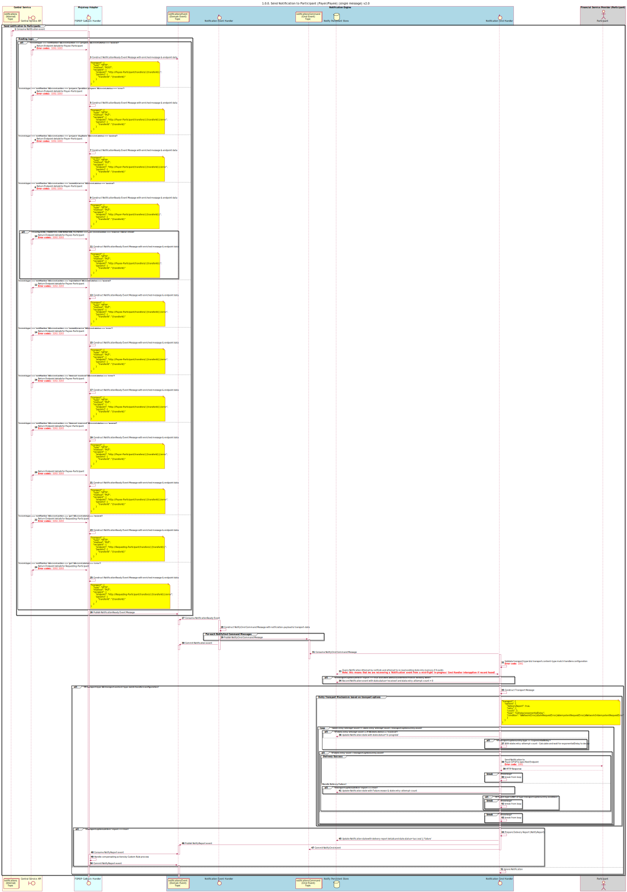

# Notifications

This document will discuss the architecture and design of Mojaloop's Notification-engine.

## 1. Requirements

```
1.1. Notification-engine must be stateless
    a. Notification messages consumed by the Notification-engine contains everything needed to send notifications

1.2. Notification messages must support
    a. Config included to indicate that the message must be reliably delivered
    b. Notification transport (i.e. HTTP, gRPC, Email, etc)
    c. End-point details to deliver the notification

1.3. Reliability
    a. Notification-engine must support retries based on a configuration
    b. HTTP keep-alive must be configured for HTTP transports
    c. A delivery-report must be published to a kafka event topic indicating the result of the notification:
        i. success / error
        ii. meta-data: request-timestamp, delivery-timestamp, request-latency
    d. Delivery-reports events must be persisted into a data-store (Central-Ledger?)
    
1.4. Notification-engine must be support the following ingress:
    a. Consuming event messages from a Kafka topic
        i. Notification message JSON schema
    b. An API for sending notifications
        ii. OpenAPI v3 YAML specification document
```


## 2. Design

### 2.1 Overview
...

<!--

-->

### 2.2. Sequence Diagram



### 2.2 Types of Notifications
...
<!--

-->

## 3. Models

### 3.1. Schema

..

### 3.2. Examples

#### 3.2.1. Events

<!--
#### 3.2.1.a. Notification Commands
```JSON
{
    "from": "noresponsepayeefsp",
    "to": "payerfsp",
    "id": "aa398930-f210-4dcd-8af0-7c769cea1660",
    "content": {
        "transport": { // transport information required by the notification-engine
          "type": "HTTP", // transport
          "method": "GET", // Optional method for the associated transport
          "endpoint": "http:///fsp.com/parties/{{partyIdType}}/{{partyId}}}?key={{value}}", // templated endpoint
          "params": { // template parameters <-- is this needed?
            "partyIdType": "MSISDN",
            "partyId": "12345",
            "value": "ABCD"
          },
          "options": { // run-time config options for the notification-engine
            "delivery-report": true, // enabled delivery-report
            "retry": { //retry config
              "count": 3,
              "type": "noDelay|exponentialDelay",
              "condition": "isNetworkError|isSafeRequestError|isIdempotentRequestError|isNetworkOrIdempotentRequestError"
            }
          },
          "customHeaders": { // any extra headers that the switch wants to include
            "yup": "nope"
          }
        },
        "headers": {
            "content-type": "application/vnd.interoperability.transfers+json;version=1.0",
            "date": "2019-05-28T16:34:41.000Z",
            "fspiop-source": "noresponsepayeefsp",
            "fspiop-destination": "payerfsp"
        },
        "payload": "data:application/vnd.interoperability.transfers+json;version=1.0;base64,ewogICJmdWxmaWxtZW50IjogIlVObEo5OGhaVFlfZHN3MGNBcXc0aV9VTjN2NHV0dDdDWkZCNHlmTGJWRkEiLAogICJjb21wbGV0ZWRUaW1lc3RhbXAiOiAiMjAxOS0wNS0yOVQyMzoxODozMi44NTZaIiwKICAidHJhbnNmZXJTdGF0ZSI6ICJDT01NSVRURUQiCn0"
    },
    "type": "application/json",
    "metadata": {
        "event": {
            "id": "3920382d-f78c-4023-adf9-0d7a4a2a3a2f",
            "type": "trace",
            "action": "span",
            "createdAt": "2019-05-29T23:18:32.935Z",
            "state": {
                "status": "success",
                "code": 0,
                "description": "action successful"
            },
            "responseTo": "1a396c07-47ab-4d68-a7a0-7a1ea36f0012"
        },
        "trace": {
            "service": "central-ledger-prepare-handler",
            "traceId": "bbd7b2c7-3978-408e-ae2e-a13012c47739",
            "parentSpanId": "4e3ce424-d611-417b-a7b3-44ba9bbc5840",
            "spanId": "efeb5c22-689b-4d04-ac5a-2aa9cd0a7e87",
            "startTimestamp": "2015-08-29T11:22:09.815479Z",
            "finishTimestamp": "2015-08-29T11:22:09.815479Z",
            "tags": {
              "transctionId": "659ee338-c8f8-4c06-8aff-944e6c5cd694",
              "transctionType": "transfer",
              "parentEventType": "bulk-prepare",
              "parentEventAction": "prepare"
            }
        }
    }
}
```-->

#### 3.2.1.a. Notification Commands

```JSON
{
    "msgId": "18efb9ea-d29a-42b9-9b30-59e1e7cfe216",
    "msgKey": "861b86e6-c3da-48b3-ba17-896710287d1f",
    "msgName": "NotifyCmd",
    "msgType": 2,
    "msgTopic": "NotificationCommands",
    "msgPartition": null,
    "msgTimestamp": 1607677081837,
    "aggregateName": "Notifications",
    "aggregateId": "861b86e6-c3da-48b3-ba17-896710287d1f",
    "transport": { // transport information required by the notification-engine
      "type": "HTTP", // transport
      "method": "GET", // Optional method for the associated transport
      "endpoint": "http://fsp.com/parties/{{partyIdType}}/{{partyId}}}?key={{value}}", // templated endpoint
      "params": { // template parameters <-- is this needed?
        "partyIdType": "MSISDN",
        "partyId": "12345",
        "value": "ABCD"
      },
      "options": { // run-time config options for the notification-engine
        "delivery-report": true, // enabled delivery-report
        "retry": { //retry config
          "count": 3,
          "type": "noDelay|exponentialDelay",
          "condition": "isNetworkError|isSafeRequestError|isIdempotentRequestError|isNetworkOrIdempotentRequestError"
        }
      }
    },
    "payload": {
      "headers": {
        "content-type": "application/vnd.interoperability.transfers+json;version=1.0",
        "date": "2019-05-28T16:34:41.000Z",
        "fspiop-source": "noresponsepayeefsp",
        "fspiop-destination": "payerfsp"
      },
      "body": "data:application/vnd.interoperability.transfers+json;version=1.0;base64,ewogICJmdWxmaWxtZW50IjogIlVObEo5OGhaVFlfZHN3MGNBcXc0aV9VTjN2NHV0dDdDWkZCNHlmTGJWRkEiLAogICJjb21wbGV0ZWRUaW1lc3RhbXAiOiAiMjAxOS0wNS0yOVQyMzoxODozMi44NTZaIiwKICAidHJhbnNmZXJTdGF0ZSI6ICJDT01NSVRURUQiCn0",
    },
    "traceInfo": {
        "traceParent": "00-8e540e87060d56a2d2e0be5d732791e7-d96a5971b7c5cac6-21",
        "traceState": "acmevendor=eyJzcGFuSWQiOiJkOTZhNTk3MWI3YzVjYWM2IiwidGltZUFwaVByZXBhcmUiOiIxNjA3Njc3MDgxNzAwIiwidGltZUFwaUZ1bGZpbCI6IjE2MDc2NzcwODE4MTkifQ=="
    }
}
```

#### 3.2.2. Delivery-report Event
```
```

## 4. References

...
