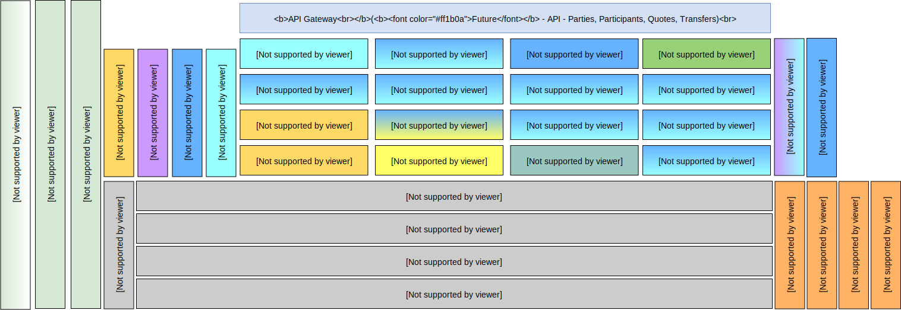

# Mojaloop Hub

There are several components that make up the Mojaloop ecosystem. The Mojaloop Hub is the primary container and reference we use to describe the core Mojaloop components.  

The following component diagram shows the break-down of the Mojaloop services and its micro-service architecture: 

_Note: Colour-grading indicates the relationship between data-store, and message-streaming / adapter-interconnects. E.g. `Central-Services` utilise `MySQL` as a Data-store, and leverage on `Kafka` for Messaging_

These consist of:

* The **Mojaloop API Adapters** (**ML-API-Adapter**) provide the standard set of interfaces a DFSP can implement to connect to the system for Transfers. A DFSP that wants to connect up can adapt our example code or implement the standard interfaces into their own software. The goal is for it to be as straightforward as possible for a DFSP to connect to the interoperable network.
* The **Central Services** (**CS**) provide the set of components required to move money from one DFSP to another through the Mojaloop API Adapters. This is similar to how money moves through a central bank or clearing house in developed countries. The Central Services contains the core Central Ledger logic to move money but also will be extended to provide fraud management and enforce scheme rules.
* The **Account Lookup Service** (**ALS**) provides mechanism to resolve FSP routing information through the Particpant API or orchestrate a Party request based on an internal Participant look-up. The internal Participant look-up is handled by a number of standard Oracle adapter or services. Example Oracle adapter/service would be to look-up Participant information from Pathfinder or a Merchant Registry. These Oracle adapter or services can easily be added depending on the schema requirements.
* The **Quoting Service** (**QA**) provides Quoting is the process that determines any fees and any commission required to perform a financial transaction between two FSPs. It is always initiated by the Payer FSP to the Payee FSP, which means that the quote flows in the same way as a financial transaction.
* The **Simulator** (**SIM**) mocks several DFSP functions as follows:
    - Oracle end-points for Oracle Participant CRUD operations using in-memory cache;
    - Participant end-points for Oracles with support for parameterized partyIdTypes;
    - Parties end-points for Payer and Payee FSPs with associated callback responses;
    - Transfer end-points for Payer and Payee FSPs with associated callback responses; and
    - Query APIs to verify transactions (requests, responses, callbacks, etc) to support QA testing and verification.

On either side of the Mojaloop Hub there is sample open source code to show how a DFSP can send and receive payments and the client that an existing DFSP could host to connect to the network.
