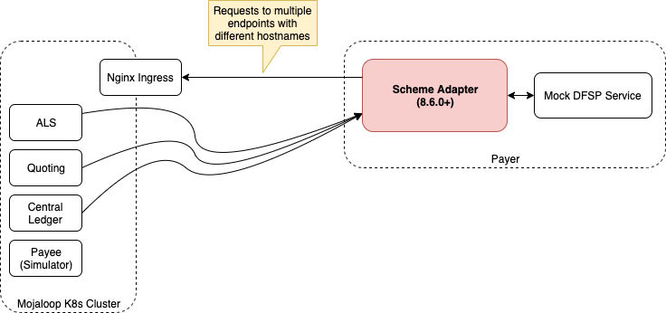

# SDK Scheme Adapter and Local K8S cluster testing

A detailed documentation for dfsps who want to test the mojaloop cluster deployment with scheme adapter and a mock backend service.



## Prerequisite

* A working mojaloop k8s cluster (Local / Cloud deployment)
* DFSP mock backend service
* sdk-scheme-adapter > 8.6.0

## Configuration & Starting services

### Mojaloop Local K8S cluster deployment
Please follow the below link to deploy your own cluster on local system.
https://mojaloop.io/documentation/deployment-guide/

A Linux based operating system is recommended and atleast 16GB Ram and 4 core processor is required.

After installation please complete the New FSP Onboarding collection available at the below link.
https://github.com/mojaloop/postman

And make sure the oracles & endpoints are configured correctly and can able to run "Golden Path Collection" successfully.

### DFSP Mock Backend service & SDK Scheme adapter
There SDK scheme adapter version should be greater than 8.6.0
The next step starts the scheme adapter from docker-compose file automatically.

Please download the following repository
https://github.com/mojaloop/sdk-mock-dfsp-backend

Edit the docker-compose.yml file and verify the following lines.

```
version: '3'
services:
  redis2:
    image: "redis:5.0.4-alpine"
    container_name: redis2
  backend:
    image: "mojaloop/sdk-mock-dfsp-backend"
    env_file: ./backend.env
    container_name: dfsp_mock_backend2
    ports:
      - "23000:3000"
    depends_on:
      - scheme-adapter2

  scheme-adapter2:
    image: "mojaloop/sdk-scheme-adapter:latest"
    env_file: ./scheme-adapter.env
    container_name: sa_sim2
    ports:
      - "4000:4000"
    depends_on:
      - redis2
```

Edit the backend.env file and change the OUTBOUND_ENDPOINT value
```
OUTBOUND_ENDPOINT=http://sa_sim2:4001
```

Edit scheme-adapter.env and change the following lines
Please replace the endpoint values with the appropriate hostnames provided in /etc/hosts file.

```
DFSP_ID=safsp
CACHE_HOST=redis2
ALS_ENDPOINT=account-lookup-service.local
QUOTES_ENDPOINT=quoting-service.local
TRANSFERS_ENDPOINT=ml-api-adapter.local
BACKEND_ENDPOINT=dfsp_mock_backend2:3000
AUTO_ACCEPT_PARTY=true
AUTO_ACCEPT_QUOTES=true
VALIDATE_INBOUND_JWS=false
VALIDATE_INBOUND_PUT_PARTIES_JWS=false
JWS_SIGN=true
JWS_SIGN_PUT_PARTIES=true
```

Start the backend and scheme adapter using the following command.
```
cd src
docker-compose up -d
```


## Testing

### Additional postman collections
Download the following files 
* ["Mojaloop-Local.postman_environment_modified.json"](./postman_files/Mojaloop-Local.postman_environment_modified.json)
* ["OSS-Custom-FSP-Onboaring-SchemeAdapter-Setup.postman_collection.json"](./postman_files/OSS-Custom-FSP-Onboaring-SchemeAdapter-Setup.postman_collection.json)

Point the following hostnames to your local machine IP by adding the below line in /etc/hosts file
```
192.168.5.101       ml-api-adapter.local account-lookup-service.local central-ledger.local central-settlement.local account-lookup-service-admin.local quoting-service.local moja-simulator.local central-ledger central-settlement ml-api-adapter account-lookup-service account-lookup-service-admin quoting-service simulator host.docker.internal moja-account-lookup-mysql
```

By selecting the environment file please run the custom collection in the postman to provision a new FSP called "safsp".
The endpoints for safsp will be set to the URL of the scheme adapter which is configured in environment file.

### Add the target MSISDN to payee simulator which is running inside the K8S. Run the following commands
```
curl -X POST \
  http://moja-simulator.local/payeefsp/parties/MSISDN/27713803912 \
  -H 'Accept: */*' \
  -H 'Accept-Encoding: gzip, deflate' \
  -H 'Cache-Control: no-cache' \
  -H 'Connection: keep-alive' \
  -H 'Content-Length: 406' \
  -H 'Content-Type: application/json' \
  -H 'Host: moja-simulator.local' \
  -H 'User-Agent: PostmanRuntime/7.20.1' \
  -H 'cache-control: no-cache' \
  -d '{
    "party": {
        "partyIdInfo": {
            "partyIdType": "MSISDN",
            "partyIdentifier": "27713803912",
            "fspId": "payeefsp"
        },
        "name": "Siabelo Maroka",
        "personalInfo": {
            "complexName": {
                "firstName": "Siabelo",
                "lastName": "Maroka"
            },
            "dateOfBirth": "1974-01-01"
        }
    }
}'

curl -X POST \
  http://account-lookup-service.local/participants/MSISDN/27713803912 \
  -H 'Accept: application/vnd.interoperability.participants+json;version=1' \
  -H 'Connection: keep-alive' \
  -H 'Content-Length: 50' \
  -H 'Content-Type: application/vnd.interoperability.participants+json;version=1.0' \
  -H 'Date: Fri, 21 Dec 2018 12:17:01 GMT' \
  -H 'FSPIOP-Source: payeefsp' \
  -H 'Host: account-lookup-service.local' \
  -H 'User-Agent: PostmanRuntime/7.11.0' \
  -H 'accept-encoding: gzip, deflate' \
  -H 'cache-control: no-cache,no-cache' \
  -d '{
    "fspId": "payeefsp",
    "currency": "USD"
}'
```

### Try to send money
Try to send funds from "safsp" (Mock DFSP) to a MSISDN which is in "payeedfsp" (Simulator in K8S) through scheme adapter.
Run the following curl command to issue command to Mock DFSP service.
```
curl -X POST \
  http://localhost:23000/send \
  -H 'Content-Type: application/json' \
  -d '{
    "from": {
        "displayName": "John Doe",
        "idType": "MSISDN",
        "idValue": "123456789"
    },
    "to": {
        "idType": "MSISDN",
        "idValue": "27713803912"
    },
    "amountType": "SEND",
    "currency": "USD",
    "amount": "100",
    "transactionType": "TRANSFER",
    "note": "testpayment",
    "homeTransactionId": "123ABC"
}'
```

You should get a response with COMPLETED currentState.
If you get 