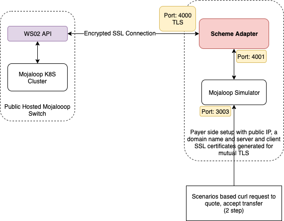

# SDK Scheme Adapter and WSO2 API Gateway

This documentaion is for testing scheme adapter against a public hosted WSO2 API gateway with SSL encryption and bearer token authentication.




## Prerequisite

* Accesss to WSO2 API production api with a generated token.
* sdk-scheme-adapter
* mojaloop-simulator

## Generate access token and URL from WSO2 API

* Login to your WSO2 store and go to applications in the menu. Create a new application and access keys if you don't have those already.
* Then go to APIs menu, you should find the following applications. Subscribe to these two APIs by selecting your application and tier from the each API main page.
  * Central Ledger Admin API - We will use this endpoint for creating a new fsp and configure endpoints for that fsp. (Please contact your infra team for the proper https endpoints, they need to provision them on the hub)
  * FSPIOP API - This is the main API for account lookup, quotes & transfers
* You can try some api requests in "API Console" tab by selecting the generated access token.
* Please make a note of the API URLs for both APIs and access token.


## Infrastructure Stuff
The following are the things your infrastructure team should take care off.
Please contact your infra team for further details.
* For getting back the responses, we need a machine with static public IP. And a domain name should be pointed to that IP.
* Generate client and server SSL certificates using MCM portal and keychain tool. This step is to establish secure communication using mutual SSL.
* Provision the endpoints pointing to your https address in WSO2 / HA Proxy.
* Establish JWS authentication
* **AWS Deployment**
  * Launch an EC2 instance in AWS console
    * Create an EC2 instance in AWS console and select **t2.micro** instance type.
    * Select **Ubuntu 18.04** as your operating system.
    * After your instance is ready, you can connect to it using ssh and the downloaded key file from AWS EC2 dashboard.
    * Install docker and docker-compose in that EC2 instance

  * Open 4000 TCP port in security groups and assign elastic IP
    * Add the inbound rule in security group of this EC2 instance that will expose the TCP 4000 port to public
    * Use Elastic IP service to assign a static IP for this instance

  * Setup domain name for this instance
    * You can use route53 in aws or any other DNS service to point a DNS name to this IP address
    * This step is required because the Let's Encrypt certificate authority will not issue certificates for a bare IP address.


## Setting up Scheme Adapter with Mojaloop Simulator

Please download the Mojaloop Simulator repo
```
git clone https://github.com/mojaloop/mojaloop-simulator.git
```
* Replace the certificates and keys in src/secrets folder with the generated certificates in the previous step.

* Edit the file src/docker-compose.yml and change the required parameters. Please refer the following file.

    ```
    version: '3'
    services:
      redis:
        image: "redis:5.0.4-alpine"
        container_name: redis
      backend:
        image: "mojaloop/mojaloop-simulator-backend"
        env_file: ./sim-backend.env
        container_name: ml_simulator
        ports:
          - "3000:3000"
          - "3001:3001"
          - "3003:3003"
        depends_on:
          - scheme-adapter
    
      scheme-adapter:
        image: "mojaloop/sdk-scheme-adapter:latest"
        env_file: ./scheme-adapter.env
        container_name: sa_sim2
        volumes:
          - ./secrets:/src/secrets
        ports:
          - "3500:3000"
          - "4000:4000"
        depends_on:
          - redis
    ```

* Edit the file src/sim-backend.env file and change the container name of the scheme adapter in that. Please refer the following lines.

    ```
    OUTBOUND_ENDPOINT=http://src_scheme-adapter_1:4001
    DFSP_ID=extpayerfsp
    ```

* Edit the file src/scheme-adapter.env and change the following settings
  ```
  MUTUAL_TLS_ENABLED=true
  CACHE_HOST=redis
  DFSP_ID=extpayerfsp
  BACKEND_ENDPOINT=ml_simulator:3000
  PEER_ENDPOINT=<Your WSO2 api url>
  AUTO_ACCEPT_QUOTES=true
  ```

Then try running the following command to run the services
```
cd src/
docker-compose up -d
```

We can now access the mojaloop simulator's test api on 3003.

## Provision a new DFSP "extpayerfsp" with proper endpoints

We should create a new fsp named "extpayerfp" or with any other name.

The FSP onboarding section in "OSS-New-Deployment-FSP-Setup" postman collection can be used for this. You can get the postman repo from https://github.com/mojaloop/postman.
* Duplicate the "Mojaloop-Local" environment and change the following valuesin that
  * payerfsp - extpayerfsp
  * HOST_ML_API_ADAPTER, HOST_ML_API, HOST_SWITCH_TRANSFERS, HOST_ACCOUNT_LOOKUP_SERVICE, HOST_QUOTING_SERVICE - Your WSO2 FSPIOP API endpoint
  * HOST_CENTRAL_LEDGER - Your WSO2 Central Services Admin API endpoint
  * HOST_CENTRAL_SETTLEMENT - Your WSO2 Central Settlement API endpoint (optional for our testing)
  * HOST_SIMULATOR & HOST_SIMULATOR_K8S_CLUSTER - https://<your_domain_name>:4000
* Change the URLs in payerfsp onboarding in "FSP Onboarding" section of "OSS-New-Deployment-FSP-Setup" from "payerfsp" to "extpayerfsp"
* Change the authentication as "Bearer Token" and provide the access token we created in WSO2 store for the entire "Payer FSP Onboarding" folder.
* Change the endpoint URLs to the https endpoints provided by your infra team.
* Then run the "Payer FSP Onboarding" folder in that collection with the newly created environment.

You should get 100% pass then we can confirm that the fsp is created and endpoints are set for the fsp.

## Provision payeefsp and register a participant against MSISDN simulator

Generally the simulator running in the switch contains payeefsp and you should register a new participant (phone number) of your choice.

You can refer the postman request "p2p_happy_path SEND QUOTE / Register Participant {{pathfinderMSISDN}} against MSISDN Simulator for PayeeFSP" in "Golden_Path" collection to achieve this.

The postman request will send a POST request to <HOST_ACCOUNT_LOOKUP_SERVICE>/participants/MSISDN/<new_phone_number> with the following body and required http headers.
```
{
    "fspId": "payeefsp",
    "currency": "USD"
}
```

## Send money

### In one step
If you want to send the money in one step, the configuration options "AUTO_ACCEPT_QUOTES" & "AUTO_ACCEPT_PARTY" in "scheme_adapter.env" should be enabled.

```
curl -X POST \
  "http://localhost:3003/scenarios" \
  -H 'Content-Type: application/json' \
  -d '[
    {
        "name": "scenario1",
        "operation": "postTransfers",
        "body": {
            "from": {
                "displayName": "From some person name",
                "idType": "MSISDN",
                "idValue": "44123456789"
            },
            "to": {
                "idType": "MSISDN",
                "idValue": "919848123456"
            },
            "amountType": "SEND",
            "currency": "USD",
            "amount": "100",
            "transactionType": "TRANSFER",
            "note": "testpayment",
            "homeTransactionId": "123ABC"
        }
    }
]'

```

### In two steps

The following command is used to send the money in two steps (i.e Requesting the quote first, accept after review the charges and party details)

```
curl -X POST \
  "http://localhost:3003/scenarios" \
  -H 'Content-Type: application/json' \
  -d '[
    {
        "name": "scenario1",
        "operation": "postTransfers",
        "body": {
            "from": {
                "displayName": "From some person name",
                "idType": "MSISDN",
                "idValue": "44123456789"
            },
            "to": {
                "idType": "MSISDN",
                "idValue": "9848123456"
            },
            "amountType": "SEND",
            "currency": "USD",
            "amount": "100",
            "transactionType": "TRANSFER",
            "note": "testpayment",
            "homeTransactionId": "123ABC"
        }
    },
    {
        "name": "scenario2",
        "operation": "putTransfers",
        "params": {
            "transferId": "{{scenario1.result.transferId}}"
        },
        "body": {
            "acceptQuote": true
        }
    }
]'

```