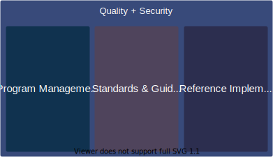

# Quality & Security

The Quality and Security effort in the Mojaloop Community is focused on delivering high quality, secure, ... software to anyone who w

This spans from recommending best practices for deployers to architecting processes to ensure that our code is scanned for vulnerabilities and security patches are applied regularly.

## Overview

- [Program Management](./program-management.md)
- [Standards + Guidelines](./standards-guidelines.md)
- [Reference Implementation](./reference-implementation.md)

## Other Links

[todo - fix links]
- The Mojaloop Community's [Vulnerability reporting procedure](https://github.com/mojaloop/documentation-artifacts/blob/master/presentations/discussion-docs/Mojaloop_Application_Security_Summary-27Jan2020.pdf)
- Presentation on [Mojaloop Application Security Summary](https://github.com/mojaloop/documentation-artifacts/blob/master/presentations/discussion-docs/Mojaloop_Application_Security_Summary-27Jan2020.pdf)
- [Summary of the Snyk investigation](./snyk_investigation)
