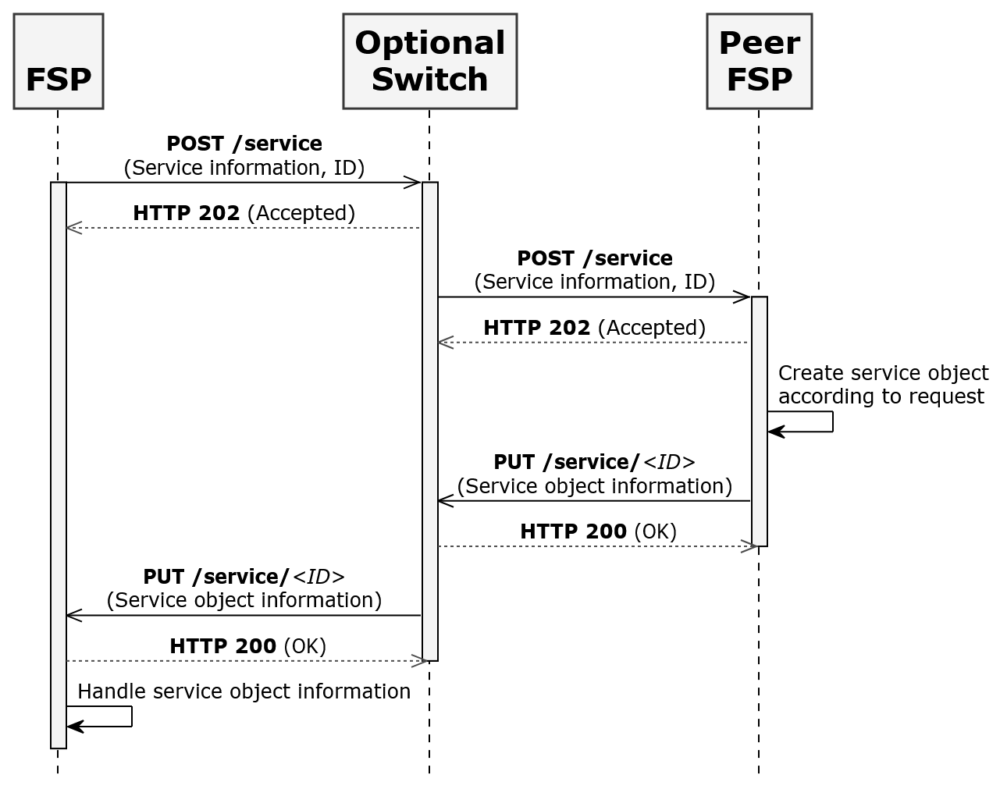
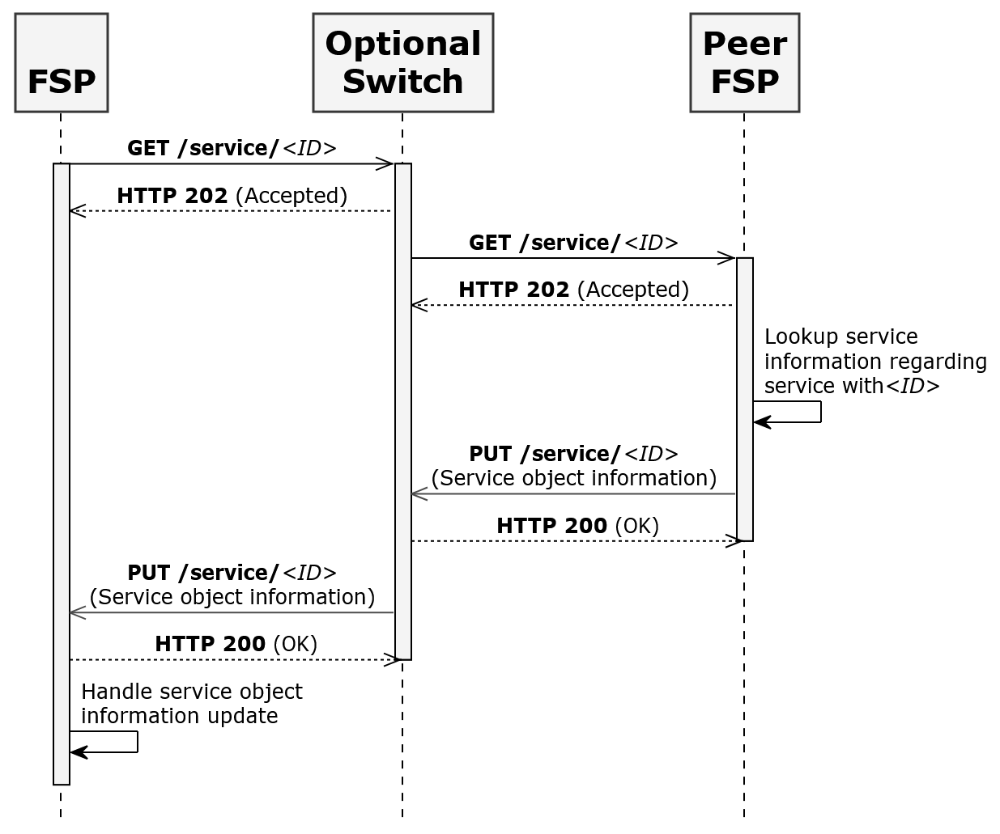

# Scheme Rules

## Preface

This section contains information about how to use this document.

### Conventions Used in This Document

The following conventions are used in this document to identify the specified types of information

|Type of Information|Convention|Example|
|---|---|---|
|**Elements of the API, such as resources**|Boldface|**/authorization**|
|**Variables**|Italics within curly brackets|_{ID}_|
|**Glossary terms**|Italics on first occurrence; defined in _Glossary_|The purpose of the API is to enable interoperable financial transactions between a _Payer_ (a payer of electronic funds in a payment transaction) located in one _FSP_ (an entity that provides a digital financial service to an end user) and a _Payee_ (a recipient of electronic funds in a payment transaction) located in another FSP.|
|**Library documents**|Italics|User information should, in general, not be used by API deployments; the security measures detailed in _API Signature_ and _API Encryption_ should be used instead.|

### Document Version Information

|Version|Date|Change Description|
|---|---|---|
|**1.0**|2018-03-13|Initial version|

## Introduction

This document defines scheme rules for Open API for FSP Interoperability (hereafter cited as the API) in three categories.

1. Business Scheme Rules:

    a. These business rules should be governed by FSPs and an optional regulatory authority implementing the API within a scheme.
    
    b. The regulatory authority or implementing authority should identify valid values for these business scheme rules in their API policy document.

2. API implementation Scheme Rules:

    a. These API parameters should be agreed on by FSPs and the optional Switch. These parameters should be part of the implementation policy of a scheme.

    b. All participants should configure these API parameters as indicated by the API-level scheme rules for the implementation with which they are working.

3. Security and Non-Functional Scheme Rules.

    a. Security and non-functional scheme rules should be determined and identified in the implementation policy of a scheme. 

 

### Open API for FSP Interoperability Specification

The Open API for FSP Interoperability Specification includes the following documents.

#### Logical Documents

- [Logical Data Model](./logical-data-model)

- [Generic Transaction Patterns](./generic-transaction-patterns)

- [Use Cases](./use-cases)

#### Asynchronous REST Binding Documents

- [API Definition](./api-definition)

- [JSON Binding Rules](./json-binding-rules)

- [Scheme Rules](#)

#### Data Integrity, Confidentiality, and Non-Repudiation

- [PKI Best Practices](./pki-best-practices)

- [Signature](./v1.1/signature)

- [Encryption](./v1.1/encryption)

#### General Documents

- [Glossary](./glossary)

 

## Business Scheme Rules

This section describes the business scheme rules. The data model for the parameters in this section can be found in _API Definition._

#### Authentication Type

The authentication type scheme rule controls the authentication types OTP and QR code. It lists the various authentication types available for _Payer_ authentication. A scheme can choose to support all the authentication types mentioned in “AuthenticationTypes” in _API Definition_ or a subset thereof.

#### Consumer KYC Identification Required

A scheme can mandate verification of consumer KYC (Know Your Customer) identification by Agent or Merchant at the time of transaction (for example, cash-out, cash-in, merchant payment). The API cannot control this scheme rule; therefore, it should be documented in scheme policy so that it is followed by all participants in a scheme. The scheme can also decide on the valid KYC proof of identification that should be accepted by all FSPs.

#### Currency

A scheme may recommend allowing transactions in more than one currency. This scheme may define the list of valid currencies in which transactions can be performed by participants; however, this is not required. A Switch may work as transaction router and doesn’t validate the transaction currency. If a scheme does not define the list of valid currencies, then the Switch works as transaction router and the participating FSP can accept or reject the transaction based on its supported currencies. Foreign exchange is not supported; that is, the transaction currency for the Payer and the _Payee_ should be the same.

#### FSP ID Format

A scheme may determine the format of the FSP ID. The FSP ID should be of string type. Each participant will be issued a unique FSP ID by the scheme. Each FSP should prepend the FSP ID to a merchant code (a unique identifier for a merchant) so that the merchant code is unique across all the participants (that is, across the scheme). The scheme can also determine an alternate strategy to ensure that FSP IDs and merchant codes are unique across participating FSPs.

#### Interoperability Transaction Type 

The API supports the use cases documented in _Use Cases_. A scheme may recommend implementation of all the supported usecases or a subset thereof. A scheme may also recommend to rollout the use cases in phases. Two or more FSPs in the scheme might decide to implement additional use-cases supported by the API. A Switch may work as a transaction router and does not validate transaction type; the FSP can accept or reject the transaction based on its supported transaction types. If a participant FSP initiates a supported API transaction type due to incorrect configuration on the Payer end, then the transaction must be rejected by the peer FSP if the peer FSP doesn’t support the specific transaction type.

#### Geo-Location Required

The API supports geolocation of the Payer and the Payee; however, this is optional. A scheme can mandate the geolocation of transactions. In this case, all participants must send the geolocation of their respective party.

#### Extension Parameters

The API supports one or more extension parameters. A scheme can recommend that the list of extension parameters be supported. All participants must agree with the scheme rule and support the scheme-mandatory extension parameters.

#### Merchant Code Format

The API supports merchant payment transaction. Typically, a consumer either enters or scans a merchant code to initiate merchant payment. In case of merchant payment, the merchant code should be unique across all the schemes. Currently, the merchant code is not unique in the way that mobile numbers or email addresses are unique. Therefore, it is recommended to prepend a prefix or suffix (FSP ID) to the merchant code so that the merchant code is unique across the FSPs.

#### Max Size Bulk Payments

The API supports the Bulk Payment use-case. The scheme can define the maximum number of transactions in a bulk payment.

#### OTP Length

The API supports One-time Password (OTP) as authentication type. A scheme can define the minimum and maximum length of OTP to be used by all FSPs.

#### OTP Expiration Time

An OTP’s expiration time is configured by each FSP. A scheme can recommend it to be uniform for all schemes so that users from different FSPs have a uniform user experience.

#### Party ID Types

The API supports account lookup system. An account lookup can be performed based on valid party ID types of a party. A scheme can choose which party ID types to support from **PartyIDType** in API Definition.

#### Personal Identifier Types

A scheme can choose the valid or supported personal identifier types mentioned in **PersonalIdentifierType** in API Definition.

#### QR Code Format

A scheme should standardize the QR code format in the following two scenarios as indicated.

##### Payer-Initiated transaction

Payer scans the QR code of Payee (Merchant) to initiate a Payer-Initiated Transaction. In this case, the QR code should be standardized to include the Payee information, transaction amount, transaction type and transaction note, if any. The scheme should standardize the format of QR code for Payee.

##### Payee-Initiated Transaction

Payee scans the QR code of Payer to initiate Payee-Initiated transaction. For example: Merchant scans the QR code of Payer to initiate a Merchant Payment. In this case, the QR code should be standardized to locate the Payer without using the account lookup system. The scheme should standardize the format of QR code; that is, FSP ID, Party ID Type and Payer ID, or only Party ID Type and Party ID.

## API Implementation Scheme Rules

This section describes API implementation scheme rules.

#### API Version

API version information must be included in all API calls as defined in _API Definition_. A scheme should recommend that all FSPs implement the same version of the API.

#### HTTP or HTTPS

The API supports both HTTP and HTTPS. A scheme should recommend that the communication is secured using TLS (see [Communication Security](#communication-security) section).

#### HTTP Timeout

FSPs and Switch should configure HTTP timeout. If FSP doesn’t get HTTP response (either **HTTP 202** or **HTTP 200**) for the **POST** or **PUT** request then FSP should timeout. Refer to the diagram in Figure 1 for the **HTTP 202** and **HTTP 200** timeouts shown in dashed lines.

###### Figure-1

**Figure 1 – HTTP Timeout**

#### Callback Timeouts

The FSPs and the Switch should configure callback timeouts. The callback timeouts of the initiating FSP should be greater than the callback timeout of the Switch. A scheme should determine callback timeout for the initiating FSP and the Switch. Refer to the diagram in Figure 2 for the callback timeouts highlighted in red.

###### Figure-2

**Figure 2 – Callback Timeout**

## Security and Non-Functional Requirements Scheme Rules

This section describes the scheme rules for security, environment and other network requirements.

#### Clock Synchronization

It is important to synchronize clocks between FSPs and Switches. It is recommended that an NTP server or servers be used for clock synchronization.

#### Data Field Encryption

Data fields that need to be encrypted will be determined by national and local laws, and any standard that must be complied with. Encryption should follow _Encryption_.

#### Digital Signing of Message

A scheme can decide that all messages must be signed as described in _Signature_. Response messages need not to be signed.

#### Digital Certificates

To use the signing and encryption features detailed in _Signature_ and _Encryption_ in a scheme, FSPs and Switches must obtain digital certificates as specified by the scheme-designated _CA_ (Certificate Authority).

#### Cryptographic Requirement

All parties must support the encoding and encryption ciphers as specified in _Encryption_, if encryption features are to be used in the scheme.

#### Communication Security

A scheme should require that all HTTP communication between parties is secured using TLS[1](https://tools.ietf.org/html/rfc5246) version 1.2 or later.

1 [https://tools.ietf.org/html/rfc5246](https://tools.ietf.org/html/rfc5246) - The Transport Layer Security (TLS) Protocol - Version 1.2

### Table of Figures

[Figure 1 – HTTP Timeout](#figure-1)

[Figure 2 – Callback](#figure-2)