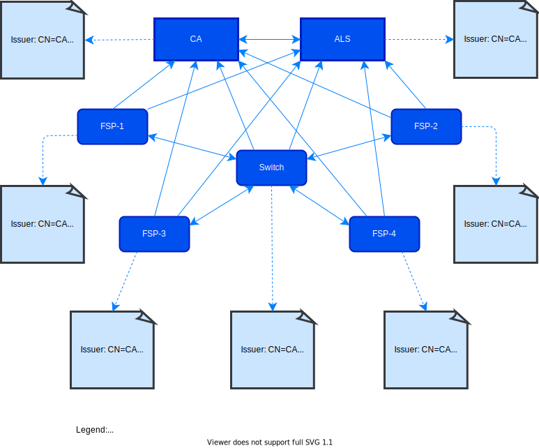

# Public Key Infrastructure Best Practices

## Preface

This section contains information about how to use this document.

### Conventions Used in This Document

The following conventions are used in this document to identify the specified types of information

|Type of Information|Convention|Example|
|---|---|---|
|**Elements of the API, such as resources**|Boldface|**/authorization**|
|**Variables**|Italics within curly brackets|_{ID}_|
|**Glossary terms**|Italics on first occurrence; defined in _Glossary_|The purpose of the API is to enable interoperable financial transactions between a _Payer_ (a payer of electronic funds in a payment transaction) located in one _FSP_ (an entity that provides a digital financial service to an end user) and a _Payee_ (a recipient of electronic funds in a payment transaction) located in another FSP.|
|**Library documents**|Italics|User information should, in general, not be used by API deployments; the security measures detailed in _API Signature_ and _API Encryption_ should be used instead.|

### Document Version Information

|Version|Date|Change Description|
|---|---|---|
|**1.0**|2018-03-13|Initial version|

## Introduction

This document explains _Public Key Infrastructure_ (PKI)<sup>1</sup> best practices to apply in an _Open API for FSP Interoperability_ (hereafter cited as “the API”) deployment. See [PKI Background](#pki-background) section for more information about PKI.

The API should be implemented in an environment that consists of either:

- _Financial Service Providers_ (FSPs) that communicate with other FSPs (in a bilateral setup) or

- A _Switch_ that acts as an intermediary platform between FSP platforms. There is also an _Account Lookup System_ (ALS) available to identify in which FSP an account holder is located.

For more information about the environment, see [Network Topology](#network-topology) section. [Certificate Authority PKI Management Strategy](#certificate-authority-pki-management-strategy) and [Platform PKI Management Strategy](#platform-pki-management-strategy) identify management strategies for the CA and for the platform. 

Communication between platforms is performed using a REST (REpresentational State Transfer)-based HTTP protocol (for more information, see _API Definition_). Because this protocol does not provide a means for ensuring either integrity or confidentiality between platforms, extra security layers must be added to protect sensitive information from alteration or exposure to unauthorized parties.

<br />

### Open API for FSP Interoperability Specification

The Open API for FSP Interoperability Specification includes the following documents.

#### Logical Documents

- [Logical Data Model](./logical-data-model)

- [Generic Transaction Patterns](./generic-transaction-patterns)

- [Use Cases](./use-cases)

#### Asynchronous REST Binding Documents

- [API Definition](./api-definition)

- [JSON Binding Rules](./json-binding-rules)

- [Scheme Rules](./scheme-rules)

#### Data Integrity, Confidentiality, and Non-Repudiation

- [PKI Best Practices](#)

- [Signature](./v1.1/signature)

- [Encryption](./v1.1/encryption)

#### General Documents

- [Glossary](./glossary)

<br />


## PKI Background

Public Key Infrastructure (PKI) is a set of standards, procedures, and software for implementing authentication using public key cryptography. PKI is used to request, install, configure, manage and revoke digital certificates. PKI offers authentication using digital certificates; these digital certificates are signed and provided by _Certificate Authorities_ (CA).

PKI uses public key cryptography and works with X.509 standard certificates. It also provides features such as:

- User authentication

- Certificate production and distribution

- Certificate maintenance, management, and revocation

PKI consists of a number of components that enable the infrastructure to work; it is not a single process or algorithm. In addition to authentication, PKI also enables the provision of integrity, non-repudiation and encryption.

To obtain a public key, a company must obtain a digital certificate. It should request this certificate from a CA or a _Registration Authority_ (RA) - an organization that processes requests on behalf of a CA. All participants must trust the CA to manage and maintain certificates. The CA requires the company to supply a number of details (_Common Name_ (CN), _Organization_ (O), _Country_ (C) and so on) and validate their request before it provides a certificate. This certificate is proof that the company is who it says it is in the digital world (like a passport in the real world).

PKI combines well with a _Diffie-Hellman solution_ (a secure mechanism for exchanging a shared symmetric key between two anonymous peers) in providing secure key exchanges. Because Diffie-Hellman does not provide authentication, PKI is used with additional protocols, such as _Pretty Good Privacy_ (PGP) and _Transport Layer Security_ (TLS).

### Layered Protection

The API should be used with protection at both the transport- and application-level.

#### Transport-Level Protection

To protect the transport level, _Transport Layer Security_<sup>2</sup> (TLS) should be used. TLS is a fundamental technique used for securing point-to-point communication. It has been proven to be stable and secure when using strong algorithms with the most recent versions of TLS, and is widely used around the world. TLS is a secure mechanism for exchanging a shared symmetric key between two anonymous peers, with identity verification (that is, trusted certificates). It provides _confidentiality_ (no one has read the content) and _integrity_ (no one has changed the content). Using TLS efficiently as-is requires certificate management.

#### Application-Level Protection

This layer provides end-to-end integrity and confidentiality. The API uses the JSON Web Signature<sup>3</sup> (JWS) standard for integrity and _non-repudiation_ (provide proof of the integrity and origin of data), and the JSON Web Encryption (JWE) <sup>4</sup> standard for confidentiality. An extended version of JWE is used to support field level encryption.

Using these standards requires certificate management; therefore, _Certificate Authorities_ (CA) and related PKI techniques are needed. For more information, see PKI Background.

## Network Topology

This section identifies the platforms that constitute the API.

### Platforms Point-to-Point Layout

Figure 1 shows an example platform point-to-point layout.



**Figure 1 - Platforms layout**

All communication between platforms must be TLS-secured using _client authentication_, also known as _mutual authentication_.

### Platform Roles

#### Certificate Authority (CA)

The CA performs the following functions:

- Sign _Certificate Signing Requests_ (CSRs) - CSRs is a secure mechanism for exchanging a shared symmetric key between two anonymous peers. The CA signs different types of certificates (for example, TLS, Content signature, Content encryption).

- Revoke certificates – Mark one or more certificates as invalid.

- Support CRLs – Maintain and provide certificate revocation lists (CRLs) to be downloaded by clients so that they can see which certificates have been revoked.

- Support Online Certificate Status Protocol (OCSP) – Provide real-time certificate revocation checks. 

#### Account Lookup System (ALS)

- Holds basic information about account holders.

- Answer questions like “Where should I send my financial transaction request for account holder with **MSISDN 0123456**?” 

#### Financial Services Provider (FSP)

Has account holders to which or from which money is transferred.

#### Switch

- Relays transaction information to other platforms.

- Can perform financial services, as specified in _API Definition_.

## Certificate Authority PKI Management Strategy

This section describes the PKI management strategy for Certificate Authorities.

### Certificate Authority Importance and Selection Criteria

The Certificate Authority (CA) role is important because:

- The CA provides a single legal entity that is trustworthy for all platforms.

- The point-to-point TLS protocol depends on certificates.

- The end-to-end protocols JWS and JWE depend on certificates for proof of non-repudiation and confidentiality.

#### Reasons Not to Use a Public CA

- A public CA can revoke the intermediate certificate used for signing our certificates, thus effectively shutting down all communication between platforms.

- A public CA also signs certificates which are not part of the _Open API for FSP Interoperability_ setup. Because you trust the certificate the CA signed for you, you then trust all certificates signed by that CA.

- There is no service in the _Open API for FSP Interoperability_ setup that is open to the public, so there is no reason to have a public CA already trusted by public clients (such as web browsers).

#### Private CA Options

- Build your own CA from scratch

- Build a CA using existing tools (for example, _openssl_)

- Use a full-featured CA (for example, the open source product _EJBCA_)

### Trusted Certificate Chain

A centralized CA makes certificate management easier for the involved platforms. By trusting the same CA certificate, each platform need only trust one certificate; the CA’s self-signed root certificate.

Thus, the CA should sign all types of certificates (TLS, signature, and encryption), but only for the participants in the _Open API for FSP Interoperability_ setup.

No intermediate CA certificates are required, because a segmented layout is not used in the _Open API for FSP Interoperability_ setup.

### CA Root Certificate

- The CA must create a self-signed root certificate to be used for signing all supported types of certificates (TLS, signing, and encryption).

- The minimum key length of the asymmetric RSA key pair is 4096 bits, and the signature algorithm should be sha512WithRSAEncryption.

- The _X.509 Basic Constraints_ must have the attribute **CA** set to **TRUE**.

- The time validity of the CA root certificate should be ten years. After eight years, a new self-signed root certificate should be created by the CA; the asymmetric RSA key pair must be recreated, not reused. This certificate becomes the certificate to use for signing the platforms CSRs. However, the old CA root certificate must still be active until it expires. This gives the platforms a window of two years to change the CA root certificate without disturbing their ongoing secured communication.

### Signing Platforms CSRs

The CA must provide a mechanism for the platforms to get their CSRs signed. Common signing methods are by email and by a web page. The chosen solution and policy must be known to the platforms.

The CA signs three types of platform certificates; TLS (for communication), JWS (for signature) and JWE (for encryption). Common requirements for these certificates are:

- The minimum key length of the asymmetric RSA key pair is 2048 bits, and the signature algorithm should be sha256WithRSAEncryption.

- The _X.509 Basic Constraints_ must have the attribute **CA** set to **FALSE**.

- The subject distinguished names must contain at least the following attributes:

   - _Common Name_ (CN) – This must be the hostname of the platform which has created the certificate. A N can never be the same for two different platforms or organizations.

   - _Organization_ (O) – The name of the organization.

   - _Country_ (C) – The country of the organization.

- The URL for platforms to download CRLs must be present.

- The URL for platforms to send OCSP requests must be present.

- The time validity should be two years.

Depending on the type of certificate to sign, the _X.509 Key Usage_ and X.509 Extended Key Usage of the platform’s certificate will differ; see Table 1 for more information.

| Certificate Type | X.509 Key Usage | X.509 Extended Key Usage |
| --- | --- | --- |
| **TLS Certificates** | Digital Signature, Key Encipherment | TLS Web Server Authentication, TLS Web Client Authentication |
| **Signature Certificates** | Digital Signature | |
| **Encryption Certificates** | Key Encipherment | |

**Table 1 – Certificate type and key usage**

### Revoking Certificates

- The CA must be able to revoke a platform’s certificates. Revoking a certificate means that it will no longer be trusted by any party. It will be marked as invalid by the CA and its revocation status published to the platforms, either in a revocation list (CRL) to be downloaded by platforms, or through a real-time HTTP query using _Online Certificate Status Protocol_ (OCSP) requested by platforms.

- The CA should support both CRL downloads and OCSP queries.

- The CA should update and sign the CRL daily and should provide (daily) a HTTP URL to the platforms that points to the CRL to be downloaded. The URL should be stored in the _CRL Distribution Points_ for each signed certificate.

- The OCSP URL should be stored in the _Authority Information Access_ for each signed certificate. An OCSP response must be signed. Nonce values in an OCSP request should be supported to prevent reply attacks.

- The CA has the right to revoke certificates, but no obligation to inform the platforms about such revocations. The platforms do not have the right to revoke certificates, but they do have an obligation to check regularly for a certificate’s revocation status.

### Certificate Enrollment and Renewal

The CA does not support enrollment or renewal of certificates for which an asymmetric key pair is reused. For increased security, the asymmetric key pairs must be recreated every time a certificate is enrolled or renewed through a new CSR.

## Platform PKI Management Strategy

This section describes the PKI management strategy for platforms.

### Keys, Certificates, and Stores

A certificate provides the identity of its owner through a trusted CA that has signed the certificate. This can be validated through its signed certificate chain. It also provides the technical means to ensure integrity (signature) and confidentiality (encryption) of data using its asymmetric key pair (known as a _public key and private key_). The public key is within the signed certificate, but its corresponding private key must be kept private and protected. A common solution for handling certificates and private keys is to put them into a protected storage area known as a store. A store can be a file, directory, or something else that provides access and confidentiality.

A single private key and its associated certificate can be used for all cryptographic purposes, but to enhance security, the following set of keys and certificates is required for each platform:

- One private key and certificate for TLS communication

- One private key and certificate for end-to-end integrity using JWS

- One private key and certificate for end-to-end confidentiality using JWE

Different keys and types of certificates can all be in the same store, but a more common setup is the following:

- For TLS communication:

   - One protected key store to hold the private key, its associated certificate, and certificate chain. These items are used for server- and client authentication in TLS.

   - One protected certificate store to hold all trusted TLS certificates. These certificates will be trusted by your platform during a TLS handshake, meaning that they will allow secure communication with the owners of the certificates. Since all participants trust the same CA, it is sufficient to keep only the CA’s root certificate here.

- For signature and encryption:

   - One protected key store to hold your private keys, their associated certificates, and certificate chains used for signatures and encryption.

   - One private key and certificate chain used for signing using JWS, and one private key and certificate chain used for encryption using JWE.

   - One protected certificate store to hold all trusted signature and encryption certificates from other platforms. Here you must store the certificates (signature and encryption certificates) for each platform that you want to trust for end-to-end integrity and confidentiality.

### Creating a CSR and Obtaining CA Signature

To be able to communicate with other platforms, you must create a key store (if one does not already exist), an asymmetric key pair, and an associated certificate that identifies your platform. This unsigned certificate must be signed by the CA before it can be trusted by other platforms. The procedure of getting a certificate signed by a CA begins with a CSR (_Certificate Signing Request_).

When you create your keys, certificates, and CSRs, the following requirements apply:

- The minimum key length of the asymmetric RSA key pair is 2048 bits, and the signature algorithm is sha256WithRSAEncryption.

- The following attributes in the subject distinguished names are mandatory:

   - Common Name (CN) – This must be the hostname of the platform who created the certificate. A CN can never be the same for two different platforms or organizations.

   - Organization (O) – The name of the organization.

   - Country (C) – The country of the organization.

**For examples of how to create a store, certificate, and CSR, see Appendix C – Common PKI Tasks**

How to create a store, certificate, and CSR.

Create your CSR and send it to your CA according to their instructions.

**Note:** The same procedure must be performed for all your different keys and certificates (TLS, signature, and encryption).

### Importing a Signed CSR

After signing your CSR, you will have two certificates in your response from the CA. The first certificate is your own signed certificate. The second is the CA’s own root certificate, which was used for signing your certificate. That certificate must now be trusted by you.

First you must import your signed certificate into your key store. It must replace your unsigned certificate. For examples, see How to import a signed certificate into your key store.

Then you must import the CA’s root certificate into the same key store to complete the chain between your certificate and the CA. For examples, see How to import the CA certificate into your key store.

#### TLS Certificates

For TLS certificates, you must also import the CA’s root certificate into your TLS trust store to automatically trust the other platforms when establishing new communication channels with them. For examples, see How to import the CA certificate into TLS trust store.

The above procedure should be performed for each of your signed CSRs. Remember to send your signed certificate and the CA’s root certificate to all other platforms with which you need to communicate.

The CA will create a validity period of two years for your signed certificate. After 18 months, you should create a new CSR to be signed by the same CA. Your newly signed certificate and the CA’s root certificate should once again be imported into your stores and sent to the other platforms. This will give you and your peers a window of six months to make sure that your new signed certificate works. After two years, the old expired certificate can be deleted.

### Trusting Certificates from Other Platforms

Just as your peers must have your certificates to be able to trust you, they must send their certificates to you for you to trust them.

Make sure that you always receive at least two certificates from a trusted peer:

- The signed certificate of the peer to trust.

- The root certificate of the CA that signed the peer’s certificate.

**Note:** A peer’s CA certificate can differ from yours. This can happen if the CA has created a new CA root certificate when the old one is about to expire.

You should always view a peer’s certificates (check CN, validity period, and so on) and validate the certificate chain (that is, that each certificate is correctly signed by the given CA) before you import them into your trust store.

For examples, see How to view a certificate.

Next, import the peer’s certificate and its CA root certificate into your trust store. For examples, see How to import a trusted certificate.

### Checking Certificate Revocation Status

Certificates can be revoked by the CA. A revoked certificate is considered not trusted and should be removed from the trust store. A certificate can also be _on hold_, which means that it is in pending state due to investigation and should not be removed.

All platforms should perform revocation checks on a regular basis. There are two common ways to find out which certificates have been revoked; either through viewing a revocation list (CRL) to be downloaded by platforms, or through a real-time HTTP query (OCSP) requested by platforms.

#### Certificate Revocation List

This is a file maintained by a CA. It contains a list of certificate serial numbers that have been revoked by the CA. This file can be downloaded by any platform at any time. The URL to the CRL file to be downloaded is included in the certificate itself and can be found in _CRL Distribution Points_. A CRL is signed by the CA and should be validated.

A CRL should be downloaded once per day and cached by the platform.

For examples, see How to verify a certificate through a CRL.

#### Online Certificate Status Protocol

The status of a certificate can be retrieved by sending an OCSP request to an _OCSP Responder_ (which can be the CA). The request contains the serial number of the certificate to be checked. The responder sends back a signed response including the status of the certificate.

The request should contain a nonce value, which the responder will put in the response, for the platform to validate on receipt. This is to prevent reply attacks.

An OCSP request/response is considered very fast and can be executed for each received client certificate operation, but depending on the load towards the responder, it might have to be cached by the platform as well.

The OCSP URL is included in the certificate itself and can be found in _Authority Information Access_.

For examples, see How to verify a certificate through an OCSP request.

### Renewing Certificates

Do not renew certificates for which an asymmetric key pair is reused. For increased security, the asymmetric key pairs must be recreated every time through a new CSR.

## Transport Layer Protection

This section describes transport layer protection.

### TLS

TLS provides point-to-point integrity and confidentiality, and is used for all communication between peers.

The setup requires both _server authentication_ - meaning that the server presents itself through its own TLS certificate - and _client authentication_ (also known as mutual authentication) in which the client presents itself through its own TLS certificate.

#### TLS Protocol Versions

The TLS protocol version used must be 1.2 or higher.

#### TLS Cipher Suites

The following cipher suites should be used:

- TLS_ECDHE_RSA_WITH_AES_256_GCM_SHA384

- TLS_ECDHE_RSA_WITH_AES_128_GCM_SHA256

- TLS_ECDH_RSA_WITH_AES_256_GCM_SHA384

- TLS_ECDH_RSA_WITH_AES_128_GCM_SHA256

- TLS_RSA_WITH_AES_256_GCM_SHA384

- TLS_RSA_WITH_AES_128_GCM_SHA256

## Application Layer Protection

This section describes the application layer protection.

### JSON Web Signature

The _JSON Web Signature_ (JWS) standard is used for providing end-to-end integrity and non-repudiation; that is, to guarantee that the sender is who it claims to be, and that the message was not tampered with.

The use of JWS is mandatory and certificates should be used. For more information, see _API Signature_.

### JSON Web Encryption

The _JSON Web Encryption_ (JWE) standard is used for providing end-to-end confidentiality; that is, to protect data from being read by unauthorized parties.

The use of JWE is optional and is applied to specific fields. This is to fulfill regulatory requirements that might exist for certain type of data in certain countries.

For more information about how to apply JWE to fields in messages, see the extended JWE standard specification _API Encryption_.


## List of Appendices

### Appendix A - Key Lengths and Algorithms

Table 2 contains the required key length and algorithm for each entity.

| Entity | Algorithm | Key length/hash size |
| --- | --- | --- |
| CA asymmetric keys | RSA | 4096 bits |
| CA signing algorithm | RSA with SHA2 | >= 256 bits |
| TLS asymmetric keys | RSA | 2048 bits |
| TLS signing algorithm | RSA with SHA2 | >= 256 bits |
| Signature asymmetric keys | RSA | 2048 bits |
| Signature algorithm | RSA with SHA2 | >= 256 bits |
| Encryption asymmetric keys | RSA | 2048 bits |
| HMAC | SHA2 - AES | >= 256 bits|
| Symmetric keys | AES | 256 bits |
| Hashing | SHA2 | >= 256 bits |

**Table 2 – Key lengths and algorithms**

### Appendix B - Terminology

| | | 
| --- | --- | 
| PKI | Public Key Infrastructure
| API | Application Program Interface
| TLS | Transport Layer Security
| JWS | JSON Web Signature
| JWE | JSON Web Encryption
| FSP | Financial Service Provider
| AL | Account Lookup
| CA | Certificate Authority
| CSR | Certificate Signing Request
| CRL | Certificate Revocation List
| OCSP | Online Certificate Status Protocol
| PEM | Privacy Enhanced Mail
| RSA | Rivest, Shamir, & Adleman
| HMA | Hashed Message Authentication Code
| AES | Advanced Encryption Standard
| SHA | Secure Hash Algorithm

### Appendix C - Common PKI Tasks

#### Appendix C.1 - How to create a store, certificate, and CSR

**Using the Java keytool**

Use the following command to create an asymmetric RSA key pair and associated certificate information to be signed by the
CA. It will automatically create a JKS key store if the given one does not exist:

```
keytool -genkey -dname "CN=<common-name>" -alias <key-alias> -keyalg RSA -
keystore <ks-path> -keysize 2048
```

**Example**

```
keytool -genkey -dname "CN=bank-fsp" -alias tlscert -keyalg RSA -keystore
tlskeystore.jks -keysize 2048
```

**Notes:**

1. The certificate attribute CN specifies the hostname of the host who identifies itself using this certificate during a TLS session.
2. When asked for password, use the same password for the key as the key store.

Use the following command to create the actual CSR to be signed by the CA:

```
keytool -certreq -alias <key-alias> -keystore <ks-path> –file <certificationrequest>.csr
```

**Example**

```
keytool -certreq -alias tlscert -keystore tlskeystore.jks -file tlscert.csr
```

**Using openssl**

Use the following command to create an asymmetric RSA key pair, and CSR to be signed by the CA:

```
openssl req -new -newkey rsa:2048 -nodes -subj "/CN=<common-name>" -out
<certificate>.csr -keyout <private-key>.key
```

**Example**

```
openssl req -new -newkey rsa:2048 -nodes -subj "/CN=bank-fsp" -out tlscert.csr -
keyout tlscert.key
```

**Note:** The certificate attribute CN specifies the hostname of the host who identifies itself using this certificate during a TLS session.

Important to note is that the created private key is stored unencrypted. Use the following command to encrypt it:

```
openssl rsa -aes256 -in <unenrypted key file> -out <encrypted key file>
```

**Example**

```
openssl rsa -aes256 -in tlscert.key -out tlscert_encrypted.key
```

#### Appendix C.2 - How to import a signed certificate into your key store

**Using the Java keytool**

Import your signed certificate into your key store. This certificate should replace the old unsigned one, so make sure that you use the correct alias.

```
keytool -importcert -alias <key-alias> -file <signed-certificate> -keystore <kspath>
```

**Example**

```
keytool -importcert -alias tlscert -file bank-fsp.pem -keystore tlskeystore.jks
```

**Using openssl**

Remove your old CSR file and replace it with the new signed certificate.

#### Appendix C.3 - How to import the CA certificate into your key store

**Using Java keytool**

Import the CA certificate into your key store:

```
keytool -importcert -alias <CA-alias> -file <CA-file> -keystore <ks-path>
```

**Example:**

```
keytool -importcert -alias rootca -file rootca.pem -keystore tlskeystore.jks
```

When you are asked to trust the imported certificated, answer **yes**:

```
Trust this certificate? [no]: yes
Certificate was added to keystore
```

**Using openssl**

Put the CA certificate with your other certificate files

#### Appendix C.4 - How to import the CA certificate into TLS trust store

**Using Java keytool**

Import the CA certificate into your trust store:

```
keytool -importcert -alias <CA-alias> -file <CA-file> -keystore <ks-path>
```

**Example:**

```
keytool -importcert -alias rootca -file rootca.pem -keystore tlstruststore.jks
```

When you are asked to trust the imported certificated, answer **yes**:

```
Trust this certificate? [no]: yes
Certificate was added to keystore
```
**Using openssl**

Put the CA certificate with your other certificate files.

#### Appendix C.5 - How to view a certificate

**Using Java keytool**

Use this command to list all certificates stored in a key store in readable format:

```
keytool -list -keystore <ks-path> -v
```

**Example:**

```
keytool -list -keystore tlskeystore.jks -v
```

**Using openssl**

Use this command to show the content of a PEM encoded certificate in readable format:

```
openssl x509 -in <certificate file> -text -nout
```

**Example:**

```
openssl x509 -in rootca.pem -text -nout
```

#### Appendix C.6 - How to import a trusted certificate

**Using Java keytool**

Import the certificate into your trust store:

```
keytool -importcert -alias <cert-alias> -file <cert-file> -keystore <ks-path>
```

**Example:**

```
keytool -importcert -alias trustedcert -file cert.pem -keystore truststore.jks
```

When you are asked to trust the imported certificated, answer **yes**:

```
Trust this certificate? [no]: yes
Certificate was added to keystore
```

**Using openssl**

Put the trusted certificate with your other certificate files.

#### Appendix C.7 - How to verify a certificate through a CRL

**Using Java**

You can use a specific security library for this (for example, Bouncy Castle), or use the in-built support for it, see:
[https://stackoverflow.com/questions/10043376/java-x509-certificate-parsing-and-validating/10068006#10068006](#https://stackoverflow.com/questions/10043376/java-x509-certificate-parsing-and-validating/10068006#10068006)

**Using openssl**

A good example is found at the following link:
[https://raymii.org/s/articles/OpenSSL_manually_verify_a_certificate_against_a_CRL.html](#https://raymii.org/s/articles/OpenSSL_manually_verify_a_certificate_against_a_CRL.html)

#### Appendix C.8 - How to verify a certificate through an OCSP request

**Using Java**

Some Java examples is found in the following link:
[https://stackoverflow.com/questions/5161504/ocsp-revocation-on-client-certificate](#https://stackoverflow.com/questions/5161504/ocsp-revocation-on-client-certificate)

**Using openssl**

A good example is found at the following link:
[https://raymii.org/s/articles/OpenSSL_Manually_Verify_a_certificate_against_an_OCSP.html](#https://raymii.org/s/articles/OpenSSL_Manually_Verify_a_certificate_against_an_OCSP.html)


<sup>1</sup> This term, and other italicized terms, are defined in Glossary for Open API for FSP Interoperability Specification.

<sup>2</sup> [https://tools.ietf.org/html/rfc5246](#https://tools.ietf.org/html/rfc5246) - The Transport Layer Security (TLS) Protocol - Version 1.2

<sup>3</sup> [https://tools.ietf.org/html/rfc7515](#https://tools.ietf.org/html/rfc7515) - JSON Web Signature (JWS)

<sup>4</sup> [https://tools.ietf.org/html/rfc7516](#https://tools.ietf.org/html/rfc7516) - JSON Web Encryption (JWE)

<br />

## Table of Figures

- [Figure 1 - Platforms layout](#platforms-point-to-point-layout)

<br />

## Table of Tables

- [Table 1 – Certificate type and key usage](#Table-1–Certificate-type-and-key-usage)

- [Table 2 – Key lengths and algorithms](#Table-2-Key-lengths-and-algorithms)